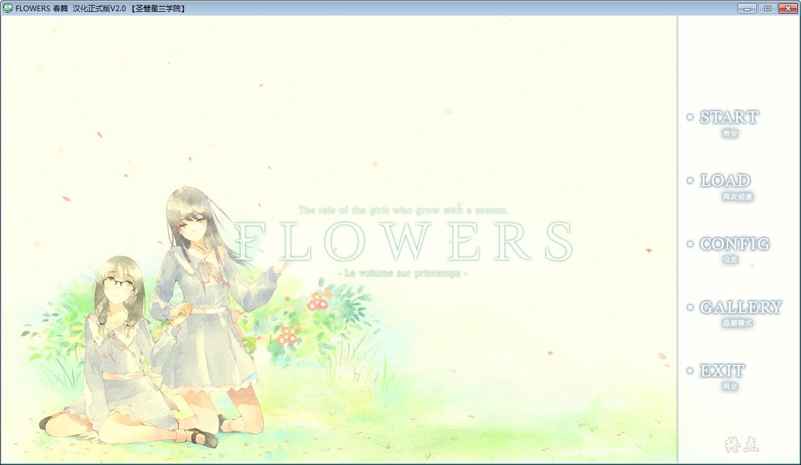
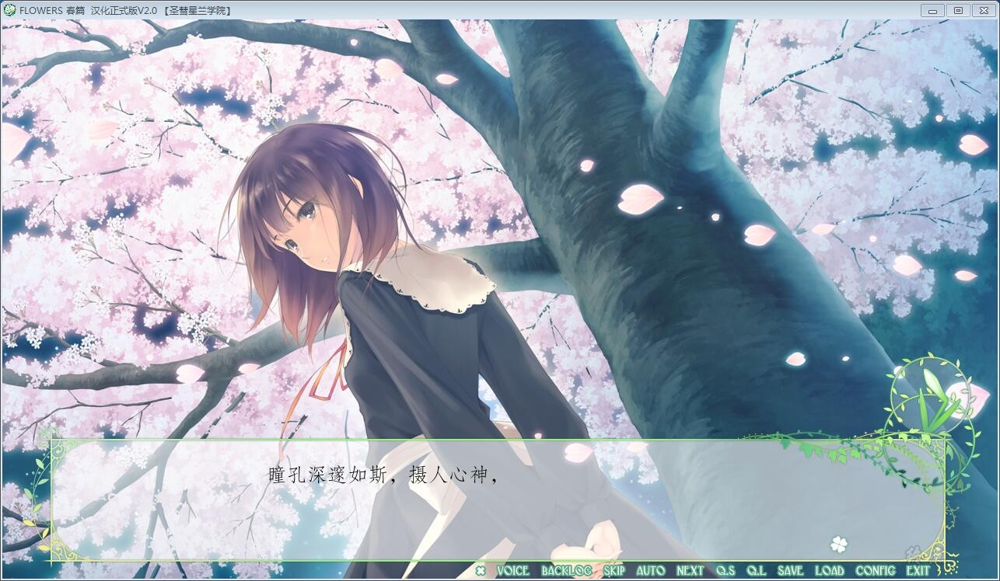
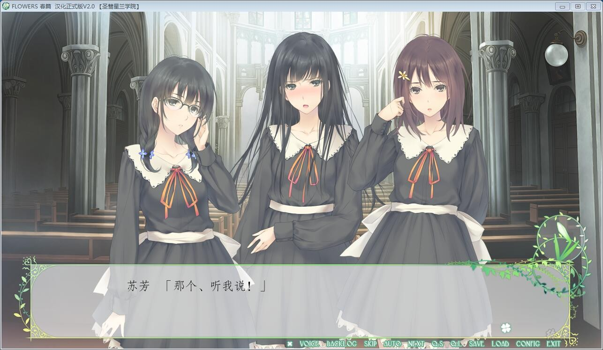
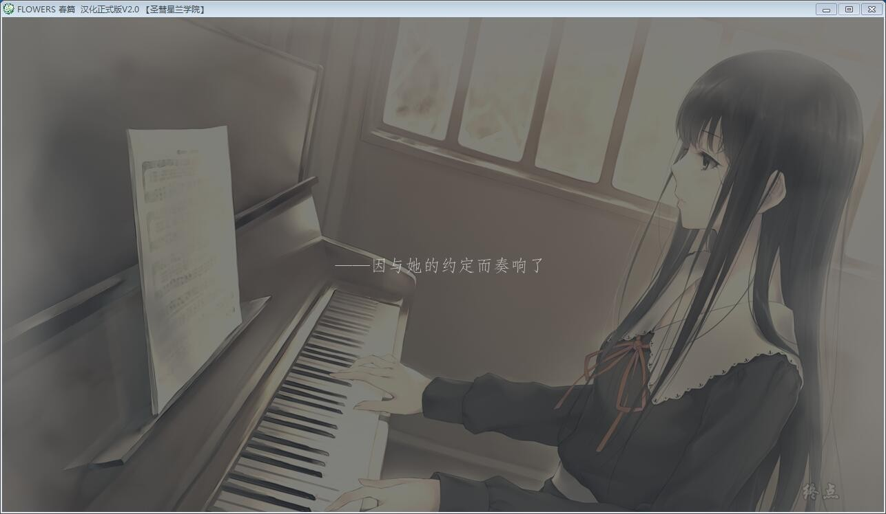
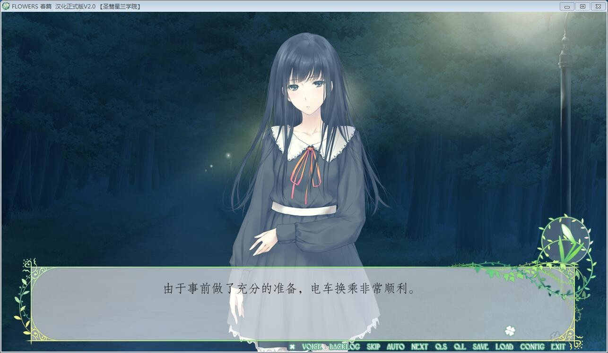
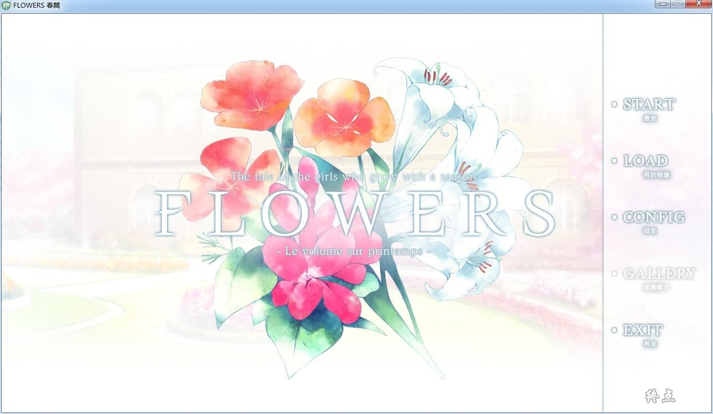
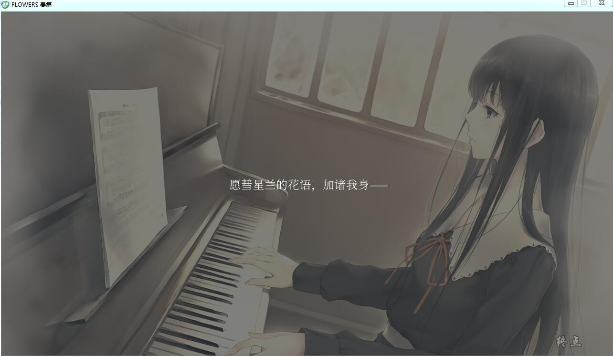
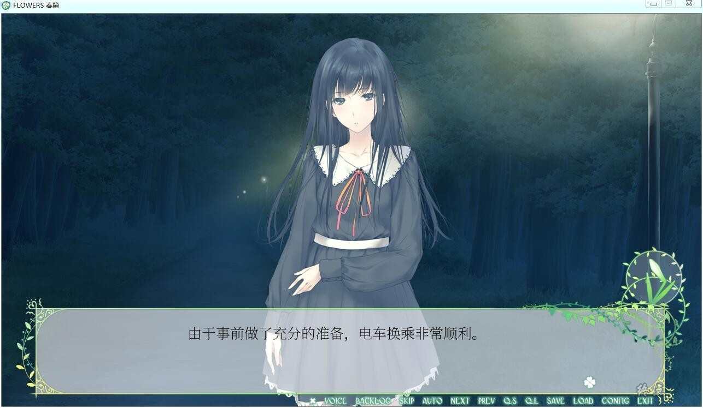
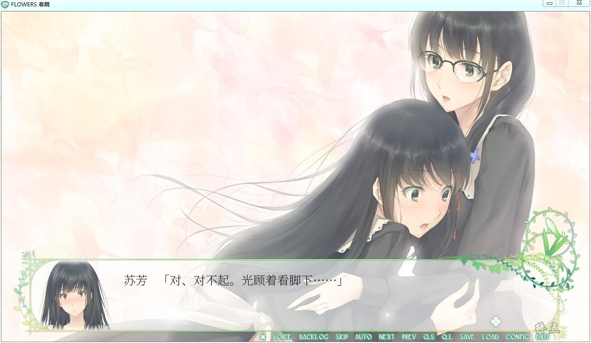

# 汉化版

# 官方中文

# ——故事简介——

故事发生在被四壁高墙环绕和深幽森林包围的教会学校・圣彗星兰学院。

心负创伤的少女・白羽苏芳，来到这所妍丽少女们云集的学院入学。

因某些缘由闭门琐居，未曾与家人以外有过接触的她，被这所意图模拟结交“友人”的学院吸引，在这里进行的一切尝试，特别统称为“amitié”。

由学院暂定分配好的人生初见之友，苏芳对她们悄然萌生了花非花雾非雾般朦胧的恋心。

平淡的学院生活日复一日，学生不自然消失的现象却油然而生……

少女们在学院里将会见证什么、明白什么。

圣慧兰学院汉化组的汉化作品

19年2月5日更新官方中文

steam版本为自购，转载请注明出处

如有能力还请支持正版

[steam地址](https://store.steampowered.com/app/452440/Flowers_Le_volume_sur_printemps/)

**请使用[IDM](https://www.123pan.com/s/jJprVv-3tMsH)进行下载，使用最新版[winrar](https://www.123pan.com/s/jJprVv-dtMsH)进行解压（非常重要）。**

**解压密码为终点（简体汉字）。**

**添加10%恢复记录，防止网盘抽风损坏。**

