# 汉化版

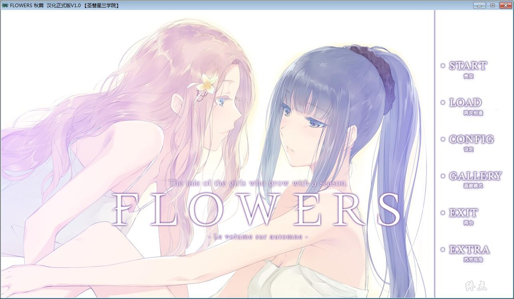

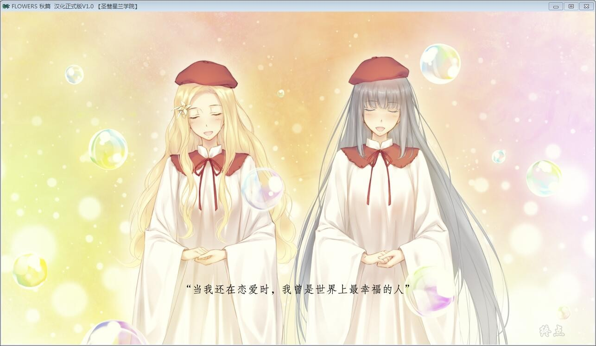

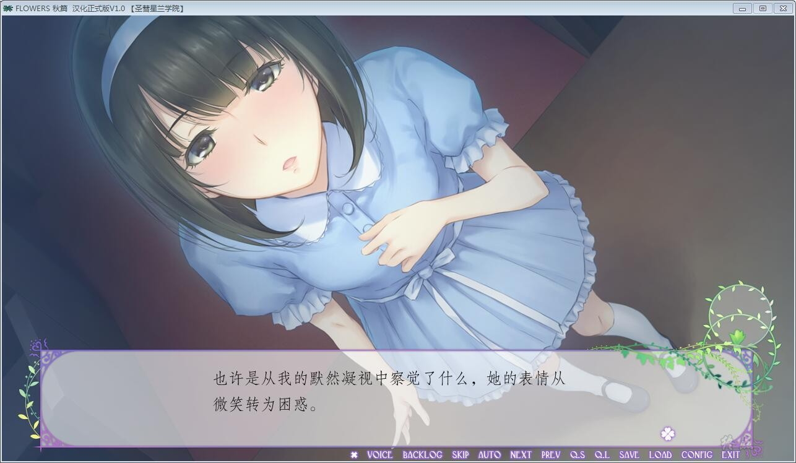

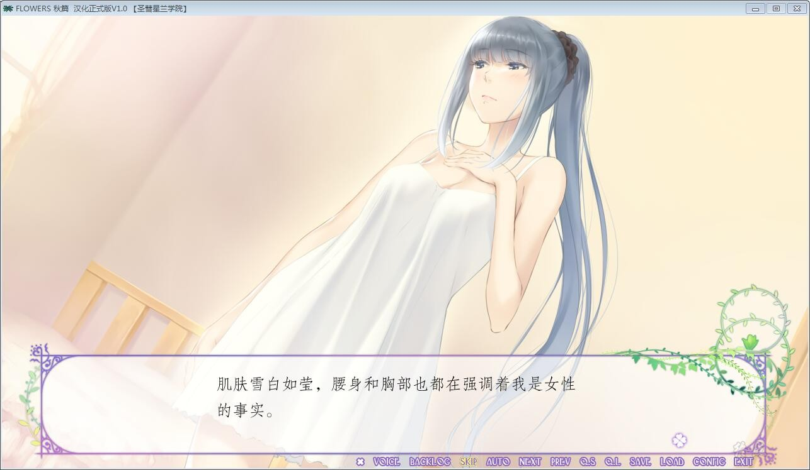

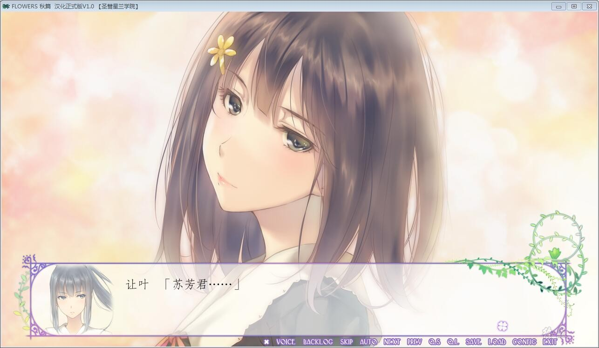

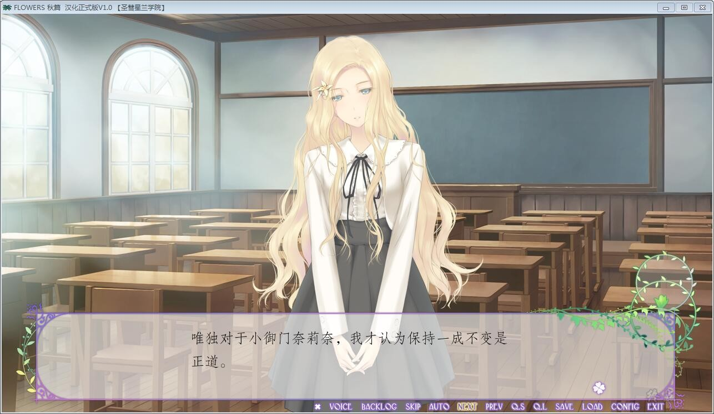

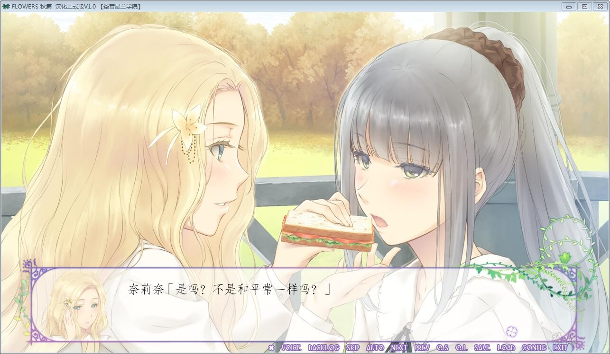

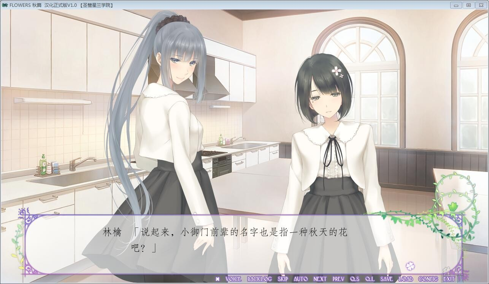

# 官方中文

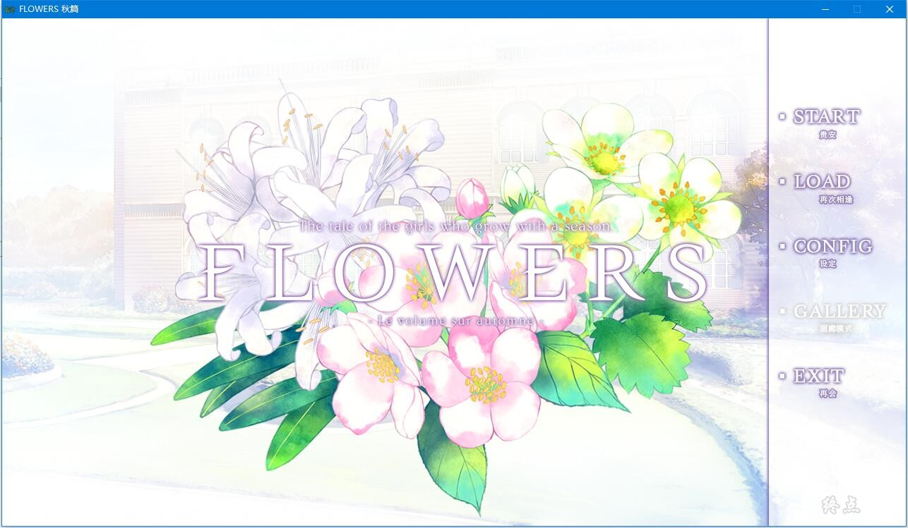

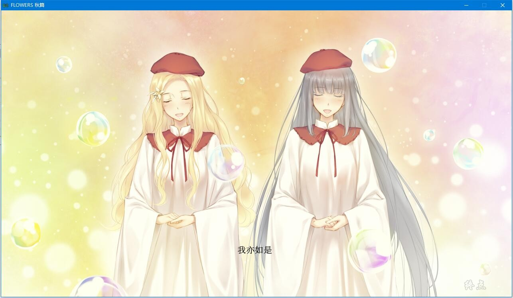

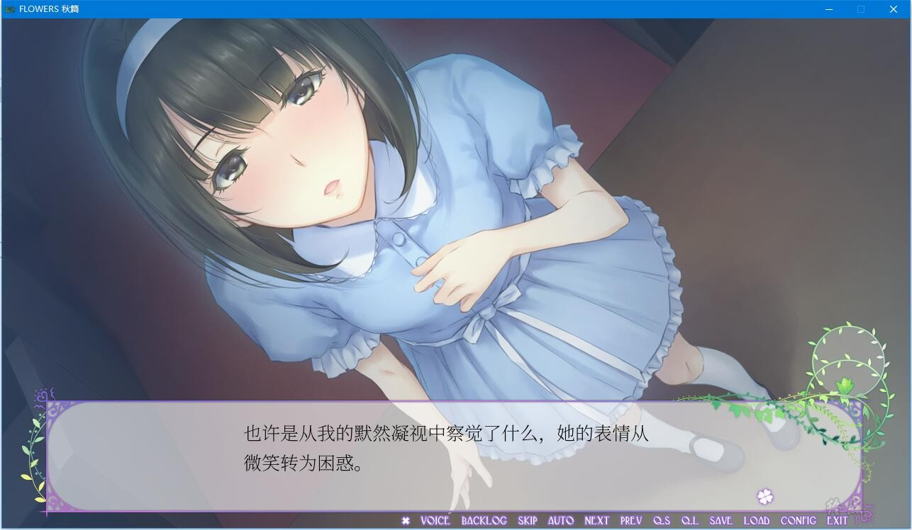

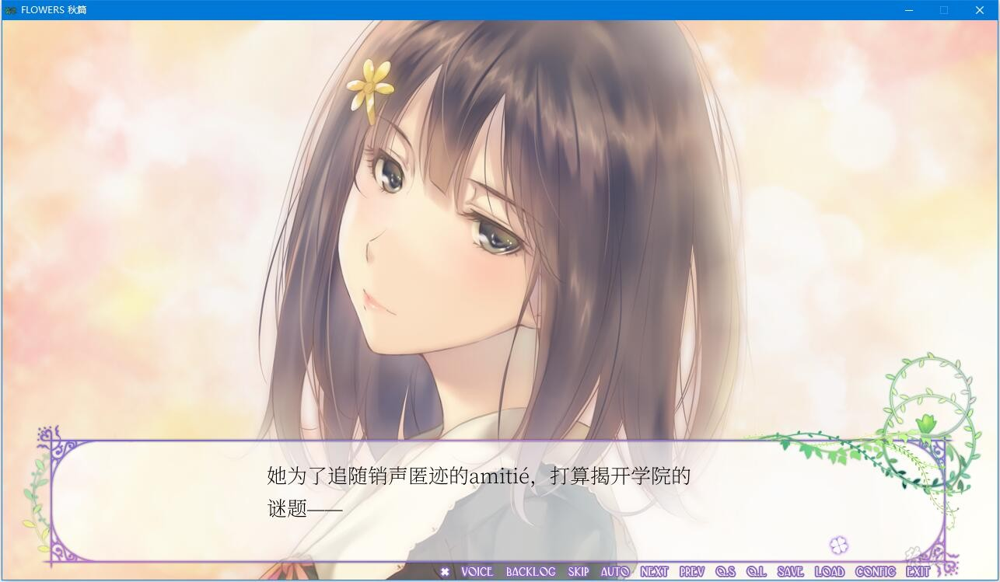

# ——游戏简介——

FLOWERS系列是，春、夏、秋、冬一年四季所组成的清水百合推理故事。

这次圣彗星兰学院献上的是四季中的秋季——金银组合与双胞胎的故事。

夏去秋来，决意寻回自己不告而别的amitié的白羽苏芳
她离amitié——匂坂真由理消失之谜的真相仅一步之遥

“如果你能成为尼西亚会的会长，我就将打开真相大门的钥匙交给你”

尼西亚会会长八代让叶如此告知追寻着消失恋人之背影的后辈

知晓学院秘密的八代让叶摸清了后辈的真心，便想借助这困难的要求逼迫她放弃

少女为了真相而东奔西走，然而，守望着她的八代让叶也心怀不可告人的秘密——

秋日的圣彗星兰学院发生了数起不可思议的事件

自己对青梅竹马那不受祝福的恋慕之情、她人对自己的恋心……种种恋爱的红线错综复杂

而关于那互相交织的真相与恋心的故事也就此徐徐展开……

圣彗星兰学院的汉化作品，详情请看原来的汉化原帖吧，因为汉化组禁止转载，

所以各位推荐自行找本体+补丁组合使用，游戏本体flowers吧精品里能找到，

应该是打了修正补丁的0608那个修正

**20年7月31日更新，steam版官方中文版本**

steam版本为，终点论坛自购，转载请注明终点论坛，谢谢配合

如有能力，还请支持正版，感谢花葬魂の侍 的馈赠

[steam地址](https://store.steampowered.com/app/1238730/Flowers_Le_volume_sur_automne/)

**请使用[IDM](https://www.123pan.com/s/jJprVv-3tMsH)进行下载，使用最新版[winrar](https://www.123pan.com/s/jJprVv-dtMsH)进行解压（非常重要）。**

**解压密码为终点（简体汉字）。**

**添加10%恢复记录，防止网盘抽风损坏。**

