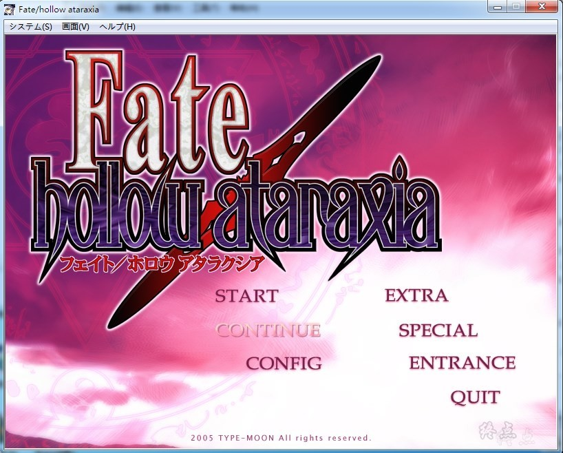
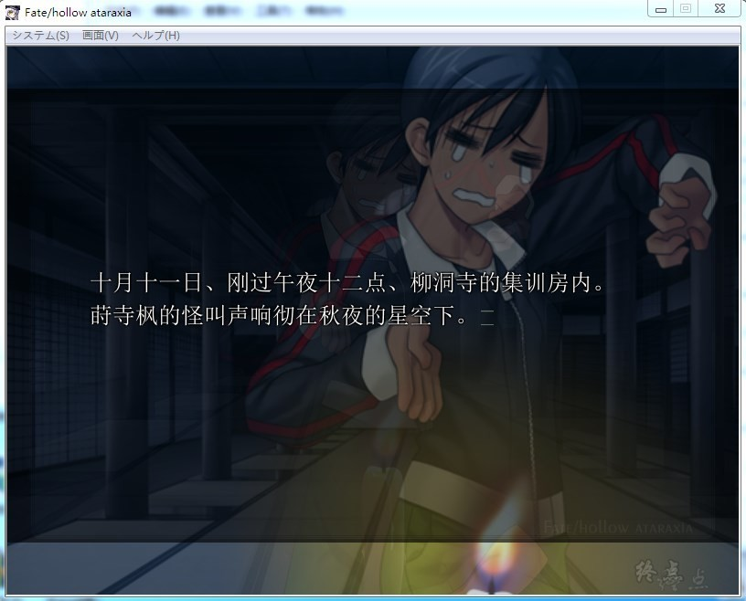
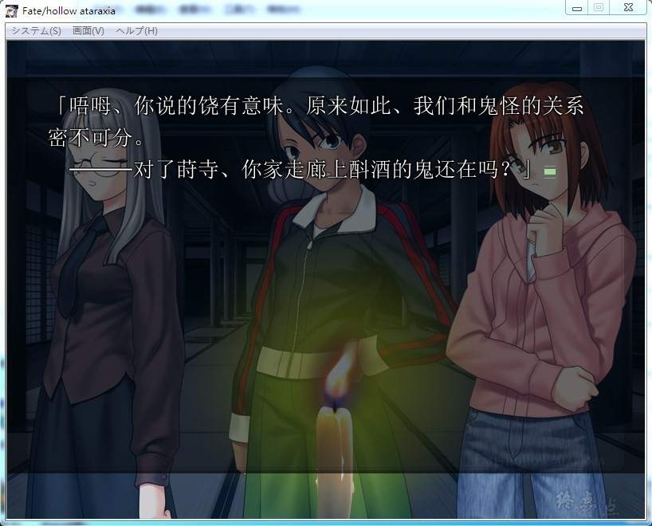
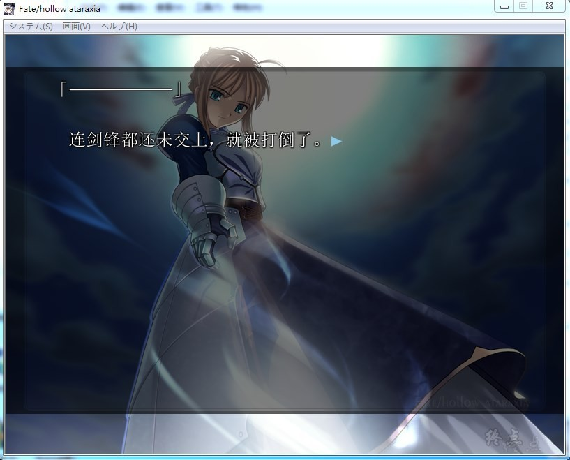
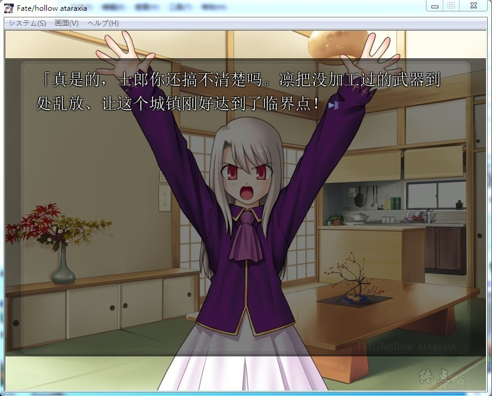

# 游戏简介

在本篇中，玩家所拥有的时间是「四天」，

玩家要利用上午（午前）和下午（午后）两次行动时段，

看要是追寻自己所喜爱的角色，或是与全员都打好关系，都可以。

在你闲逛逡寻的同时，有可能在意想不到的地方遇到意想不到的人。

时间是第五次圣杯战争结束后半年，

因为远坂凛的第二魔法实验失败的原因，

使冬木变成了一个什么都可能发生的地方，

本应消失了的Servant们再次出现在冬木市。

安定的日常生活不断重复，以及悄悄地进行中的另一个圣杯战争。

命运的布幕将再次升起，那就是四日轮回的规则。

在那前方，有的是虚无，亦或是平稳？

**2021-11-6 更新步兵（非官方），感谢等雨来的制作，默认为官方CG，增加切换bat，需要的自行切换**

**2023-1-15更新，全语音版**，默认全CG存档在游戏目录下，
语音版启动，开启R18需要答题（非原版功能），所以避免这个步骤，
因语音原帖失效故此更新，如有争议再撤销

**请使用[IDM](https://www.123pan.com/s/jJprVv-3tMsH)进行下载，使用最新版[winrar](https://www.123pan.com/s/jJprVv-dtMsH)进行解压（非常重要）。**

**解压密码为终点（简体汉字）。**

**添加10%恢复记录，防止网盘抽风损坏。**

