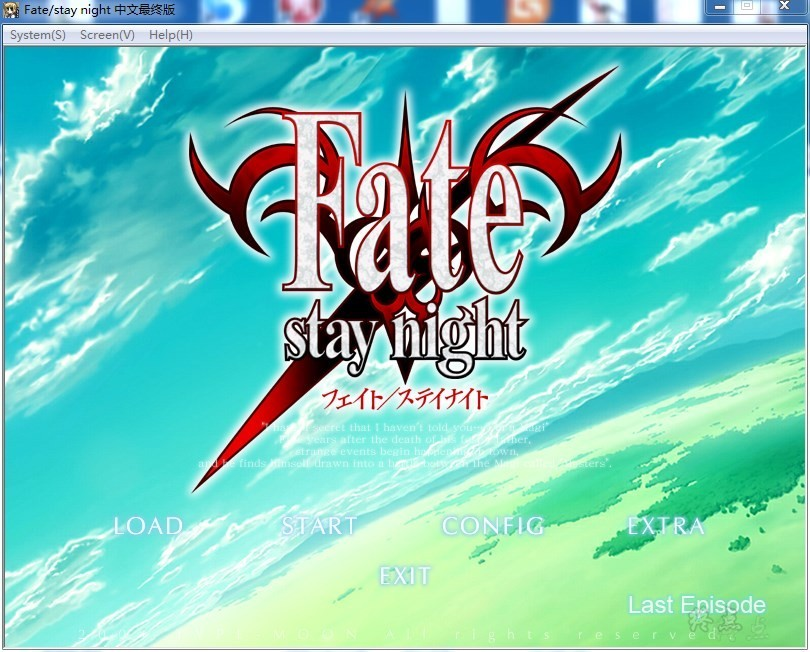
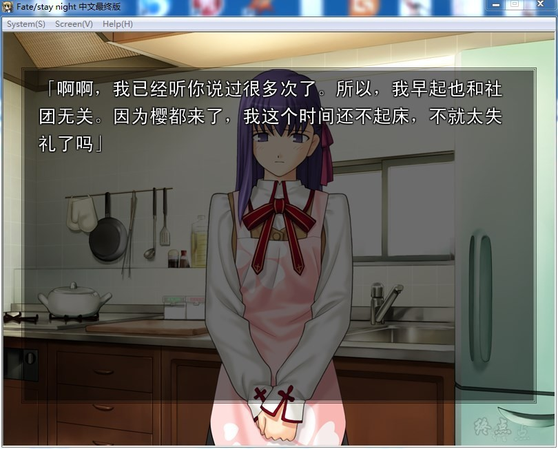
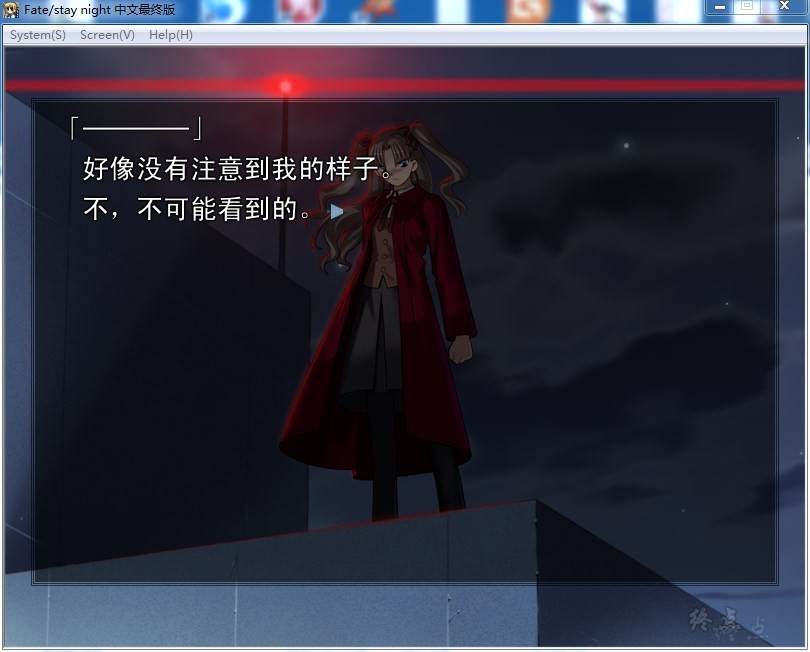
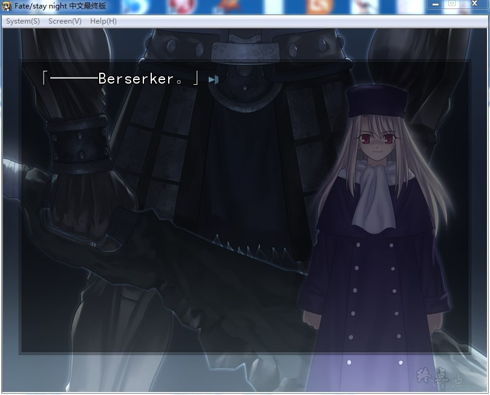
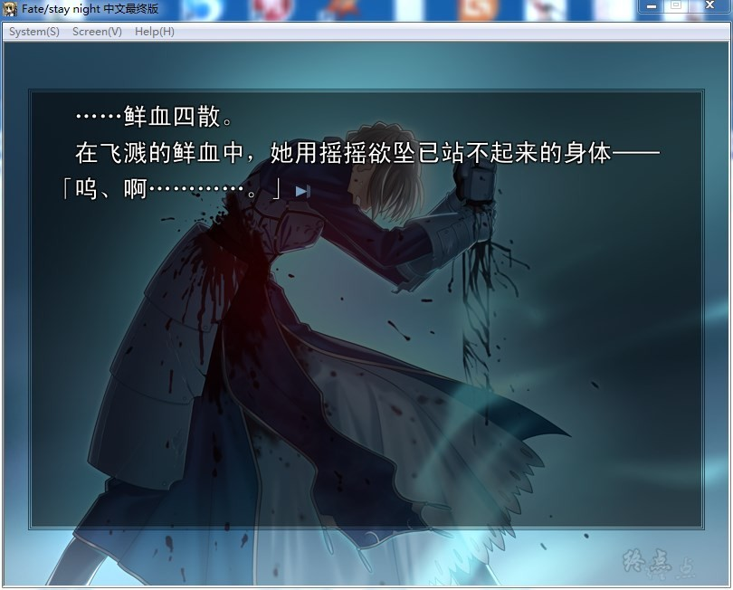

# 游戏简介

圣杯是传说中可实现持有者一切愿望的宝物，而为了得到圣杯的仪式就被称为圣杯战争。

参加圣杯战争的7名由圣杯选出的魔术师被称为Master，与7名被称为Servant的使魔订定契约。

他们是由圣杯选择的七位英灵，被分为七个职阶，以使魔的身份被召唤出来。

能获得圣杯的只有一组，这7组人马各自为了成为最后的那一组而互相残杀。

卫宫切嗣的养子卫宫士郎，偶然地与servant中的剑士Saber（定契约，被卷入圣杯战争当中。

在游戏版本中，随着初期选择的不同，后面剧情亦会出现极大改变，共有3线。

**2021-11-6  更新步兵（非官方），感谢等雨来的制作，默认为官方CG，增加切换bat，需要的自行切换**

**请使用[IDM](https://www.123pan.com/s/jJprVv-3tMsH)进行下载，使用最新版[winrar](https://www.123pan.com/s/jJprVv-dtMsH)进行解压（非常重要）。**

**解压密码为终点（简体汉字）。**

**添加10%恢复记录，防止网盘抽风损坏。**

