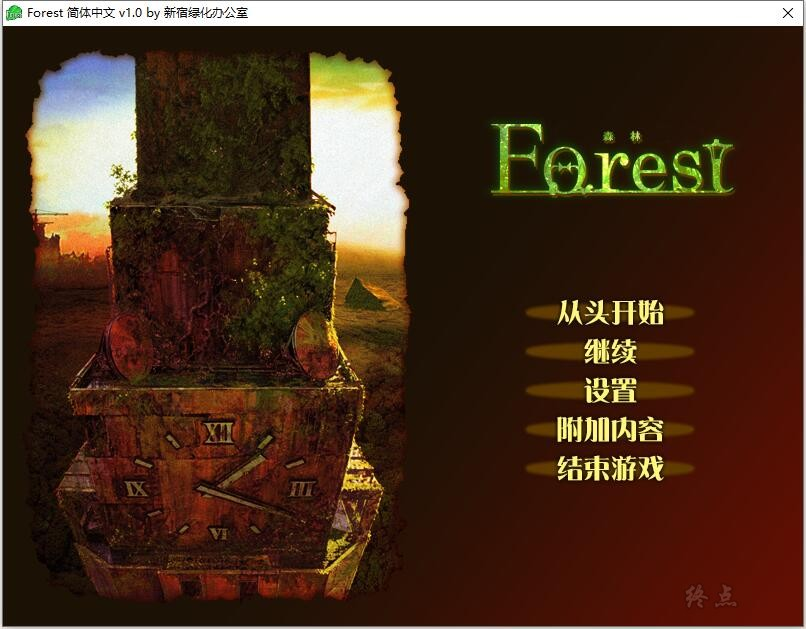
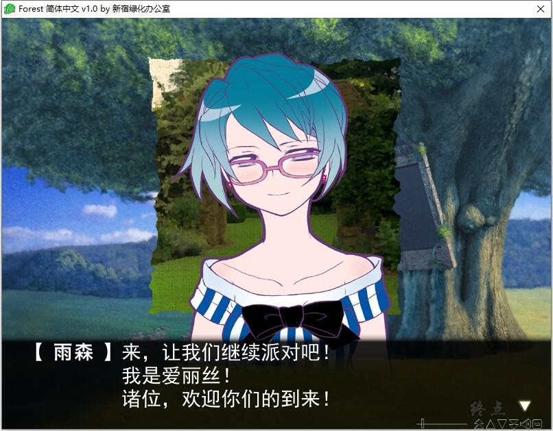
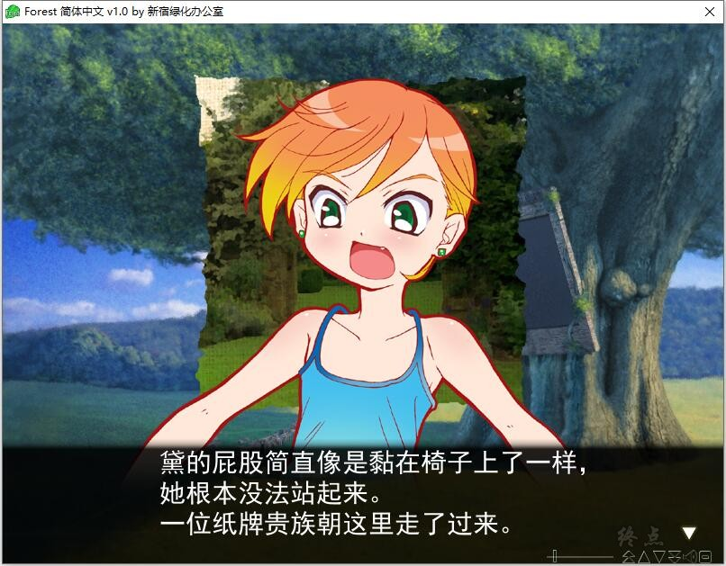
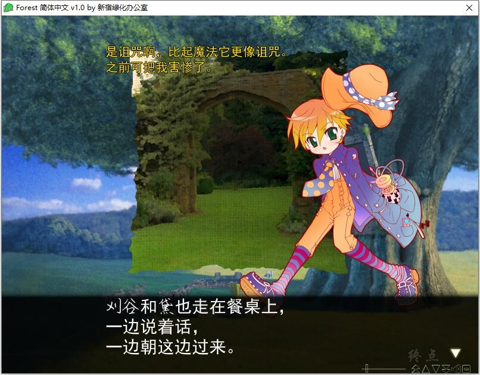
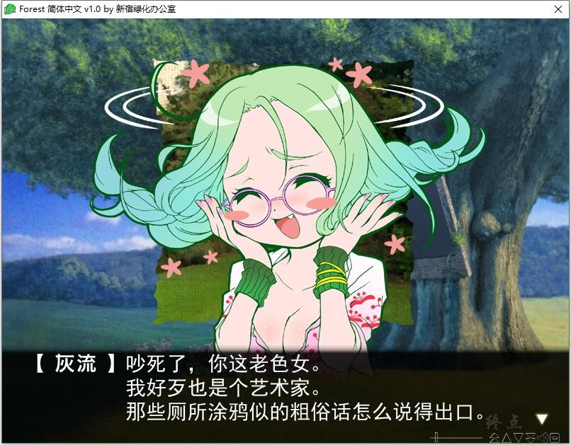
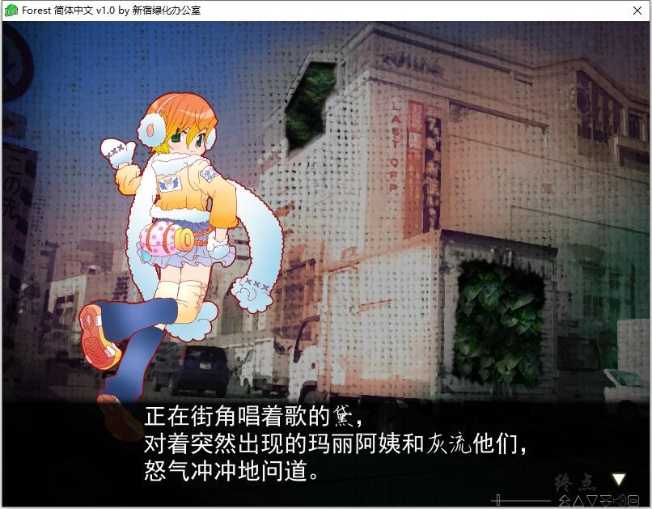
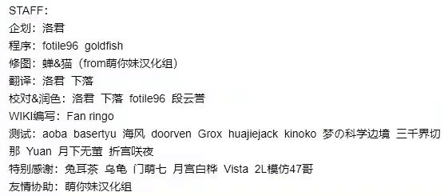

# 故事简介：

「我是爱丽丝。 好了、听我说。」

高楼大厦间、临街小道里、地下水道中……复数的“森”于街道各处出现。

那乃任何常识都不起作用的、禁断的领域。

不被任何人所理解、没有救赎、只是只是持续着孤独地绝望的战斗的他。

“森”那无言的强大之下能够对抗「リドル～riddle～」的、只有获得名为「ギフト～gift～」的超能力。

失败、即意味着、他、比何物何事都要惧怕的「新宿からの追放（驱逐出新宿）」。

*（介绍来自2dfan）*

新宿绿化办公室的汉化作品，详情请看汉化原帖

[汉化原帖](https://tieba.baidu.com/p/7308686869)

**PS：汉化补丁内置了系统时间检测，我测试了下7月2日失效，届时汉化失效无法启动，需要更新，重新下载**

**2021-4-19 更新1.0汉化**

**2021-7-6 更新1.1汉化**

**请使用[IDM](https://www.123pan.com/s/jJprVv-3tMsH)进行下载，使用最新版[winrar](https://www.123pan.com/s/jJprVv-dtMsH)进行解压（非常重要）。**

**解压密码为终点（简体汉字）。**

**添加10%恢复记录，防止网盘抽风损坏。**

