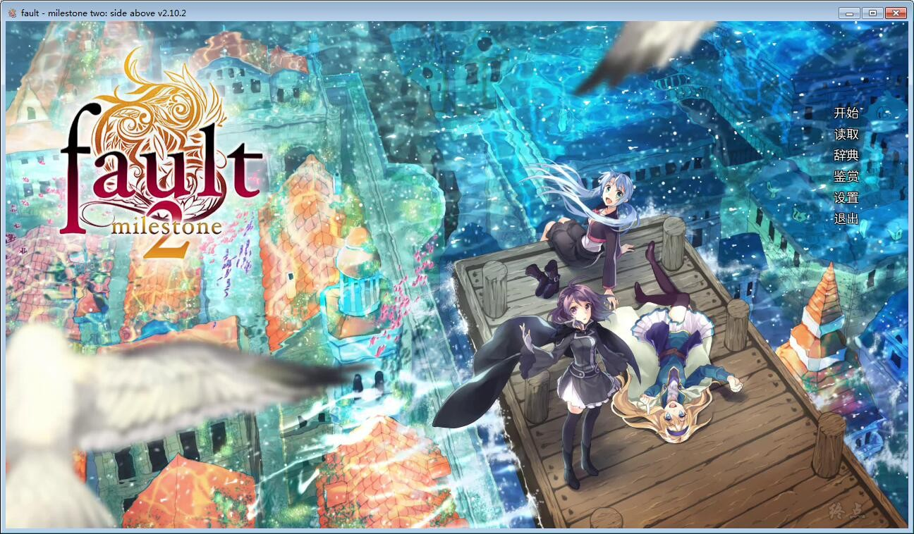
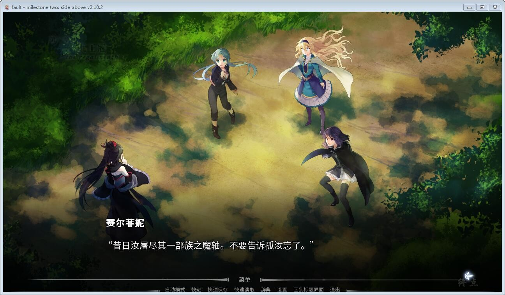
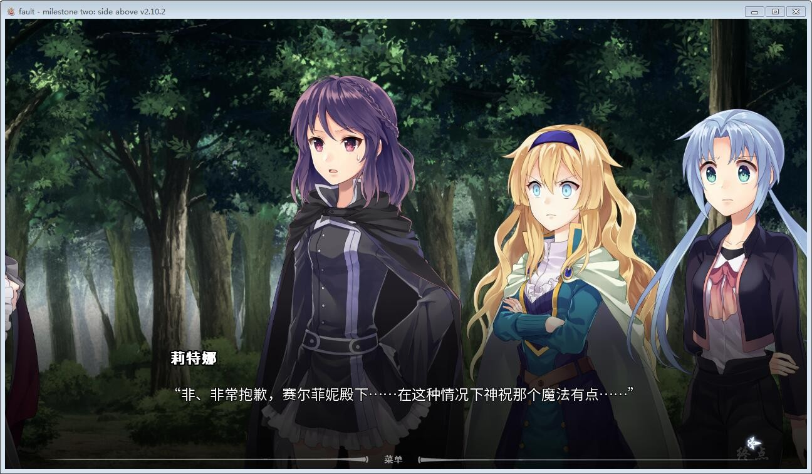
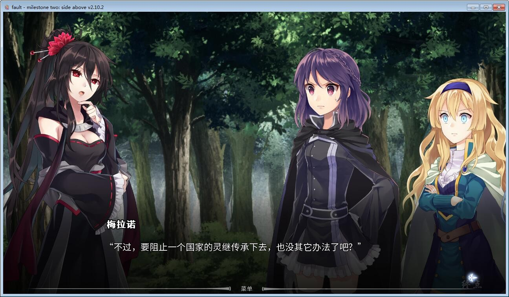
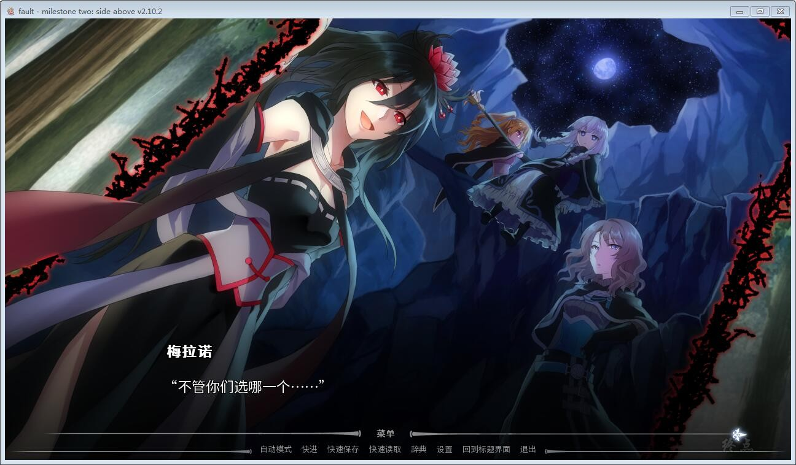

fault - milestone two 上篇（side:above）是一部影像化视觉小说，其剧情紧接前作 fault - milestone one而展开。在全新的3D镜头系统的辅助下，fault - milestone two致力于为玩家带来接近真实而又“超越生活”的阅读体验。敬请欣赏这一宏大的科学幻想故事，跟随赛尔菲妮和她的小团队踏上返回故乡的旅途吧！

请注意这部视觉小说是 fault - milestone one的直接续作，并包含了大量首部作品中的内容。强烈建议玩家在开始本作之前先通关上部作品

感谢论坛，灵梦的自购，游戏是全年龄的

[正版地址](http://store.steampowered.com/app/344770/)

**请使用[IDM](https://www.123pan.com/s/jJprVv-3tMsH)进行下载，使用最新版[winrar](https://www.123pan.com/s/jJprVv-dtMsH)进行解压（非常重要）。**

**解压密码为终点（简体汉字）。**

**添加10%恢复记录，防止网盘抽风损坏。**

