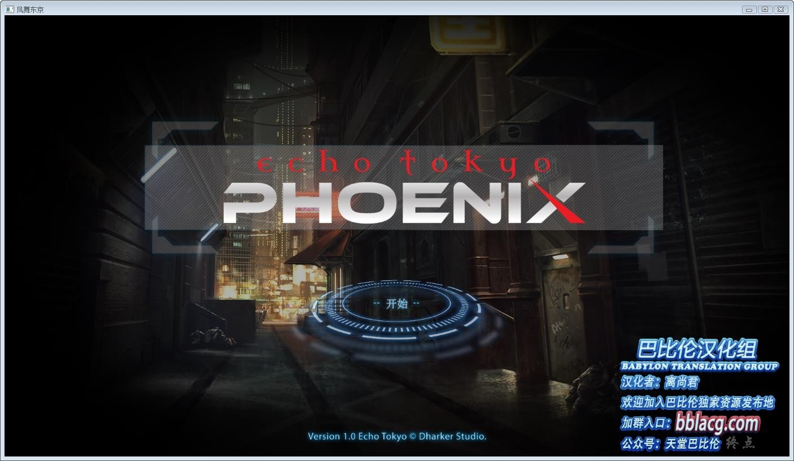
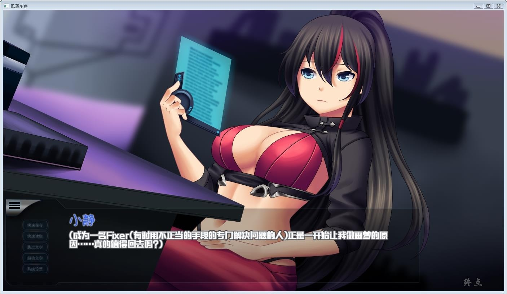
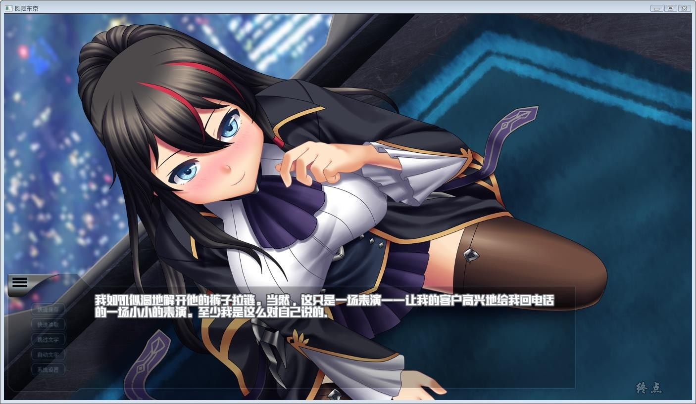
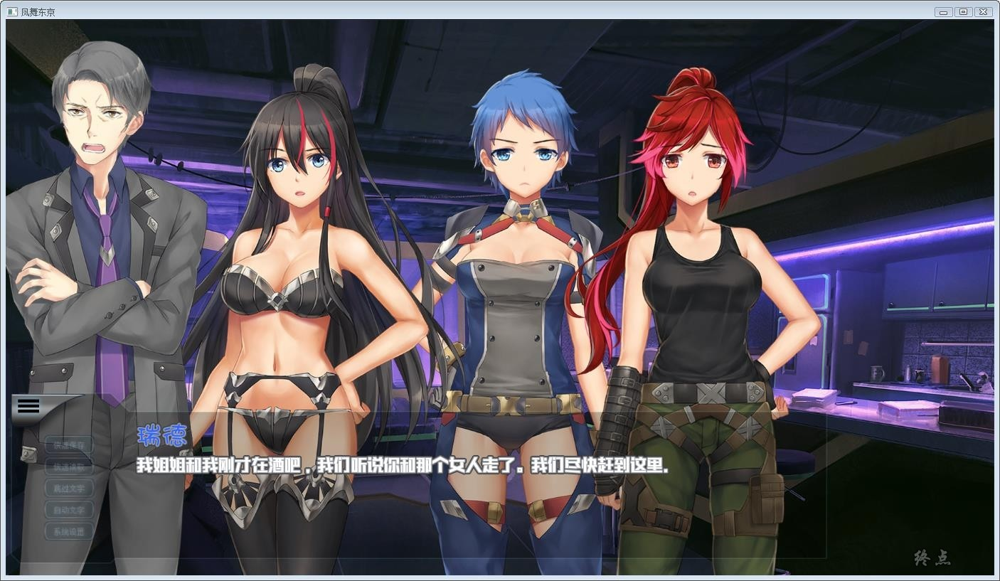
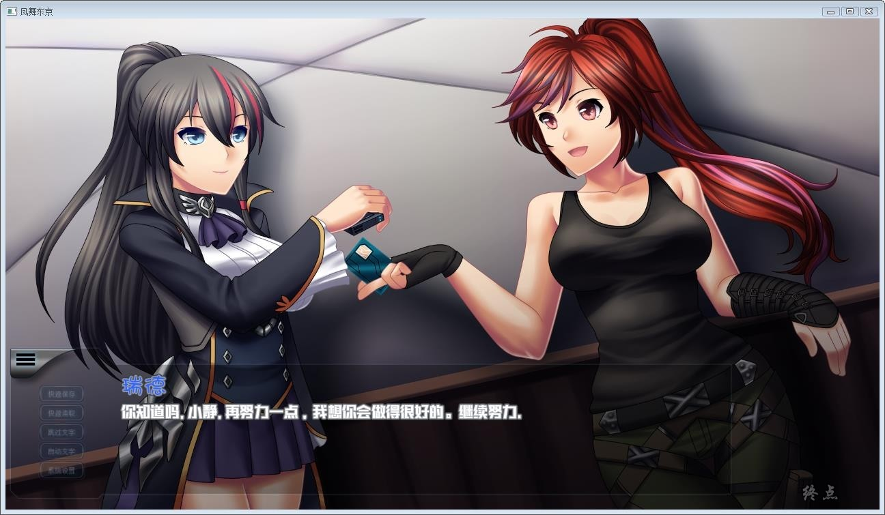
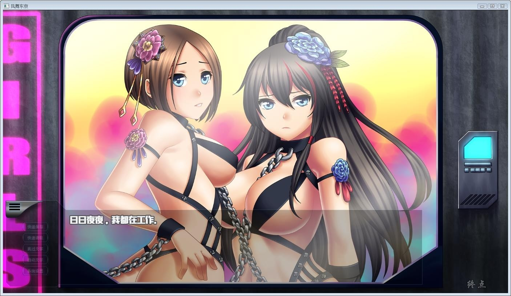

# **游戏简介** 

在一次核事件摧毁了大部分的东京之后，为了生存和逃离地面的辐射

幸存者们在放射云之上建造桥梁和平台，一个新的城市诞生了。

一千年多年后，城市以某种程度继续存在和生存。 

 小静是一个侦探，黑暗的东西潜伏在这个世界中，她的工作是调查它们和揭露真相。  

赛博朋克未来世界，尔虞我诈的勾心斗角，步步杀机的紧张冒险，一言不合就来一枪的疯狂黑道。

游戏有多个分支的故事线，你的决定将不只是影响到你的生存，也会影响其他人和你周围的世界。

**巴比伦汉化组 汉化作品**

**欧美赛博朋克游戏，东京回音系列的新作，有H场景却没HCG。之前我通关过英文版，所以有点印象。**

**2019-5-25 更新汉化修正版本，解决BUG报错问题。**

**请使用[IDM](https://www.123pan.com/s/jJprVv-3tMsH)进行下载，使用最新版[winrar](https://www.123pan.com/s/jJprVv-dtMsH)进行解压（非常重要）。**

**解压密码为终点（简体汉字）。**

**添加10%恢复记录，防止网盘抽风损坏。**