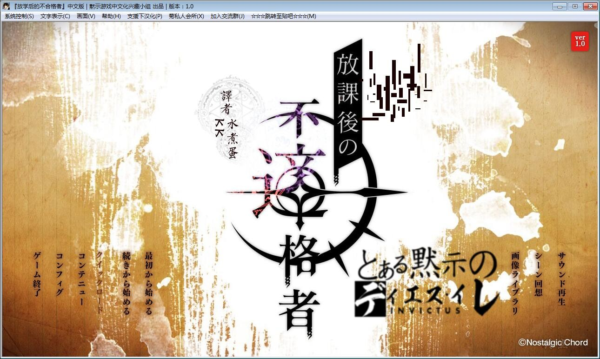
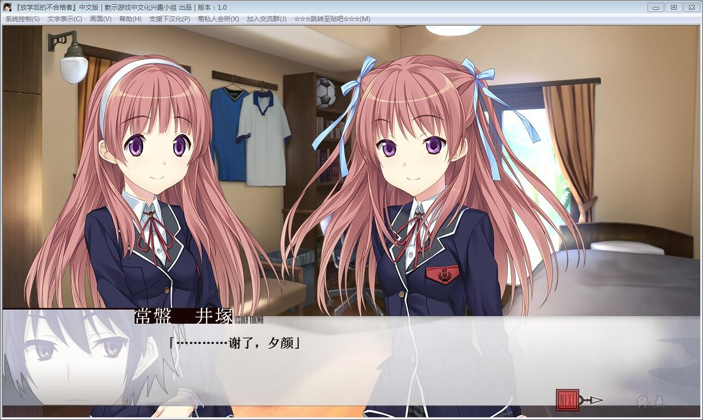
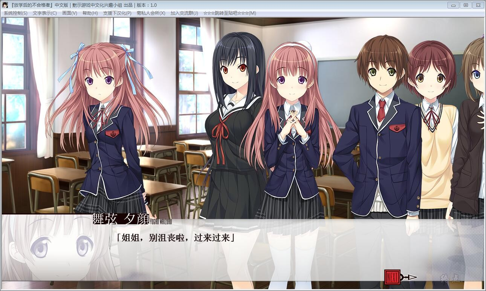
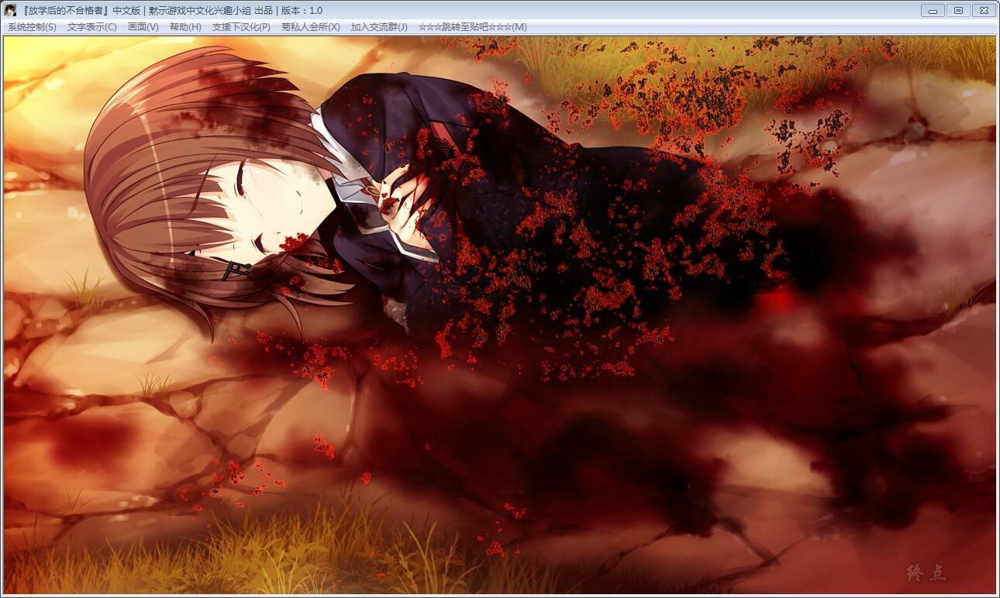

# 游戏简介

「往昔已去成追忆，明日之力今紧记――」

春去秋来的私立秋華学園。

那是一年生总算稍微适应了新的学院生活，二年生全力讴歌着青春，

开始被毕业所追赶着的三年生开始珍惜起仅剩不多的学院生活。

这般的季节。

常盤イツカ，就读于这个秋華学園里的仅仅一名的普通学生。

学年是三年级。兴趣爱好是足球，这般不管在哪里都能见得到的极其平凡的少年。

这样的他与朋友们一起，理所当然的过着与传奇过激等词汇毫不相关的普通的生活。

青梅竹马的双胞胎姐妹，夕顔和朝顔。

同属足球部的亲友的纯。

有着相当长交情的恶友的，康介。

认真角色属性的委员长，奏。

国语教师的班主任，栞。

毫无特别之处我也好人生也好友人也好，即使如此我们也开心的幸福的每日每日的如此生活着。

可是，以某日为界限他们那平和生活为之遽变。

平凡的日常如同被狂风所袭的砂垒般分崩离析四散毁坏。

那情景宛如，是嘲笑着那抱着幸福的残片将头埋入沙坑中的イツカ他们一般无情而猛烈。

黙示汉化组  汉化作品

**请使用[IDM](https://www.123pan.com/s/jJprVv-3tMsH)进行下载，使用最新版[winrar](https://www.123pan.com/s/jJprVv-dtMsH)进行解压（非常重要）。**

**解压密码为终点（简体汉字）。**

**添加10%恢复记录，防止网盘抽风损坏。**

