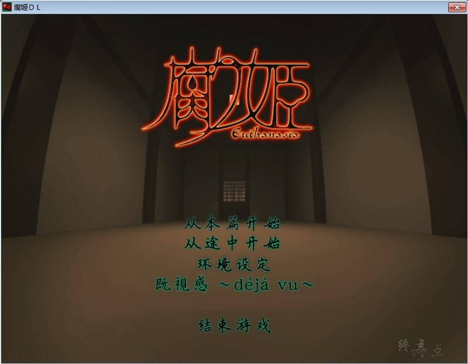
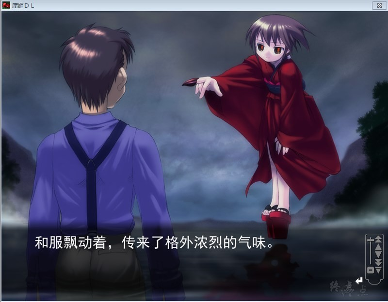
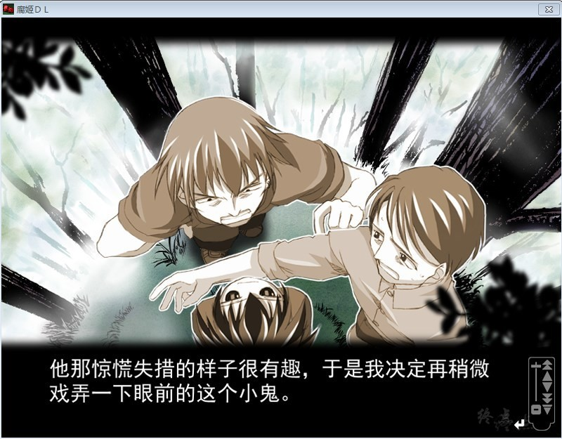
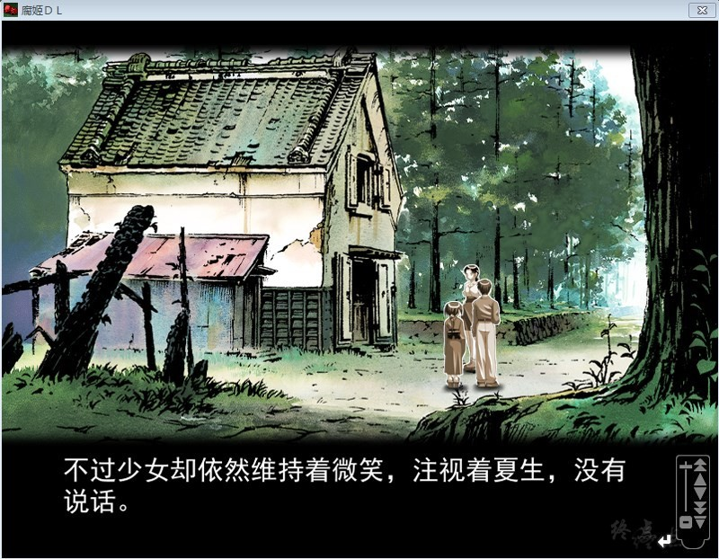

# 游戏简介

《腐姬》完全是到现在为止galgame中最具内涵最RP的的作品之一。公司于2001年六月『腐り姫』开发规划准备工作。 预定于2002年八月二号正式发售,后来直接影响了C+C/沙耶/Fate(HF编）甚至clannad作品走向。
在日本众多论坛里一提到腐姬就一定会结合到C+C/沙耶/Fate(HF编）、也会和曾经高桥龙也的《痕》作比较。

被喻为“究极妹控”向作品，因为传统的“妹控”作品譬如：加奈,更大众的如：DC一般会给人以好的或者唯美的感觉，美满的感觉，但这部作品绝对让你的希望破灭。如果玩过这部作品，还对“妹控”有兴致那你就是究极妹控…
这部作品能通过日本游戏审查真得是奇迹了，也是这部作品最独特的卖点所以很RP，有点人会觉得恶心没有办法接纳。但在这雷雨外衣的包裹中却有一份对家族、对亲情的迫切盼望，极为感人至深。

**请使用[IDM](https://www.123pan.com/s/jJprVv-3tMsH)进行下载，使用最新版[winrar](https://www.123pan.com/s/jJprVv-dtMsH)进行解压（非常重要）。**

**解压密码为终点（简体汉字）。**

**添加10%恢复记录，防止网盘抽风损坏。**

