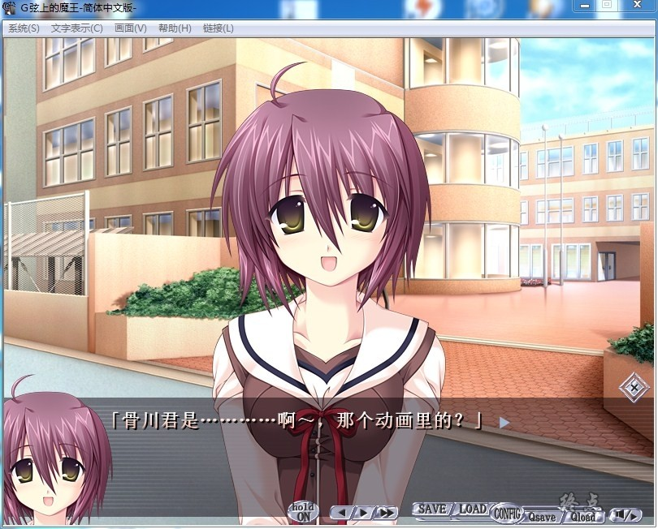
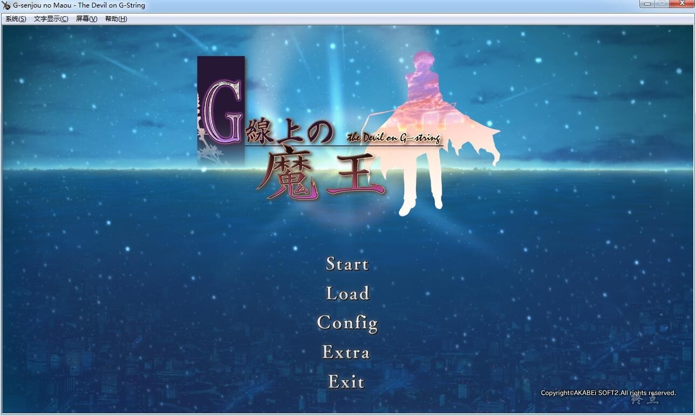

# 原版汉化

# STEAM版汉化

# 游戏简介

赌上性命的——纯爱。

寒冬。"魔王"在下着鹅毛大雪的大都市ZC没。企图，是“人类社会的崩坏”。

主人公浅井京介，一面在学校上学，一面帮养父做生意，周转着大量难以想象资金。

受傲岸的养父影响，他发挥了全部商业才能，一跃成为著名企业的领导者。

然而，平日里他只是个爱好古典音乐的平凡而低调的青年。

身边有同学美轮椿姫和义妹浅井花音、以及好友相沢栄一的陪伴，过着平淡的学园生活。

故事的开端，和一位突然到来的转学生有着密不可分的关系。

京介平凡的日常生活中，一件件不平凡的事件发生了。
转学生到来后，

椿姫一家人被要挟离开一直居住的房子、

花音因参加全国花样滑冰大赛受到恐吓、

学园理事长千金白鸟水羽被绑架犯挟持、

城市内的孩子们开始悄悄地不断地失踪。

这一系列事件，竟全部都和潜伏在都市的"魔王"有关。

这位有着长发的转学生，名叫宇佐美春。她自称“勇者”。

面对神出鬼没的"魔王"，利用头脑打起了一场场斗智斗勇的攻防战。

而有着柔顺长发的美少女、宇佐美春。

她，也正是在京介充满痛苦与无力的孩提时代中，帮助过京介的"勇者"。

时隔十年，京介是否还记得儿时的约定？

随着种种事件的发生，一连串被深深埋藏的真相被逐条揭开。

而一个惊天阴谋就要上演在这看似繁华安定的都市中。

面对种种猜忌，用尽全力来应对“魔王”所设计的“游戏”，经历了以前从未预料过的事件，

“魔王”到底是何人？而京介会做出什么样的选择呢？

一切，等你去发现。

原版汉化

G弦上的魔王汉化委员会  汉化作品

**[Steam地址（英文版）](https://store.steampowered.com/app/377670/Gsenjou_no_Maou__The_Devil_on_GString/)**

感谢论坛成员 風 的自购，有能力请支持正版补票（语音都要用dlc单独买的）

论坛自购分享，转载注明出处。

**2019-4-11  更新Steam汉化版，已打汉化补丁V4.0，语音dlc，添加了h场景**

## 两个版本的区别：

原版的分辨率是800×600，Steam版的画质和分辨率都提升了，分辨率是1280×720

2个版本都整合到了这帖，网盘里请自行选择下载

**请使用[IDM](https://www.123pan.com/s/jJprVv-3tMsH)进行下载，使用最新版[winrar](https://www.123pan.com/s/jJprVv-dtMsH)进行解压（非常重要）。**

**解压密码为终点（简体汉字）。**

**添加10%恢复记录，防止网盘抽风损坏。**

