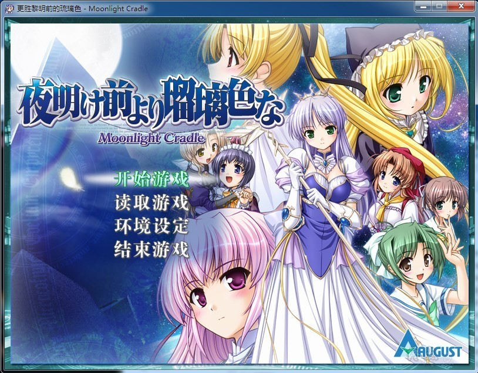
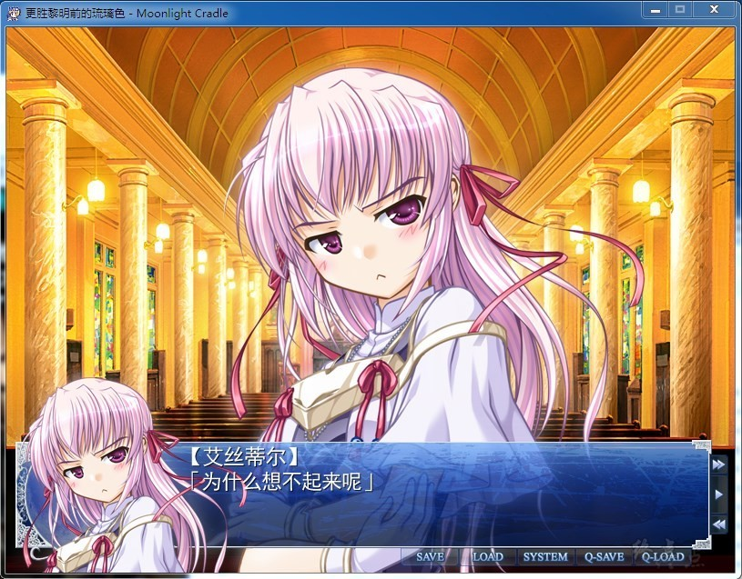
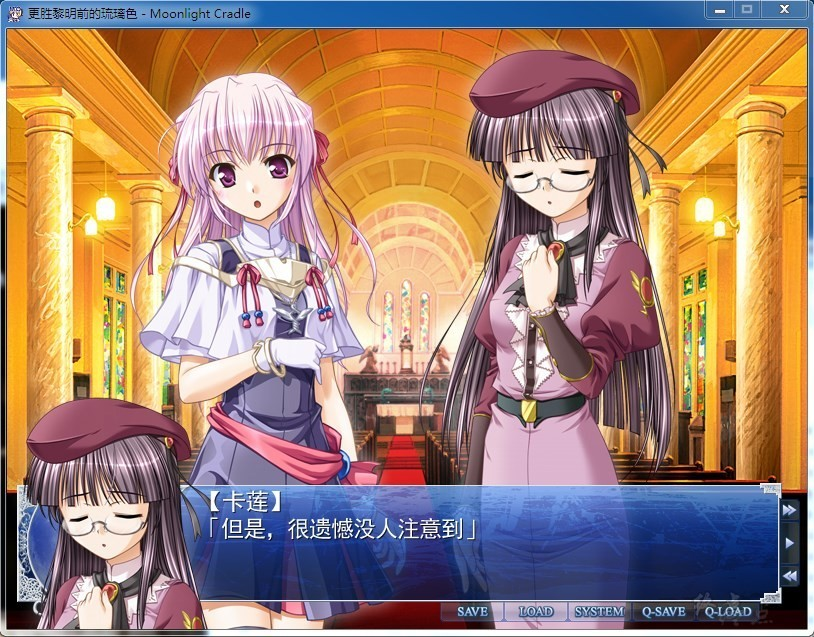
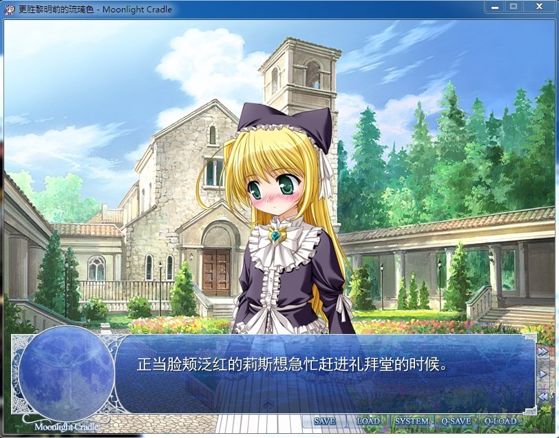

# 游戏简介

续篇故事与全新故事交织而成的月光圆舞曲―――
本章为PS2版的后续故事，统一了到现在截止向多方面展开的『夜明け前より瑠璃色な』世界的最终篇章诞生了！

覆盖了掌控故事关键的新角色・シンシア・マルグリッド在内的以及其他9名女主角，全员都将有五光十色的新编故事发生。玩家能够享受到在本篇里未能尽情描写的时期的故事以及各位女主角在本篇之后的挖掘得更深的After Story等等迄今为止未曾讲述的故事。

值得特书一笔的是，从PS2版开始作为女主角登场的エステル・フリージア＆远山翠，在本作开始可以直接体验到成为恋人后的幸福一刻！对于痴想着「好想对接得更深啊……」的人来说，正可谓是喜讯是也。

以崭新的视点展开的『夜明け前より瑠璃色な』，已经令人无暇旁视!!

CK-GAL中文化小组的作品

[汉化原帖](https://bbs.sumisora.net/read.php?tid=10958461)（权限）

**请使用[IDM](https://www.123pan.com/s/jJprVv-3tMsH)进行下载，使用最新版[winrar](https://www.123pan.com/s/jJprVv-dtMsH)进行解压（非常重要）。**

**解压密码为终点（简体汉字）。**

**添加10%恢复记录，防止网盘抽风损坏。**

