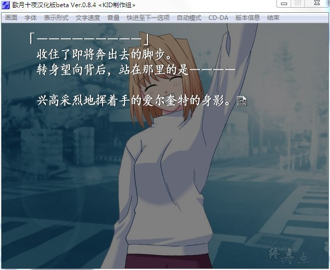
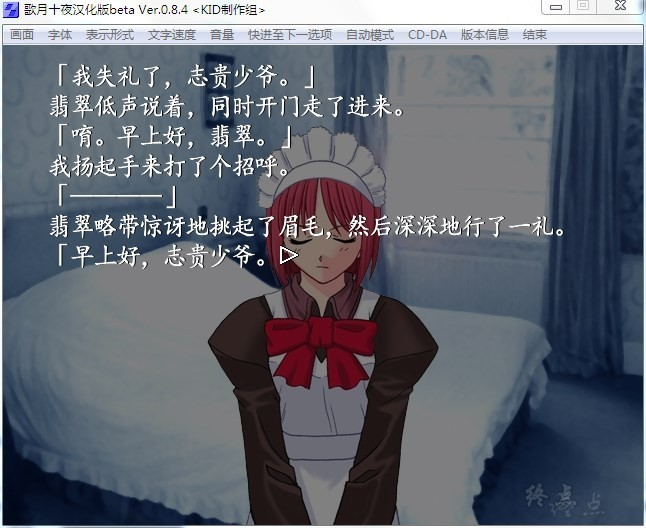

# 游戏简介

说白了本作就是《月姬》的FAN DISC-粉丝互动，TYPE-MOON为了和各位的FANS进行互动娱乐，其中剧情加入了某些FANS投稿的剧情内容。

故事讲述的是本篇剧情完后的又一段故事，是志贵与爱尔奎特的使魔之间和谐友爱的工口剧（口胡）

同时还有数十个短篇故事“梦十夜”以及SPECIAL”醉梦夜”，各个本篇中的人物会聚集在一起上演或搞笑或温情或惊心动魄的大活剧！

TYPE-MOON於2001年制作的月姬FAN DISK，内容覆盖了疯狂的妄想（无论是远野志贵的或玩家的）、对月姬世界的研究讨论，与月姬故事残缺部份的补完。要进行本游戏当然是以玩过月姬为佳，不过单纯想看レン是谁而玩的话应该也不会失望。

游戏进行采事件点数制，可能会让玩家有支离破碎之感。攻略上只说：「多多尝试新的选择，享受月姬的世界，而不是被月姬的世界压得喘不过气来。」

**请使用[IDM](https://www.123pan.com/s/jJprVv-3tMsH)进行下载，使用最新版[winrar](https://www.123pan.com/s/jJprVv-dtMsH)进行解压（非常重要）。**

**解压密码为终点（简体汉字）。**

**添加10%恢复记录，防止网盘抽风损坏。**

