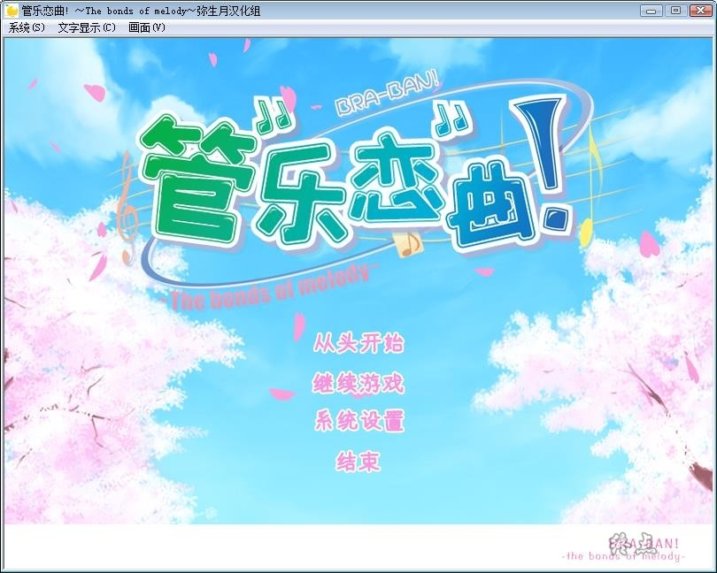
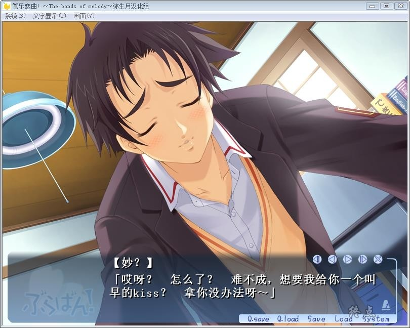
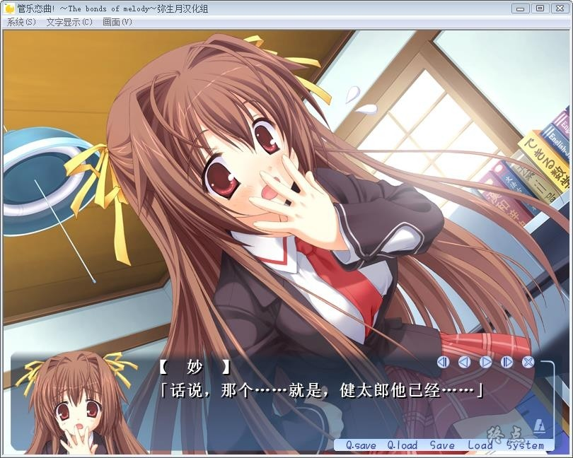
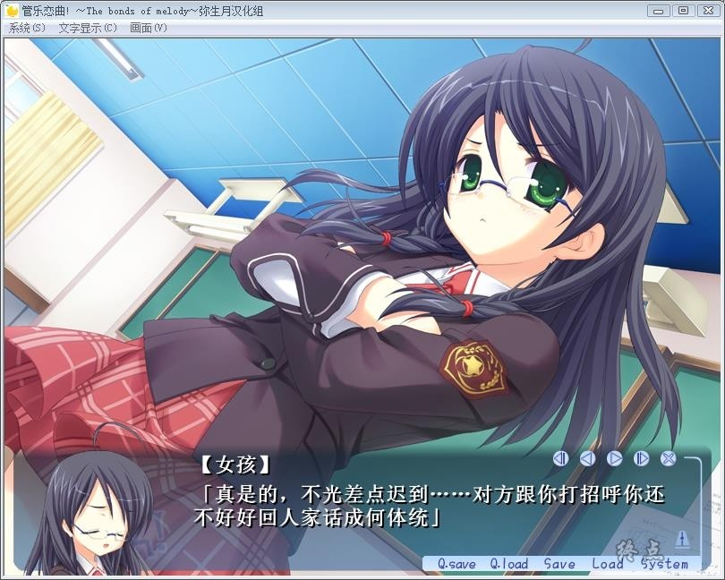
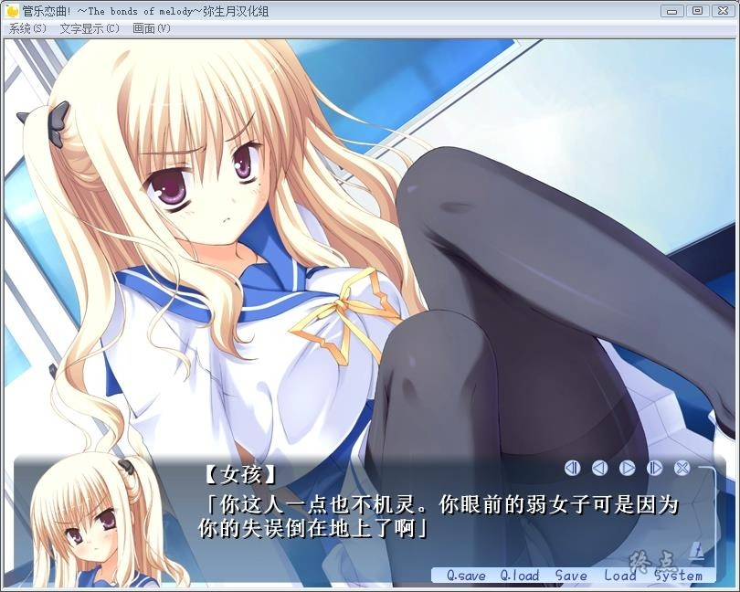
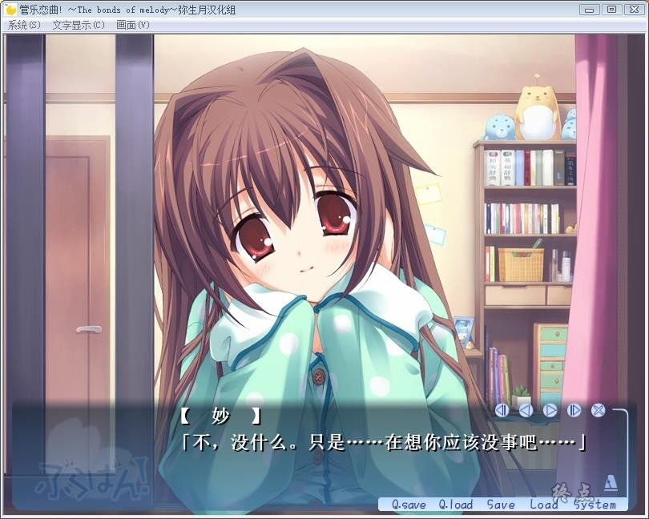
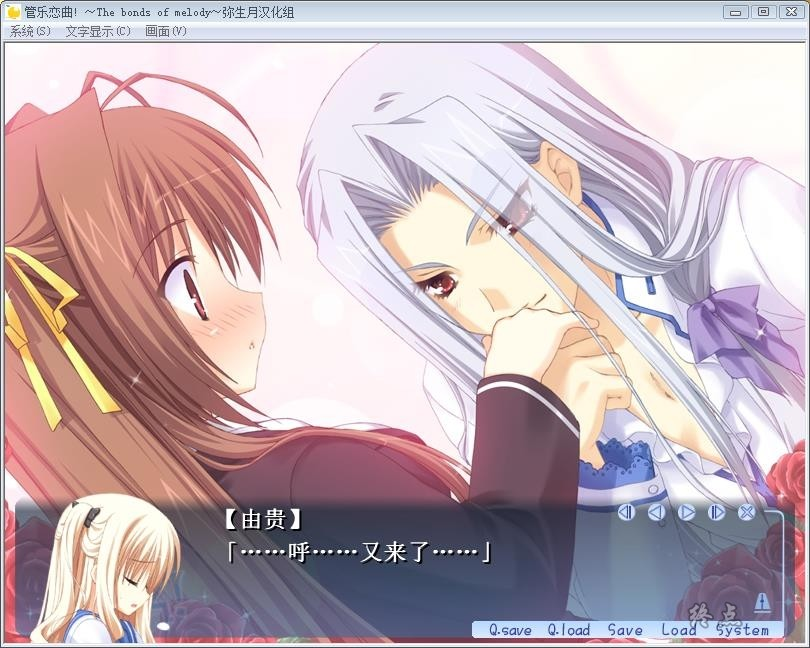
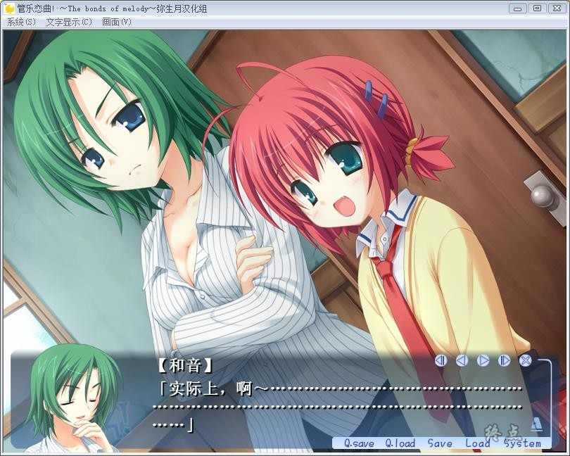
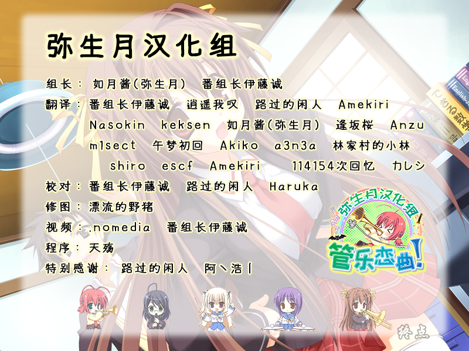

# 游戏简介

某乡间小城―主角所就读的赤城山学园由于当地人口持续减少，生源不足而废校。

春天即将开放的円山学园，将原来赤城山学园的众人分别吸收进了各个新的社团之中，
但是主角所在的铜管乐队却没人要……

而且对方社团的顾问也以“低水平的人没有来的必要”而拒绝他们的加入。

不过一座校园里只能有一个铜管乐队。经过一番商议，学园做出如下决定：

“一个月之后举行一场比赛，得到投票数多的一方为正式的铜管乐队。”

对方是县大赛银奖得主的强人。来到那里的顾问老师拍了拍主角的肩膀，“加油吧，新部长！”

于是，波澜壮阔的社团活动开始了……

弥生月汉化组  汉化作品

**详情请看 [汉化发布帖](https://tieba.baidu.com/p/6117886866)**

柚子社2006年发售的第一部作品，这样就全部汉化了

已打v1.10和v1.11修正补丁，内置全CG存档和攻略

**请使用[IDM](https://www.123pan.com/s/jJprVv-3tMsH)进行下载，使用最新版[winrar](https://www.123pan.com/s/jJprVv-dtMsH)进行解压（非常重要）。**

**解压密码为终点（简体汉字）。**

**添加10%恢复记录，防止网盘抽风损坏。**

