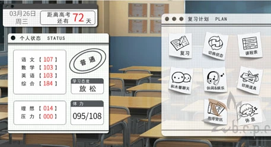
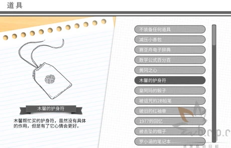
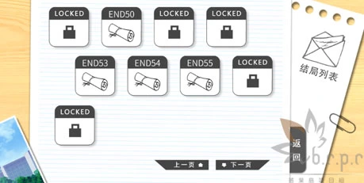
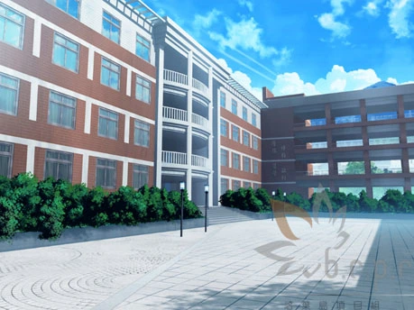
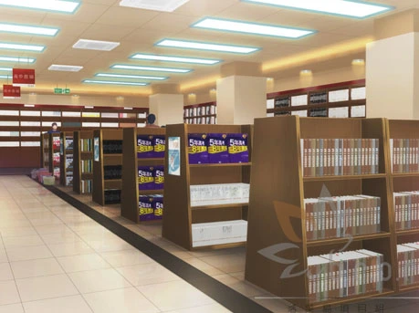
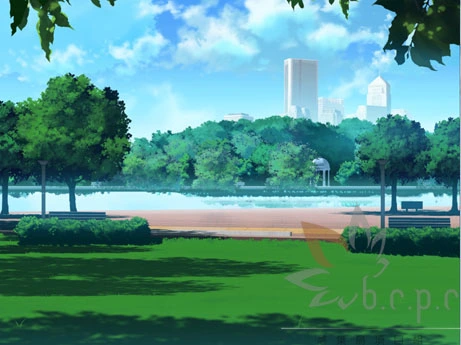
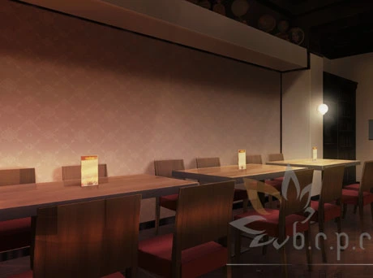
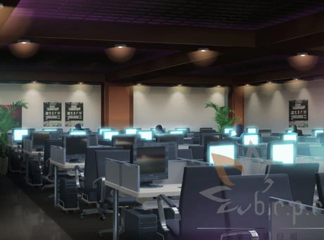

高考，几乎是天朝当代每一位学子必经的一次考试。

谈起这次考试，每位参加过的人，都会留下一段深刻的

回忆吧，即便它可能被封存，但我相信绝不会被忘记。

## 故事简介

《高考恋爱一百天》的主人公是一位平凡的高考应试生。

在距离高考还有100天的时候，他对自己一直以来都暗恋的女生告白了，而这位女生也在惊讶中，接受了主人公的告白。

主人公跟暗恋的女生开始交往了，距离高考还有100天。

在这100天里，等待主人公和她的，将是快乐，烦恼还是忧伤？

恋爱，学业，又该如何取舍？

这一百天，主人公要如何去度过呢？

这一切都取决于你的选择。

无论结果如何，这都将是难忘的一百天。

## 游戏特色

### 养成系统

在高恋的养成系统中，玩家将能够亲自安排这一百天里的各种行动。

玩家的种种行动将影响到各项数值，最终会反映在考试成绩当中。

是顶着压力努力学习，还是倾身投入恋情。

这都将由你亲自决定。

### 道具系统

参考书，电子词典，护身符，桌游（？），游戏杂志（？？）……

游戏中有许许多多的道具可供玩家收集，主人公携带不同的道具会带来许多不同的效果。

当中甚至有能够直接考上重点本科的道具哦。

### 结局众多

高恋拥有高达50种以上的结局。

考试成绩、承受的压力、与恋人的关系、与朋友的关系以及身体的健康情况，都将会影响到游戏的走向。

同样的高考，却会因为你的选择得出许多不同的结局，大大增加了游戏的耐程度。

## 场景介绍

### 校园

故事的主舞台，学习与恋爱，都将在这展开。

传说中在这个校园里面还埋藏着宝藏？

### 新华书店

全国各地都有在经营的连锁书店，在这里可以找到各种各样的书籍。

周末去的话不仅能买到书还可能与朋友们邂逅呢。

### 中央公园

市中心的公园，环境优美，无论是去放松身心还是跟女朋友约会都是很好的场所。

另外在公园里总会有各种各样的活动，在适合的时间去的话，说不定会有意外的收获。

### 咖啡屋

地处学校附近，环境不错，价格不贵，深受广大学生的喜爱。

不过据说最近来了一个很奇怪的女孩子？

### 网吧

与高考备考生格格不入的场所。

不过沉迷于网络的话说不定也能邂逅一段新的感情？

**请使用[IDM](https://www.123pan.com/s/jJprVv-3tMsH)进行下载，使用最新版[winrar](https://www.123pan.com/s/jJprVv-dtMsH)进行解压（非常重要）。**

**解压密码为终点（简体汉字）。**

**添加10%恢复记录，防止网盘抽风损坏。**

