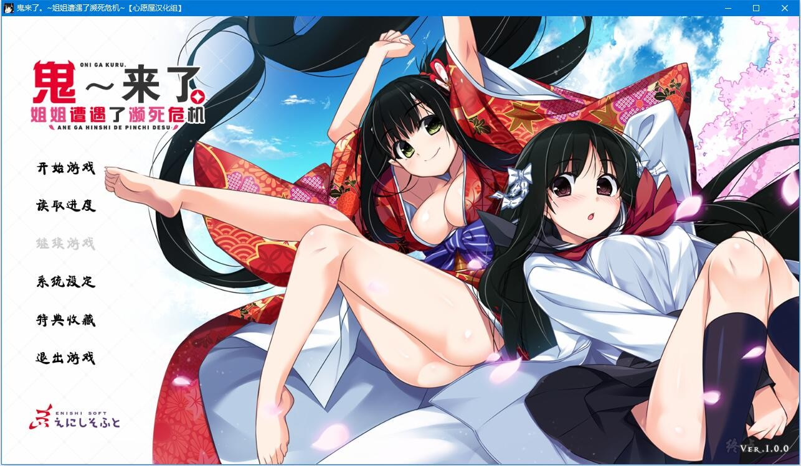
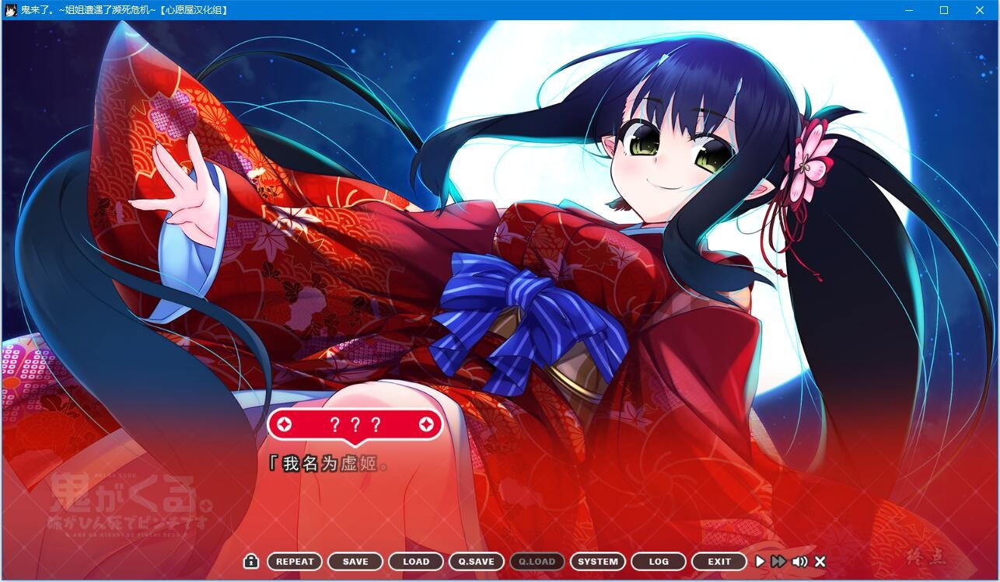
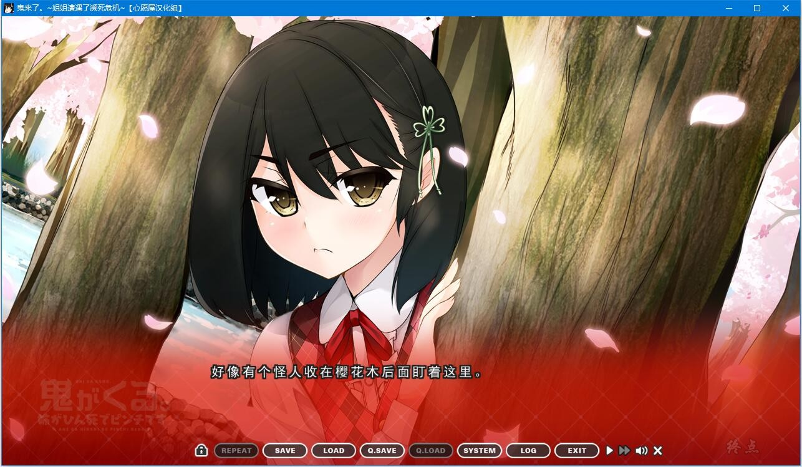
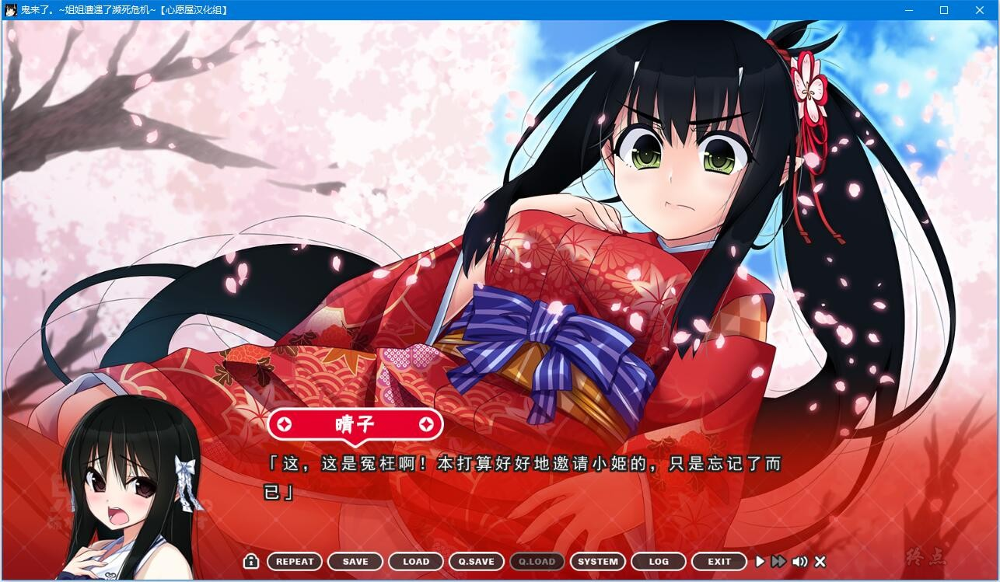

# 故事介绍

为了拯救姐姐・晴子，神明・虚姬在弟弟・阳人的面前现身了。

然而因为信仰心的不足而无法实现他的请求。

晴子：「真是没用啊！」

两人也只能开始努力收集信仰心了。

晴子：「喂喂喂，即使如此也不能二十四小时都和阳人黏在一起哦？」

误以为弟弟会被夺走的晴子越发地对阳人撒娇。

凛凛：「二十四小时都黏在一起的不就是你吗」

而姐弟从小就认识的凛凛却忽然化身为跟踪狂。

凛凛：「才不是跟踪狂呢。只不过跟在后面偷看而已」

而虚姬每天也只在吃零食、看漫画又或是玩手机中懒散度日。

虚姬：「神也是要休息的嘛」

总感觉她休息的时候反而比较多。

晴子：「真是间不容发的状况！为了不让阳人被拐走，我会更努力撒娇的啦！」

于是，越发依存着阳人的废柴姐姐晴子。

每日偷偷在远处看着阳人的凛凛。

总是奴役着阳人，主张对其所有权的虚姬，

围绕着阳人的争夺战日益升温——

——最终，阳人的命运究竟如何！

凛凛：「嘛，怎样都无所谓啦」

阳人：「明明是很重要的事情啊！」

（介绍来自2dfan）

心愿屋汉化组的汉化作品

2月10日加了注册表bat，可以用恢复注册表，启动原版游戏，跳过闪退部分存档后，在切换汉化

2月10日更新V2修正，修复闪退问题

3月4日重压了下，更新V3汉化修正，OP播放顺序修正

**请使用[IDM](https://www.123pan.com/s/jJprVv-3tMsH)进行下载，使用最新版[winrar](https://www.123pan.com/s/jJprVv-dtMsH)进行解压（非常重要）。**

**解压密码为终点（简体汉字）。**

**添加10%恢复记录，防止网盘抽风损坏。**

