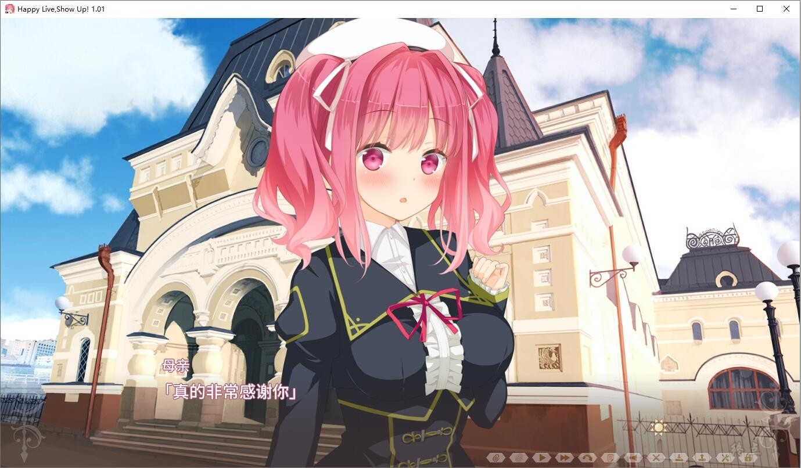

四季寒冷的罗刹大国结束漫长的冬天，迎来春风吹拂的时节——

某日。菜卡斯克学园的2年級学生晓斗・雪原在人潮中发现了与家人走失的孩子，

并与正巧在场的索菲亚・图里纳一起踏上了帮助孩子寻亲的道路。

晓斗使用了魔法，让孩子破涕为笑。

母子平安相会后，索菲亚对晓斗说道：

“能不能教我学习魔法！？”

“我也想变得和你一样厉害！”

晓斗决心照顾索菲亚，直到她找到愿意收留索菲亚并教授她魔法的课堂。

在菜卡斯克站街头，他们邂逅了正在表演的街头艺人露・昴。

“和我一起参加演出（Live）吧!”

这个国家将街头表演称作“演出（Live）”

在露的一句建言下，二人一起报名了街头演艺大赛。

三人究竟能否在正式演出前聚齐成员呢！？

而索菲亚最终能否学会魔法呢！

「Happy Live Show Up!」

这是一篇，与伙伴们齐心打造一颗红日的故事——

[STEAM地址](https://store.steampowered.com/app/1885570/Happy_Live_Show_Up/)

已打补丁

游戏为终点论坛自购，转载请注明终点论坛，谢谢配合

如有能力，还请支持正版

[破解补丁转载地址](https://github.com/name1essa/crack)

来自热心网友的破解，游戏需要安装steam客服端才可启动

2023-3-15 更新破解，增加画质选项，不兼容会有提醒

2023-3-26 更新，官中移植日版，日版已打1.01修正

[转载地址](https://kf.miaola.work/read.php?tid=984246&sf=48b)

**请使用[IDM](https://www.123pan.com/s/jJprVv-3tMsH)进行下载，使用最新版[winrar](https://www.123pan.com/s/jJprVv-dtMsH)进行解压（非常重要）。**

**解压密码为终点（简体汉字）。**

**添加10%恢复记录，防止网盘抽风损坏。**

