# 汉化版

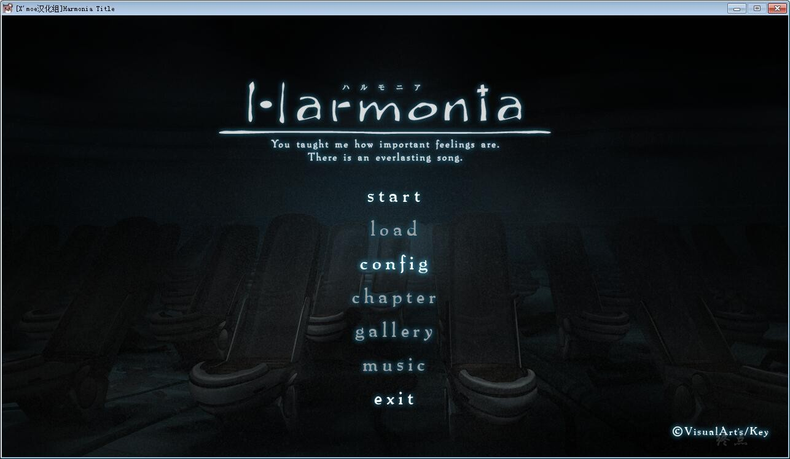

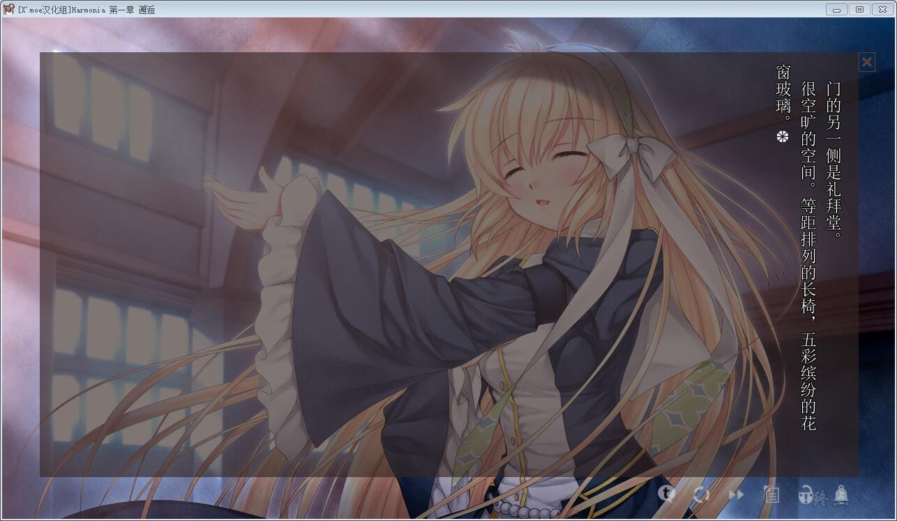

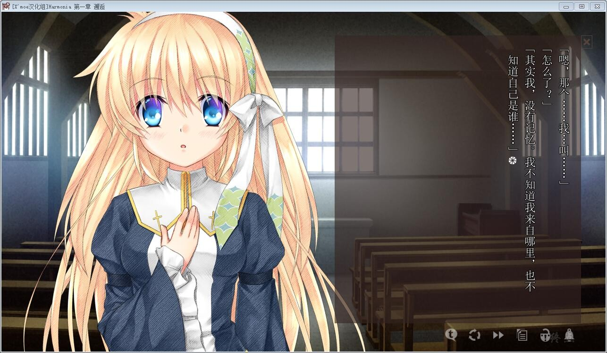

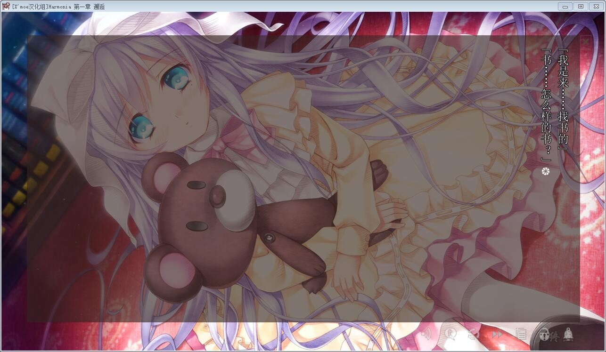

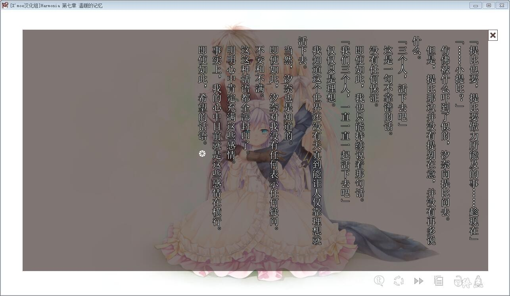

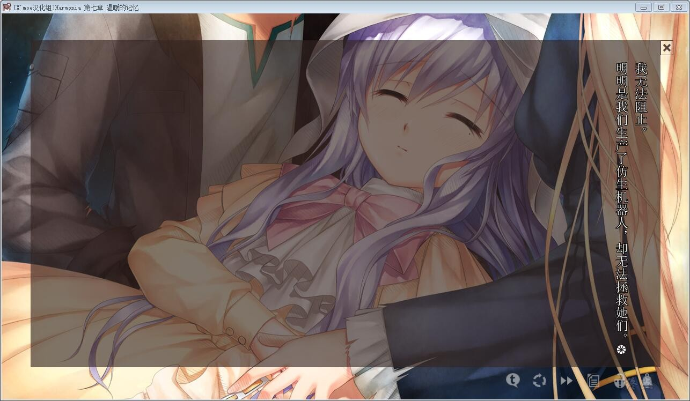

# 官中版

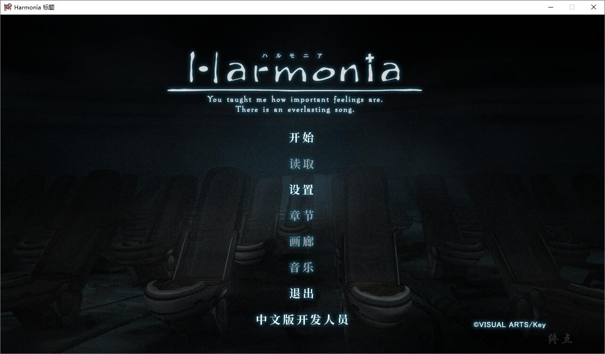

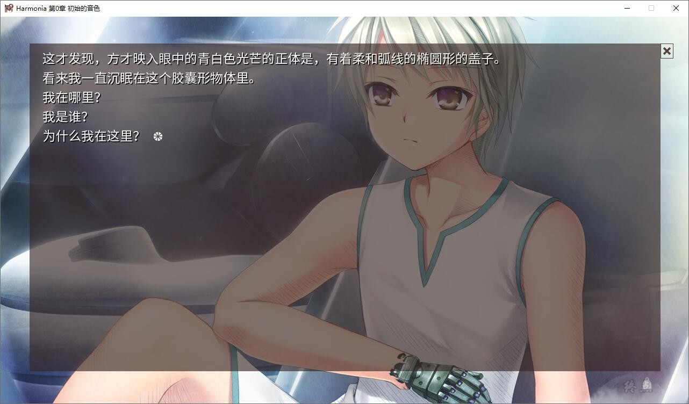

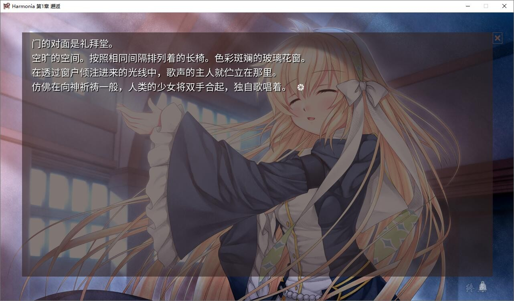

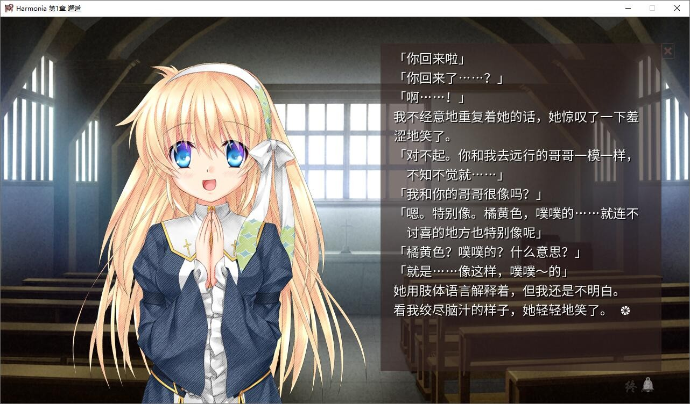

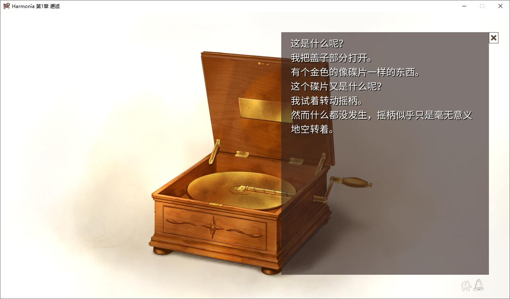

# 游戏简介

「让想要传达的全部乘着歌声飞向明天……。」

这是，遥远时代的故事。

在腐朽的设施当中，并未拥有感情机能而觉醒的机械少年。

他想要接近人类，在荒废的世界中不断行走着。

之后，他与独自一人歌唱的少女相遇了。

随着被少女捡到并一同生活，时钟的指针开始前进。 重要的心情、想要留下的心、没能说出的思念、

想要传达的话语、延续至永远的约定。

X'moe汉化组的汉化作品，补丁不兼容XP，杀毒会拦截补丁，字体设置，首次启动等等，详情请看汉化原帖

\------------------------------------------------------------------------------------------------------------------------------
**2021-12-23 更新steam官方中文**

[DMM地址](https://dlsoft.dmm.com/detail/images_0028/)

steam官中为终点论坛自购，转载请注明终点论坛，谢谢配合

如有能力，还请支持正版

[steam地址](https://store.steampowered.com/app/421660/Harmonia/)

**请使用[IDM](https://www.123pan.com/s/jJprVv-3tMsH)进行下载，使用最新版[winrar](https://www.123pan.com/s/jJprVv-dtMsH)进行解压（非常重要）。**

**解压密码为终点（简体汉字）。**

**添加10%恢复记录，防止网盘抽风损坏。**

