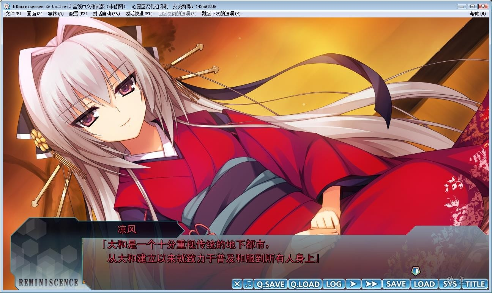

# 游戏简介

给てぃーぐる的出道蓬荜生辉的『レミニセンス』，其作为完结篇的续作终于出场了！

故事主线将会由新女主角大善寺涼風、获得了很高的人气的女配角長谷川恋、倉屋敷和葉来发挥强烈的存在感！

另外，也会有对前作的女主角キズナ、秋、アクセラ、凛、希望等5人进行描述的、各自的亲热缠绵的后记。
敬请在玩本作前复习前作。

# 故事介绍

自从主人公島津秀隆成了特务官后，2年过去了。

秋、希望与凛等人也早已毕业，在她们正往各自的道路开始前进的此刻，

一个很大的变化造访了希望镇与梦想镇：

名为『大和』的第三个地方被发现了。

两地本想着与大和保持和平的关系而开展了外交交涉，然而大和却是单方面地漫天撒价。

那就是，要希望镇与梦想镇交出全部技术。

特别对倉屋敷表示出强烈关注的大和，提出了要得到倉屋敷和葉的要求。

而且还威胁两个镇，说倘若不接受这个要求，就会诉诸武力。

为了回避这个情况发生的希望镇与梦想镇的特务官们，开始投身于严峻的交涉之中。

心愿屋汉化组  汉化作品

**详情请看 [汉化发布帖](https://tieba.baidu.com/p/6002084110)**

**衣笠彰梧作品，晓之护卫的未来时间线。**

**具体看游戏简介，内置全CG存档和攻略。**

**有兴趣的话，建议玩下前作，补下剧情。**

**レミニセンス，2DFan介绍，[点我查看](https://www.2dfan.com/topics/1895)。**

**2019-5-10 更新汉化补丁V10，解决闪退问题。**

**请使用[IDM](https://www.123pan.com/s/jJprVv-3tMsH)进行下载，使用最新版[winrar](https://www.123pan.com/s/jJprVv-dtMsH)进行解压（非常重要）。**

**解压密码为终点（简体汉字）。**

**添加10%恢复记录，防止网盘抽风损坏。**

