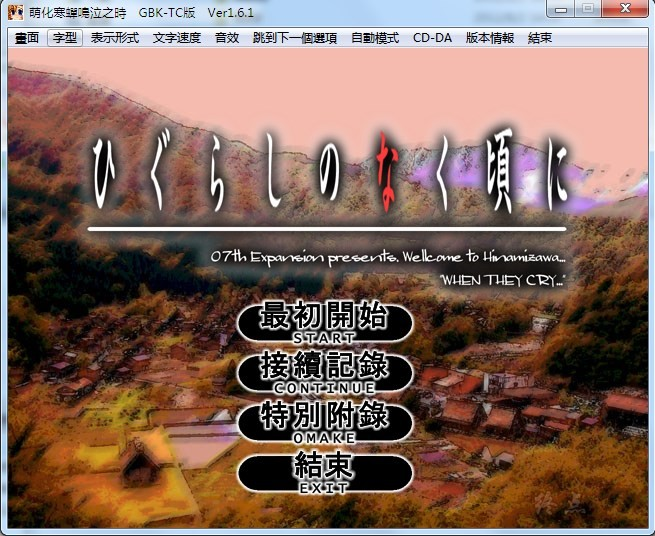
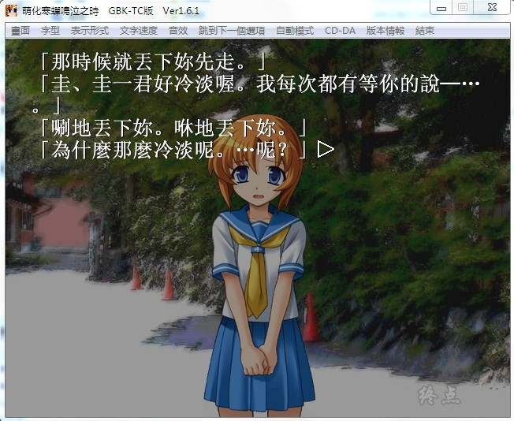
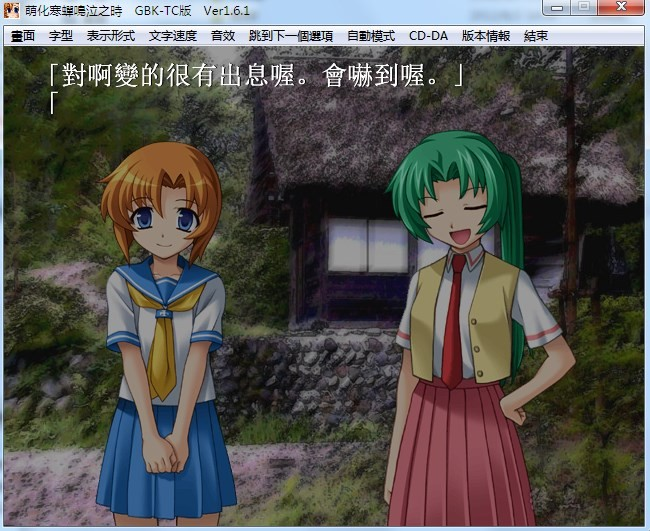
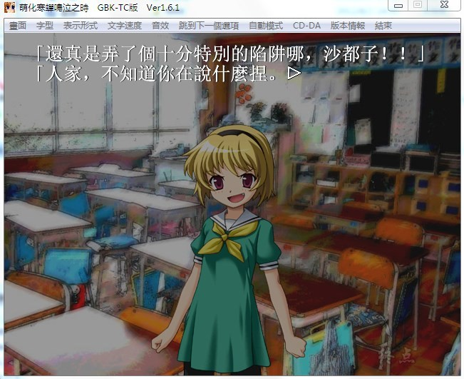

# 游戏简介

鹿骨市雏见泽村是一个人口未满2000人的小村庄。此村过去曾因一水坝工程遭逢灭顶危机，幸而村民团结一致，阻止该工程的进行。水坝工程无限期冻结后的第5年（昭和58年），前原圭一随着家人移居此村。圭一开朗的性格使他轻易和新学校的朋友们打成一片，然而他们和平的日子，却在名为“綿流し祭”的祭典当天后开始产生变化。过去四年来“綿流し祭”当天都会发生一个人死亡、另一个人失踪的事件。这也是雏见泽村里的秘密所在。

**请使用[IDM](https://www.123pan.com/s/jJprVv-3tMsH)进行下载，使用最新版[winrar](https://www.123pan.com/s/jJprVv-dtMsH)进行解压（非常重要）。**

**解压密码为终点（简体汉字）。**

**添加10%恢复记录，防止网盘抽风损坏。**

