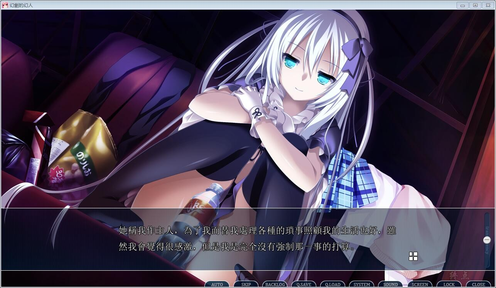

# 游戏简介

七年前，发生了被称为“Naglfar之夜”的现象（注： 北欧神话诸神之黄昏之时）

同时，巨大的空间裂缝产生，也带来了现实中的二次灾害

...........从那天开始，夜空ZC现了“Aurora”（注：Aurora，极光，）

从前在这个国家被称作首都的地方，因为地壳运动的影响承受了巨大的打击，不过，由于瘫痪后，担当都市机能中枢的城市不断改变，原首都机能的回复也得以顺利进行，于是现在，它以和原来几乎没有不同的样子被复原了

住在取回都市机能的“新市街”的主人公 水濑优真
住在残留着地壳影响伤痕的主人公 赫

在似乎是巧合的命运下，两人相遇了，展开了两人间，离奇宏大的命运篇

AUGUST中文化委員會的作品

[汉化原帖](http://bbs.seikuu.com/thread-155557-1-1.html)

**2020-5-20 制作汉化硬盘版，无需挂镜像启动了，感谢 風 的技术支持**

**请使用[IDM](https://www.123pan.com/s/jJprVv-3tMsH)进行下载，使用最新版[winrar](https://www.123pan.com/s/jJprVv-dtMsH)进行解压（非常重要）。**

**解压密码为终点（简体汉字）。**

**添加10%恢复记录，防止网盘抽风损坏。**

