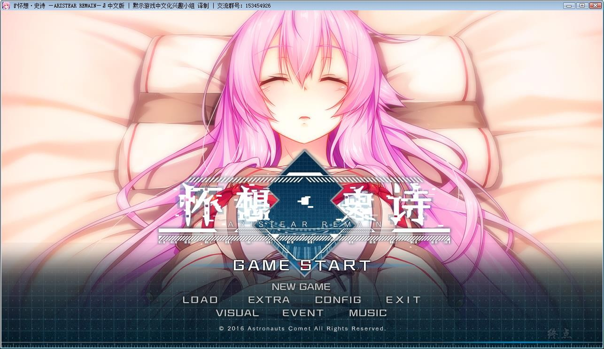
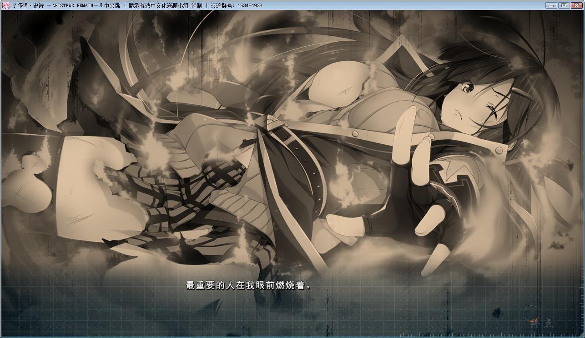
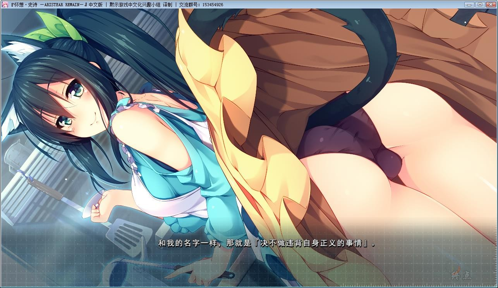
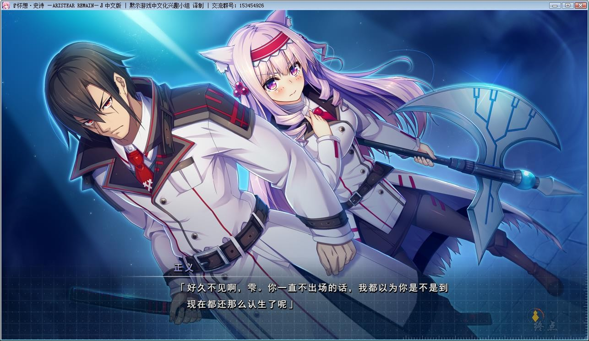
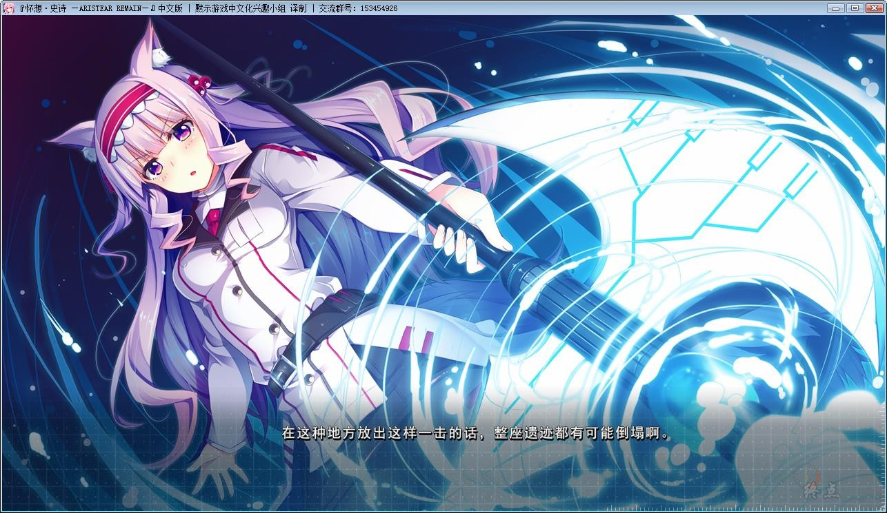
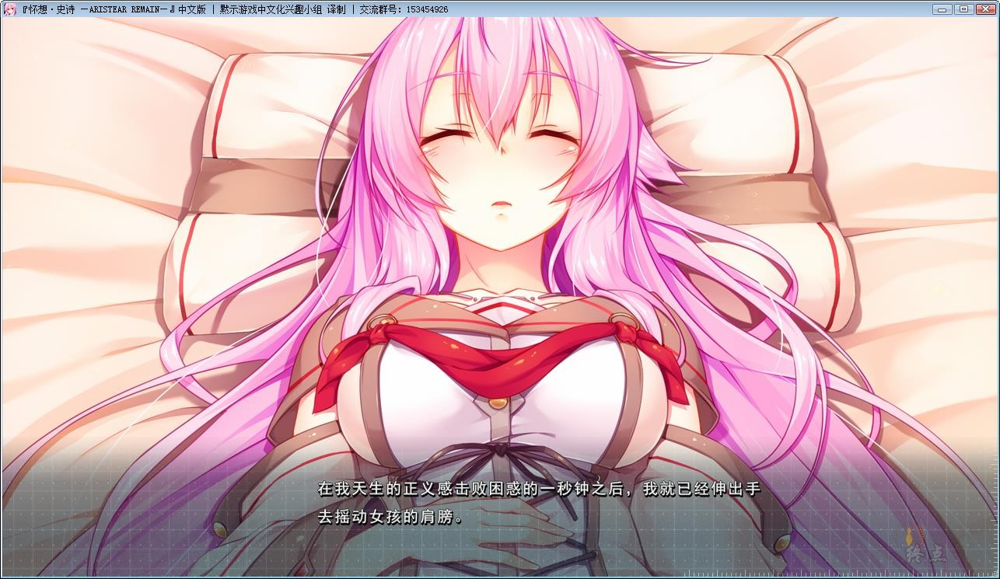
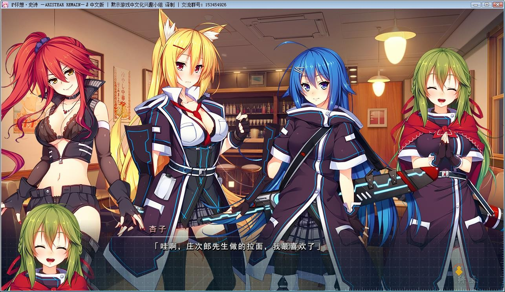
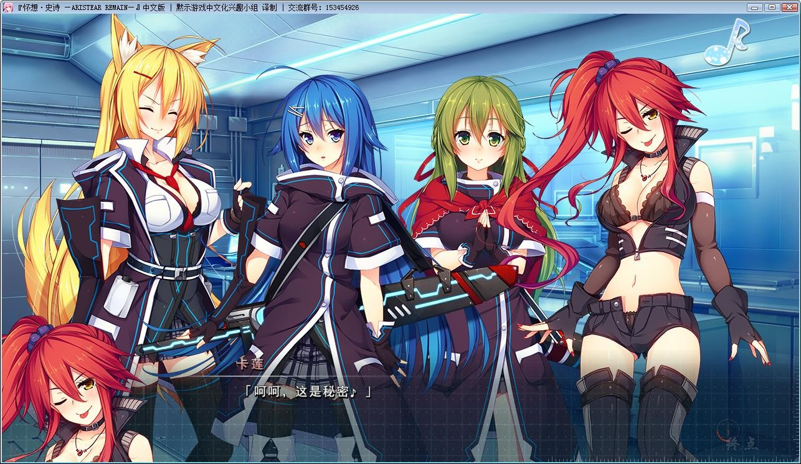
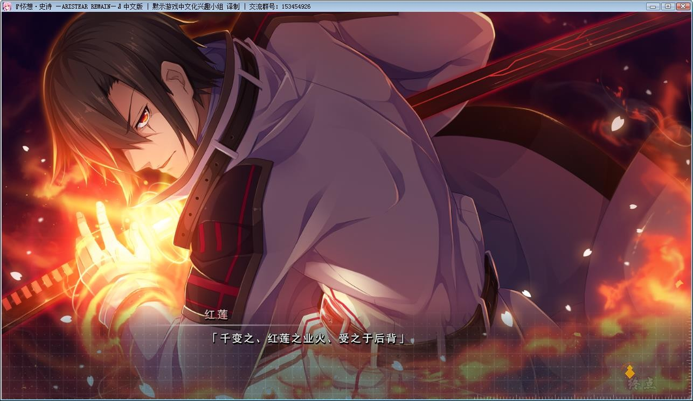
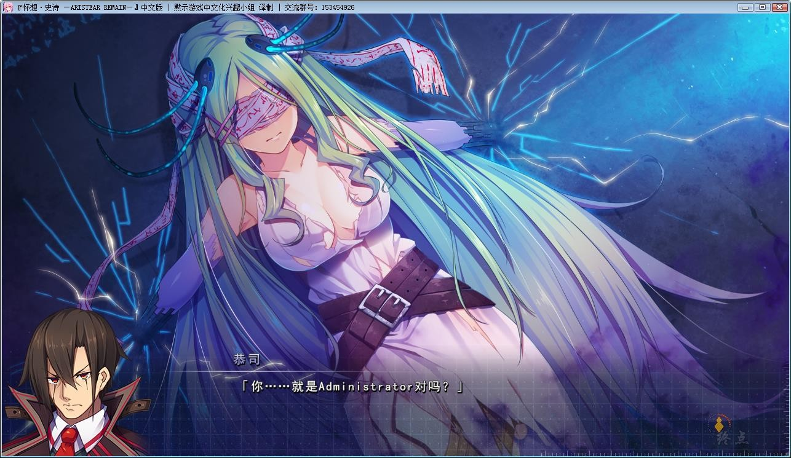

# 游戏简介

*（来自2DFan）*

这里是，与现代日本似是而非的异世界。

本物语便发生在这个世界的其中一个都市・「神森」内。

「魔法」作为理所当然的力量而存在于这个世上，与科学技术的融合使得文明高度发展。

然而乍看之下一派祥和的世界，繁荣的底部仍不时翻覆着层层不寻常的暗涌。

这便是这个世界的常态。

人们把那些事件及相关人物称为「里社会」，这个社会当下也确实有着不少的居民。

通称「便利屋」。只要不触碰法律，无论任何工作都会接手的家伙。

这种职业理所当然地在这个世界里存在着。

初出茅庐，刚起步着手此行的青年，这里便有一枚。

他的名字是「桐岛正义」。

人如其名，是一位即使身为便利屋，也坚持要贯彻自己“正义”的一根筋青年。

不过他原本其实是这个世界的某个特殊警察组织的一员，因某种缘故而委身于便利屋。

然而因某次便利屋的工作，让他收留了一枚记忆丧失的少女。

完全不清楚自己身份的谜之少女「露露」

以她与正义的偶然相遇为契机，从久远便设计好的、
巨大的历史齿轮渐渐复苏……

便利屋的助手「春香」。以前曾是正义同僚的「艾尔莎」。

后辈的「舞」和「杏子」——

默然的齿轮将与正义亲近的人们都卷入事件，缓缓地开始了转动。

黙示汉化组  汉化作品

塔下兵势×异之课题的续作，不过取消了卡牌战斗系统。

内置全CG存档和攻略，游戏没选项，一条主线走到底。

**2022-05-29  添加Win10兼容文件，资源重压。**

**请使用[IDM](https://www.123pan.com/s/jJprVv-3tMsH)进行下载，使用最新版[winrar](https://www.123pan.com/s/jJprVv-dtMsH)进行解压（非常重要）。**

**解压密码为终点（简体汉字）。**

**添加10%恢复记录，防止网盘抽风损坏。**

