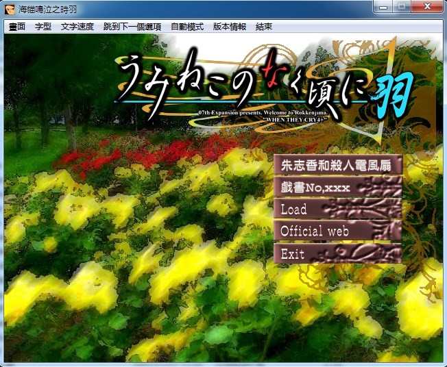
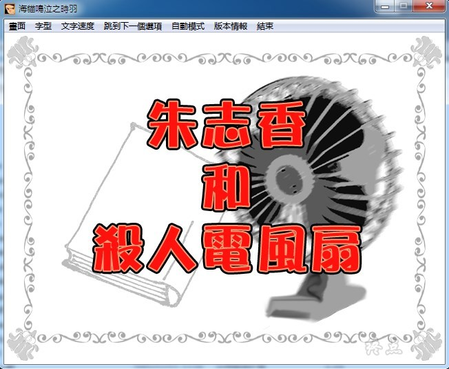
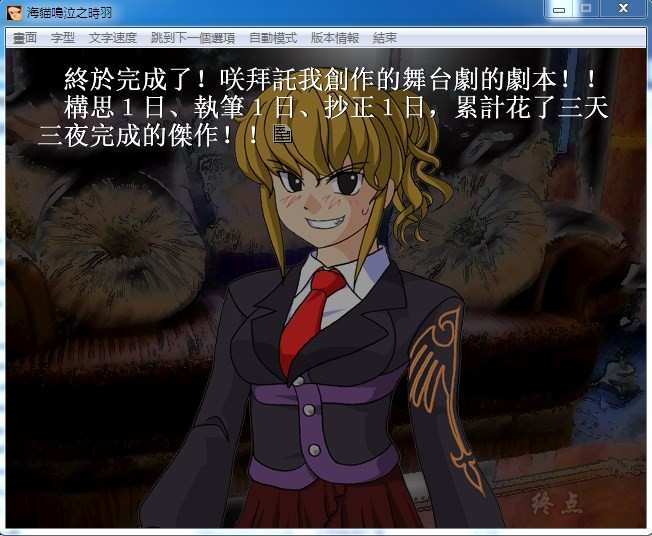

# 游戏简介

《海猫鸣泣之时》的舞台是在日本伊豆群岛中，一个名为六轩岛的小岛上。这个长度只有10公里的小岛，是大富豪右代宫家的私有领地。

1986 年10月4日～5日，由于召开一年一度的家庭会议，右代宫全族成员都集中在岛上。由于家族首脑，右代宫金藏已病入膏肓，他的子孙们都急着想要瓜分掉他的遗产。原本为分割遗产而举行的家族会议，却因为台风的缘故而将聚集而来的18个人完全困在了岛上，电话无法接通、船只也无法起锚，岛屿成了一个彻底封闭的空间。而与此同时，在岛上又发生了神秘的连续杀人事件！

为了这些财宝而勾心斗角的人们，突然收到到了来自传说中赐给了右代宫金藏十吨黄金的“魔女”的可疑信件，原本应该只有18个人的岛上，竟然还存在着第19个人？不断出现的残酷杀人事件，留在现场的无法解开的谜团。接下来究竟谁会死去，谁能活下来，或是所有人都会被杀？犯人就在这18人中间么，还是那个神秘的“魔女”？

此乃魔女对人类的挑战,剧中主角只会给出最基本的推理,一切由你来思考,由你来找出线索,由你来推理.

向魔女屈服,它就是人魔大战的奇幻剧.

向魔女抗争,它就是地地道道的推理剧.

要怎么玩,由你自己来选择.

**请使用[IDM](https://www.123pan.com/s/jJprVv-3tMsH)进行下载，使用最新版[winrar](https://www.123pan.com/s/jJprVv-dtMsH)进行解压（非常重要）。**

**解压密码为终点（简体汉字）。**

**添加10%恢复记录，防止网盘抽风损坏。**

