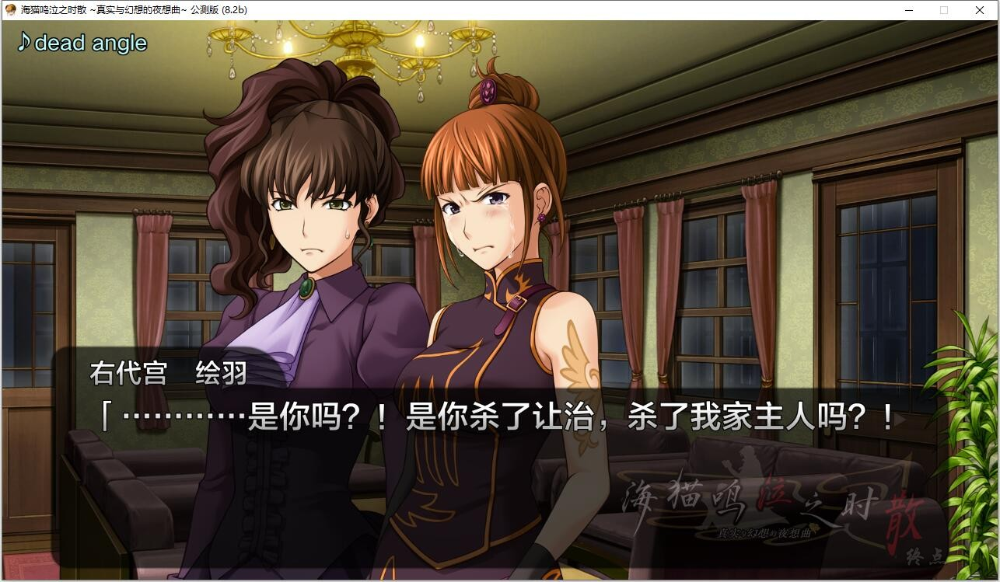

# [发布原帖](https://snsteam.club/)

# 建议先看原帖内容

**海猫鸣泣之时 ～轮舞曲与夜想曲 移植版～**

是由民间制作组 Umineko Project 基于 Alchemist 制作的 PS3 游戏《海猫鸣泣之时 ～魔女与推理的轮舞曲～》与《海猫鸣泣之时散 ～真实与幻想的夜想曲～》进行移植重制版本，该版本包含了 PS3 版《海猫》与《海猫散》的全部内容。

为了实现“完整还原 PS3 版”的游戏体验，制作组对游戏进行了完全重制。不同于旧有的 PC 版补丁，本移植版拥有与 PS3 版完全一致的视听效果，并对 PS3 版系统进行了多项优化。

完整还原 PS3 版游戏的 CG、语音、特效、动态立绘。

全高清 1080p 画质， 60fps 帧率。

支持 Windows、macOS、Linux、Android、iOS 系统。

支持中文、英文、俄文等多种语言。

渲染引擎迁移至 OpenGL，并对游戏进行全面重制。

优化 PS3 版旧有游戏系统，并全新增加奖杯、注释、曲名与歌词本地化等便利功能。

**请使用[IDM](https://www.123pan.com/s/jJprVv-3tMsH)进行下载，使用最新版[winrar](https://www.123pan.com/s/jJprVv-dtMsH)进行解压（非常重要）。**

**解压密码为终点（简体汉字）。**

**添加10%恢复记录，防止网盘抽风损坏。**

