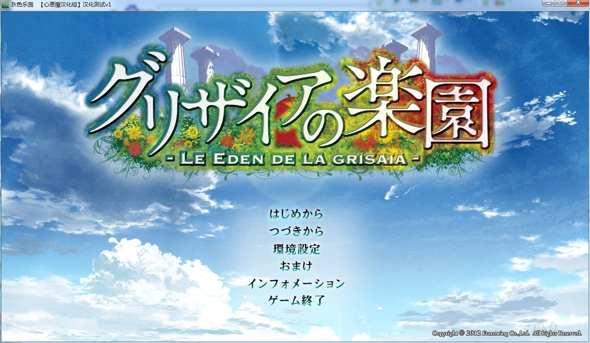
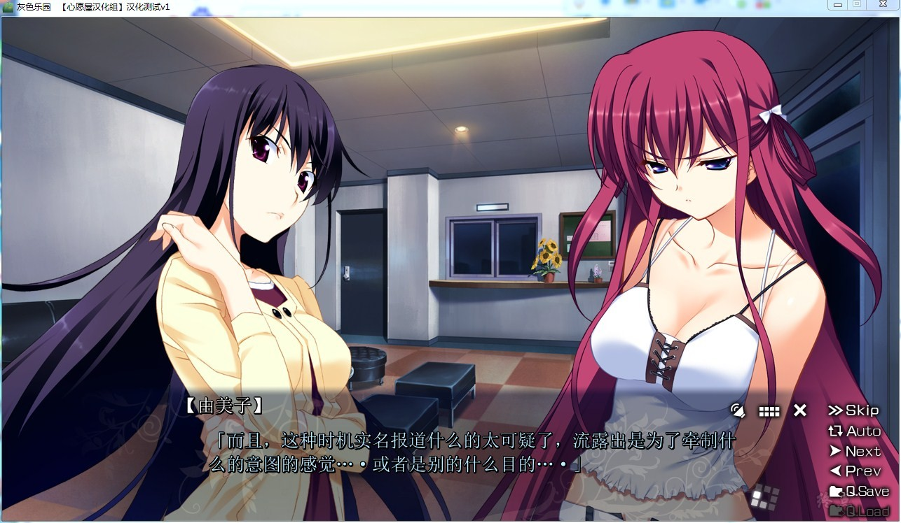
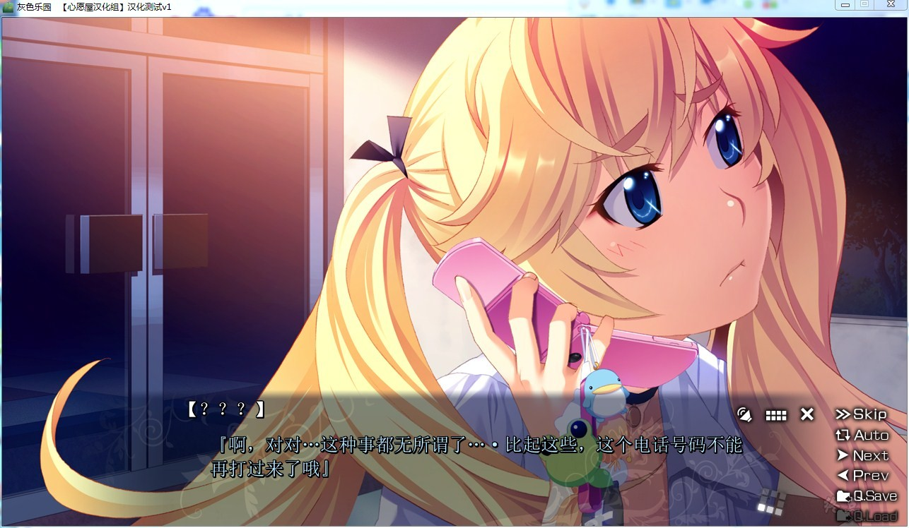
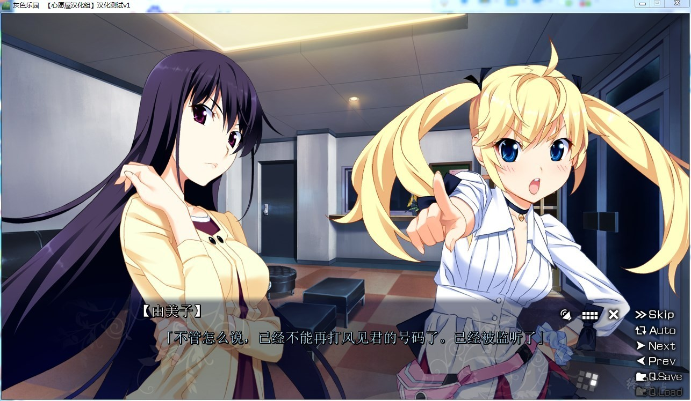
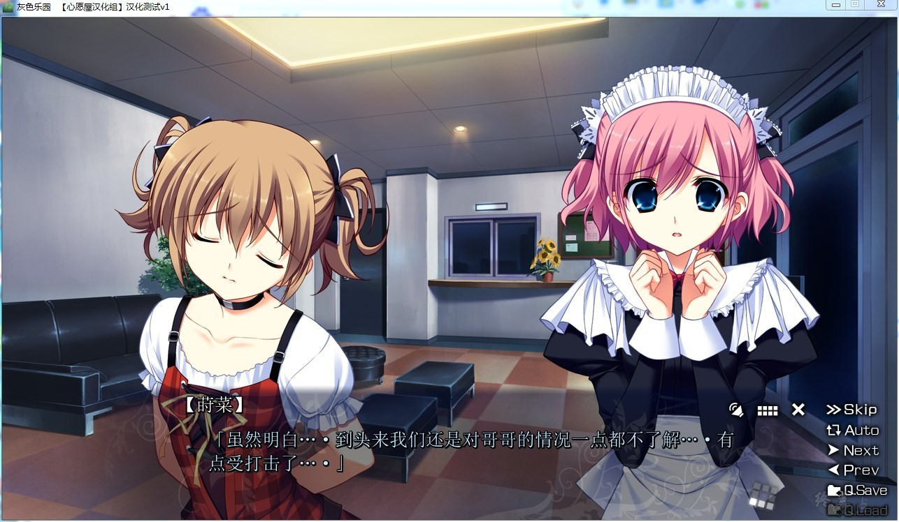
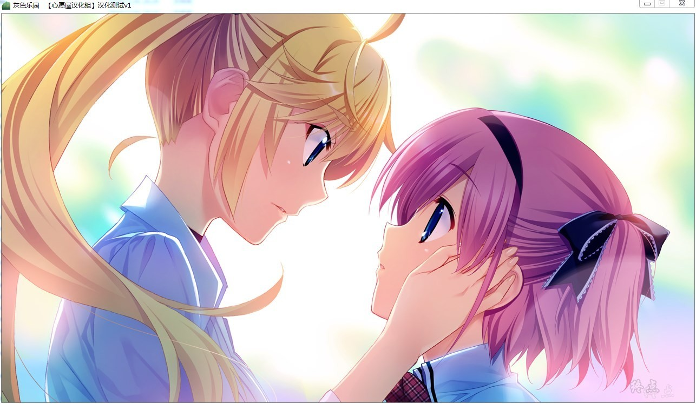

# 游戏简介

*灰色本篇3*

男人掰开拾起的果实、他挖出了种子。将种子取出来之后、埋入土中。

然后新芽破土终成巨木、直到男人死后仍不断成长。

那灰色的名为“Grisaia”的世界树、绝非世界上唯一的世界树────

认为永远不会改变的学园生活。

大家都朝着同一个方向、并肩前进、何时开始有这种错觉了呢。

只要这样与大家齐步前行的话、一定会到达共同的终点这样相信着。

然后不经意间察觉到了。如同狭隘到仅能数人通行的窄门一般、共同的人生道路什么的是不存在的。
──麻子、我、已经救了那5人了哟？

所以、已经够了吧…？我、死掉也…没关系了吧…？
知道啊、即使拯救了谁啊、我也无法洗去过去的罪孽啊。

那么、笑着死去、能做到的仅此而已了吧？

说不定再也无法相会。即使如此永远、也不会忘却心中思念。

因为此世之中、仅仅只言片语就满足了的那样可爱的女孩子可不多啊。

那是、一个少年所感到的、仅仅一个的真实──

**请使用[IDM](https://www.123pan.com/s/jJprVv-3tMsH)进行下载，使用最新版[winrar](https://www.123pan.com/s/jJprVv-dtMsH)进行解压（非常重要）。**

**解压密码为终点（简体汉字）。**

**添加10%恢复记录，防止网盘抽风损坏。**

