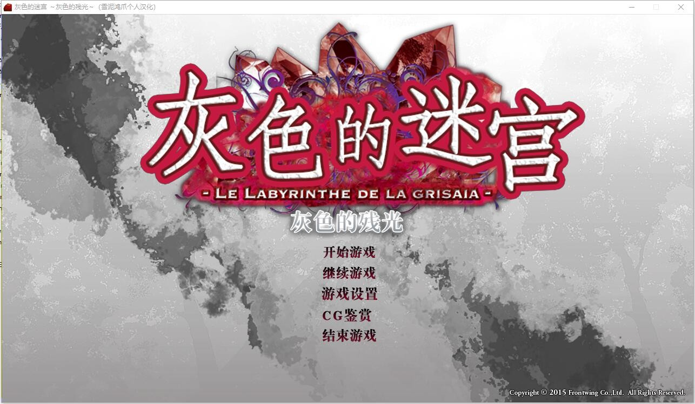
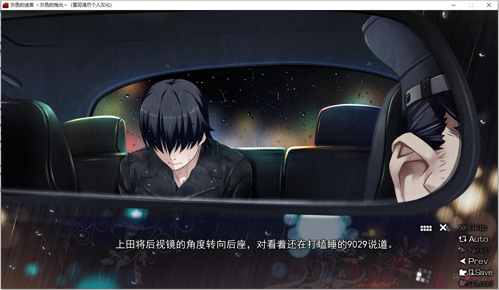
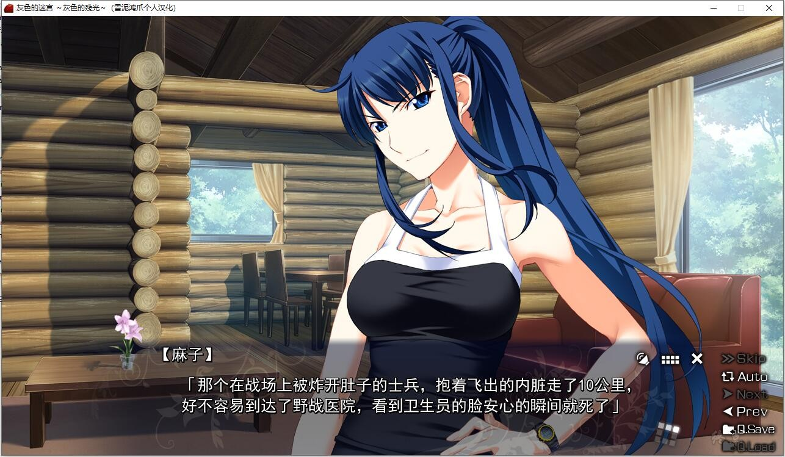
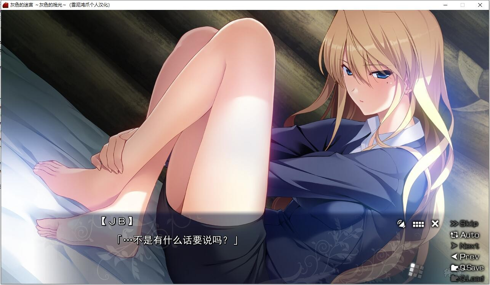
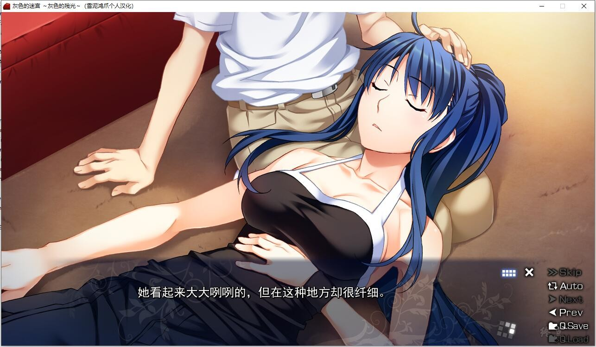
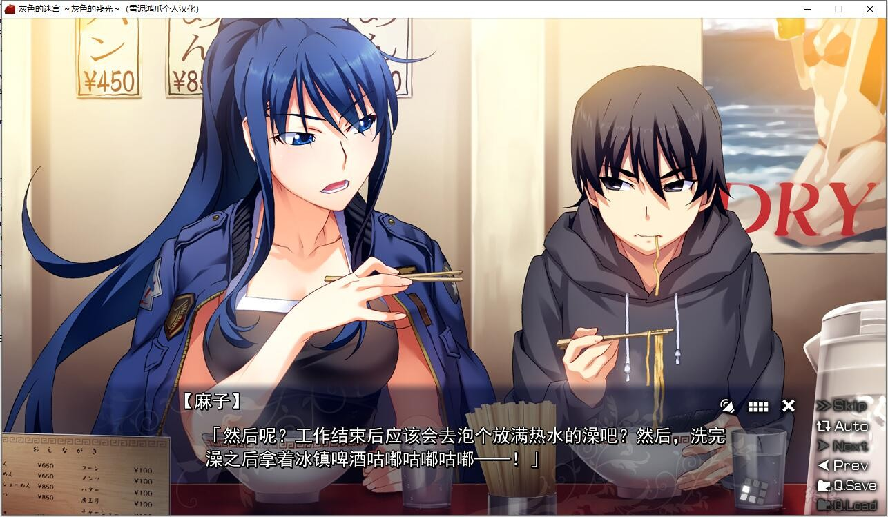

# 故事简介：

本作是灰色本篇2外传

讲述了幼年孤苦伶仃、被国际恐怖分子利用的主人公·风见雄二，
被隶属于国家机关CIRS的特工·日下部麻子救出，并由她抚养长大的时期的一个故事。

补全了与“灰色的迷宫”中的“任性之茧”的空白处相关联的缺失片段。

隐藏的麻子和雄二的趣闻被公开！

*（介绍来自2dfan）*

雪泥鸿爪个人汉化作品，详情请看汉化原贴

[汉化原贴](https://tieba.baidu.com/p/7890103449)

**请使用[IDM](https://www.123pan.com/s/jJprVv-3tMsH)进行下载，使用最新版[winrar](https://www.123pan.com/s/jJprVv-dtMsH)进行解压（非常重要）。**

**解压密码为终点（简体汉字）。**

**添加10%恢复记录，防止网盘抽风损坏。**

