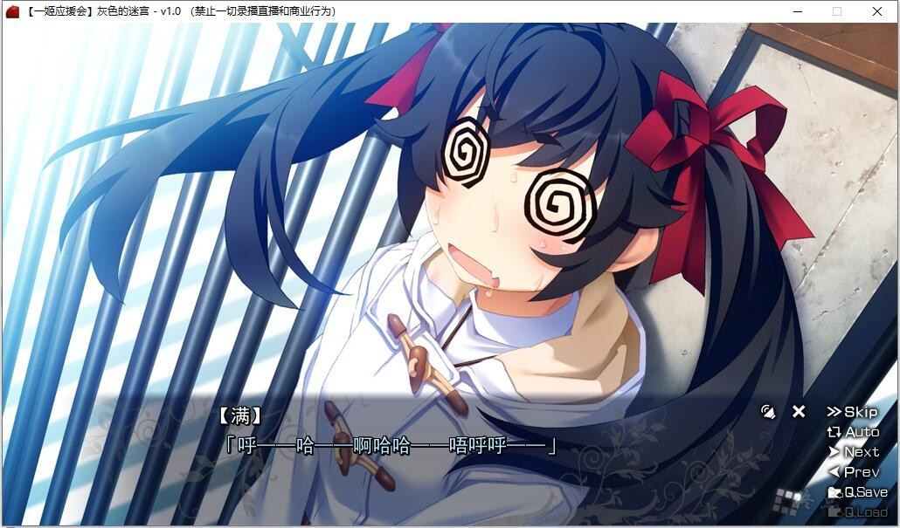

# 故事简介：

*灰色本篇2*

──这样的话就好了吧？

那是曾经珍视着流逝的一分一秒的生活的少年胸中，无数次萦绕着的疑问。

感觉宛如背负着罪恶一般的平静的每天中所邂逅的少女们，就好像是看到了往昔的自己一般，在折磨着少年的心。

──那个少女寻找到的，所赋予生命的意义

就是无需伪装的真实的自我──

──抱着必死之心生活下去是何意味

从被守护者成为了守护者──

──活着，真的很好，真的太好了。

以少年的干涉为契机，少女们为灰色的果园再次染上了颜色。

永远是不可能获得的东西。

但是，紧握那已经抓到的手，却是可以做到的吧。

这，少年深埋在胸中的一个决意──

*（介绍来自2dfan）*

**一姬应援会汉化组的汉化作品，详情请看汉化原帖**

[汉化原帖](https://tieba.baidu.com/p/7611210920)

**请使用[IDM](https://www.123pan.com/s/jJprVv-3tMsH)进行下载，使用最新版[winrar](https://www.123pan.com/s/jJprVv-dtMsH)进行解压（非常重要）。**

**解压密码为终点（简体汉字）。**

**添加10%恢复记录，防止网盘抽风损坏。**

