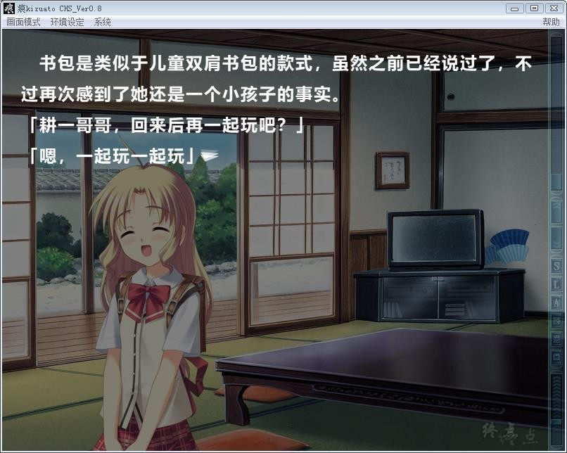

# 游戏简介

一个月前，异地居住的父亲因为事故而去世了。

法事总算是赶在大学暑假结束前做完了，主人公取消了之前所预定好的旅行，回到了乡下老家。

自幼而父母双亡，由主人公父亲一手拉扯成人的表姐妹们，
也渐渐从悲伤中振作了起来，脸上慢慢开始重现出往日那开朗的笑容。

心中烙下了伤痕的女主角们，还是温柔地接纳了主人公。

可是，却藉由某个事件，而再一次无情地撕裂了她们的心灵……

痕-游戏汉化组  汉化作品，详情请看汉化发布帖

**[汉化发布帖](https://tieba.baidu.com/p/5934341056)**

万年老坑填上，悬疑系鼻祖影响深远，叶厨们不容错过。
这是09年复刻版，复刻版追加线路及部分番外没有汉化。
内置全CG存档和复刻版日文攻略，还有一个720P的OP。

**请使用[IDM](https://www.123pan.com/s/jJprVv-3tMsH)进行下载，使用最新版[winrar](https://www.123pan.com/s/jJprVv-dtMsH)进行解压（非常重要）。**

**解压密码为终点（简体汉字）。**

**添加10%恢复记录，防止网盘抽风损坏。**

