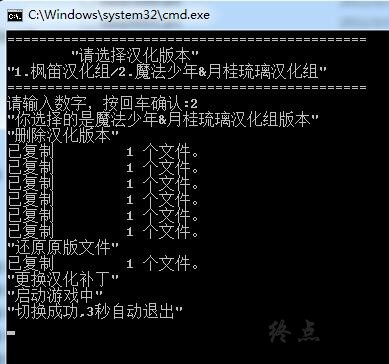

# 游戏简介

悲剧往往是“不合理”的，不过，

也没有这么多“不合理”可以合适地形容那临近的悲剧了。

那一天，这个城市与许多人的生命一起随大地崩塌了。

性别，年龄，人性，地位，经济力······

任何牺牲者，如沧海一粟，没有任何区别，

只是发生在那一刹那的一件事，便无情地夺走了他们的生命。

为何必须得死亡？

无尽的死亡，对这个世界有意义吗？

回答是没有，死亡，即是身处此地的人们被上帝命中指定的结局，

没有生的轮廓，只有汪洋般的丧失感。

这即是，被后世人称作为《大崩塌》的悲剧。

从那次灾难至今，这个城市被酸雨和销烟所笼罩。

从上至下，污染了城市的渠水、河流，

不久淤塞了整个城市的生态，使之成为人间牢狱。

没有除去愈加扩大的污水的策略，生者即如囚犯，仅剩无力的喘息。

究竟得等到何时，这个城市才能迎来晴日的洗礼？

**秽翼的尤斯蒂娅（枫笛）；秽翼的由丝蒂娅（魔法少年）**

汉化发布帖：

**[枫笛汉化组](https://tieba.baidu.com/p/1153141095)**

**[魔法少年えすか☆エムカ×月桂琉璃汉化组×澄空学园AUGUST学部](http://bbs.sumisora.net/read.php?tid=11014361)**

**2019-10-4 重新压制，添加汉化版本切换bat，默认是枫笛汉化组的汉化版本**

**请使用[IDM](https://www.123pan.com/s/jJprVv-3tMsH)进行下载，使用最新版[winrar](https://www.123pan.com/s/jJprVv-dtMsH)进行解压（非常重要）。**

**解压密码为终点（简体汉字）。**

**添加10%恢复记录，防止网盘抽风损坏。**

