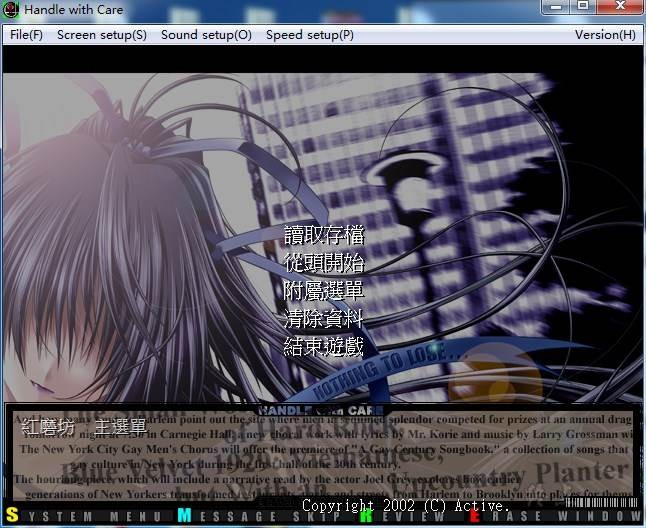
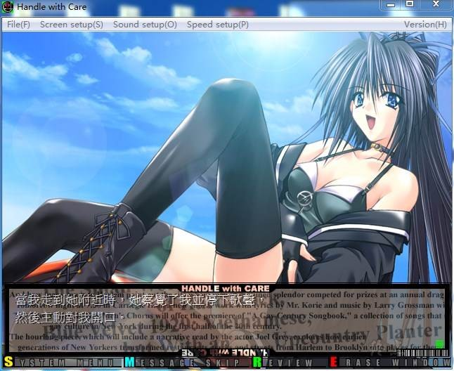
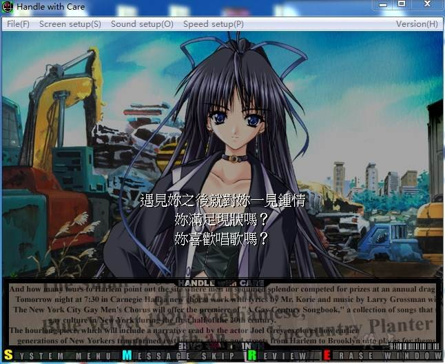
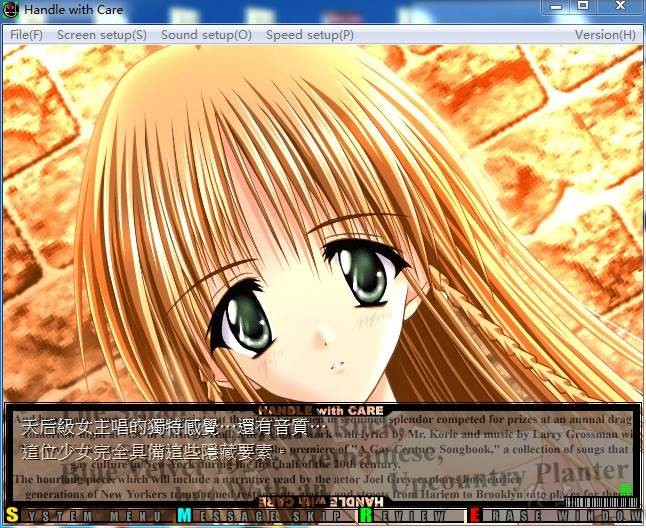
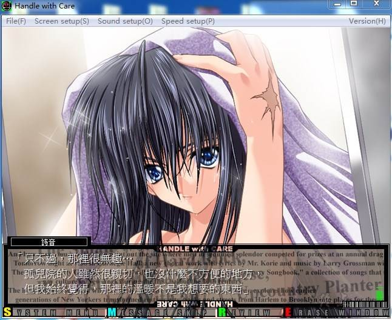

# 游戏简介

‘挫折并不足惧，只怕丧失灵魂’。
如慧星般出现，达到摇滚最高峰后又如慧星般殒落的传说R&B乐团‘Bloody Roses’，其主唱黑泽玲司经过长时间的蛰伏后，无意间于Live House‘Mellow’中，发现了代班歌手佐原诗音与生俱来的卓越才能。

个性倔傲的诗音以对自己毫无好处的理由，起先对玲司的邀约不屑一顾，但在玲司百般劝说后，也激起她挑战自己沉睡才能的欲望，决意跟在玲司身旁。

经过一连串困难与恶意阻挠后，同样倔强的鼓手雾生媹歌及BASS手琴吹椎名也加入了‘CION’乐团，诗音终于向自己的传说踏出了第一步。这不仅是为了找寻自己存活的证明，更为了站上最终目标．Live House‘红磨坊’的舞台上…

造成R&B乐团‘Bloody Roses’解散的这桩谋杀案，凶手竟是意想不到的人…！？

音乐．匠气．理念．传说…

一个个性洋溢的地下乐团力争上游，成为主流乐团的曲折奋斗过程与感人情愫，数十万字一气呵成情与泪的结合，阐述刻划人与人之间的现实与友情。

**镜像做不成硬盘，所以需要安装，有说明的一定要看说明**

**请使用[IDM](https://www.123pan.com/s/jJprVv-3tMsH)进行下载，使用最新版[winrar](https://www.123pan.com/s/jJprVv-dtMsH)进行解压（非常重要）。**

**解压密码为终点（简体汉字）。**

**添加10%恢复记录，防止网盘抽风损坏。**

