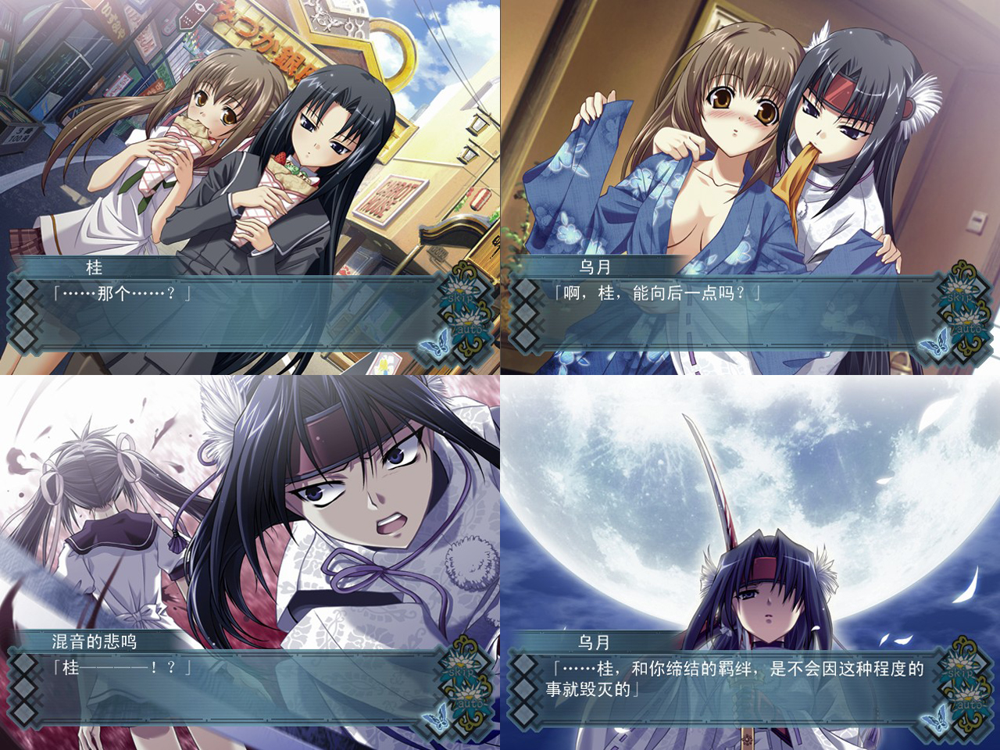
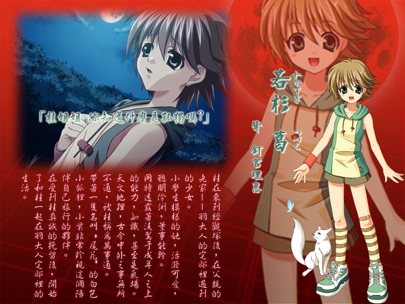
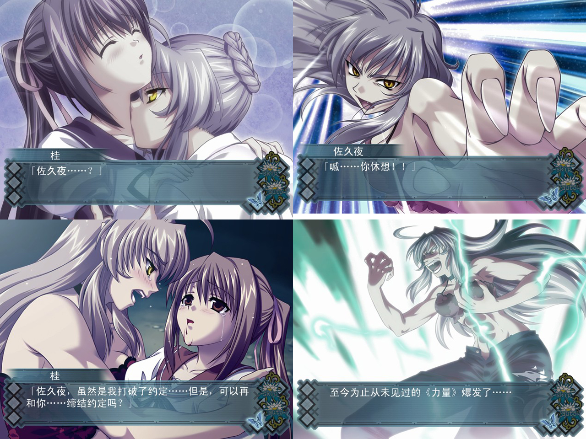
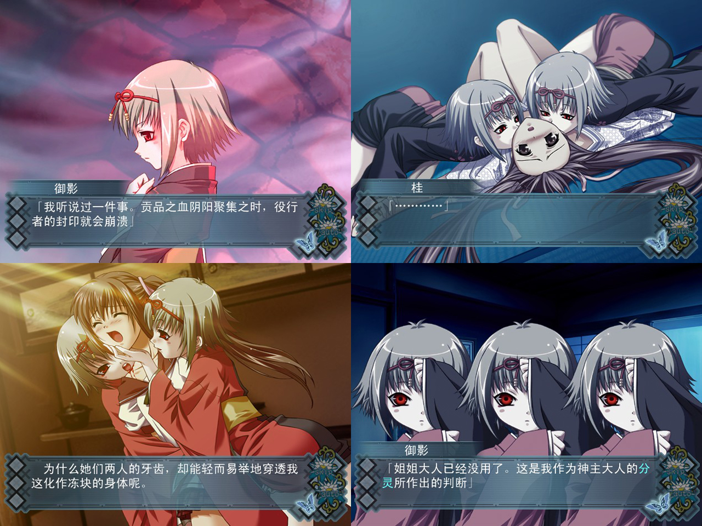

# 原版

# STEAM重制版

## 我个人还是比较推荐玩原版，原版虽然分辨率不高，但是体验会比重置版好特别多。

# 游戏简介

父亲已故，羽藤桂前往他的家乡经观冢。
那是个人迹罕至的闭塞之地，有着古韵十足的氛围。

经由在经观冢的见闻遭遇，羽藤桂渐渐明白了自己的真正身份。

随后，羽藤桂想起了自己失去的记忆，得到了新的重要之人。

跨越千年羁绊及恩怨的故事，就此展开——

这个夏天，身为我唯一亲人的母亲去世了——

——为了去见父亲残留遗产的家业，我乘着电车踏上漫长的旅程。

梦见了非常不可思议的梦

想不起来的红色回忆

成群的飞翔，闪耀着青色光芒的蝴蝶

还有，拥有悲伤眼神，似曾相识的那人。
在我出生的地方有一座经观冢

在那里，和谁曾相遇，和谁曾经别离

过去和现在，梦境与现实，我的记忆与我的血——

缘之线交错而组成的一个画面——

是命运之轮的轮回。

# **《アカイイト》（红线）完全介绍**

『アカイイト』是日本游戏公司SUCCESS于2004年10月21日发售的于PlayStation 2 （P2）平台运行的15禁和风Galgame（美少女恋爱游戏）。正式汉化名称为《红线》。同时汉化版的《红线》除了对PS2原版进行了汉化，同时还发布了PC移植版。

本作为SUCCESS公司为数不多的纯AVG游戏之一，同时也是作为主营家用机游戏的SUCCESS公司未被官方或国外代理商PC化的游戏之一。作为一部以独特的世界观，生动丰满的人物，跌宕起伏的故事和别出心裁的系统为特色的极其优秀的作品，在中文化PC版本出现前，一直是不少玩家心头的遗憾。
　　

本作所有的画面均采用了逐帧保存，使得画面动感十足，人物表情丰富，呼之欲出，战斗情景激烈刺激，背景特效逼真华丽。配合出色的角色立绘，豪华的声优阵容，激昂动听的背景音乐，跌宕感人的剧情故事和多样化的选择支及结局，HAl的原画和麓川智之的剧本完美结合，浓厚的和风气息更是能在细细的品茗中越品越香，以上这些，都给玩家带去了足以区别于常规AVG的独特游玩享受。
　　
由于本作在04年上市后广受好评，经久不衰，因此在此后的2008年5月15日发售了该作的姊妹篇《アオイシロ》（青白之恋），同时《青白之恋》还在2010年7月9日由SUCCESS官方发售了PC移植版。
　　
《红线》的PC汉化移植版由AUGUST中文化委员会制作。保留了PS2版本中的全部内容，尽管是民间自主移植，但近乎完美地还原了所有PS2上的效果，并增加了新的功能，帮助玩家在PC上也能顺利方便，同时不留遗憾地进行游戏。

| 中文名：       | 红线                                                         | 发行时间： | 2004年10月21日                                               |
| -------------- | ------------------------------------------------------------ | ---------- | ------------------------------------------------------------ |
| 日文原名：     | アカイイト                                                   | 限制年龄： | 15岁以上                                                     |
| 别名：         | 红线                                                         | 主要角色： | 羽藤桂，梦，浅间佐久夜，若杉葛，千羽乌月，望，御影，京,      |
| 游戏类别：     | GALGAME（美少女恋爱游戏）                                    | 语音：     | 所有角色全语音                                               |
| 游戏版本：     | 2004年10月21日（官方PS2版）   2013年9月----日（民间PS2汉化版&PC汉化移植版） | 游戏语言： | 日文（SUCCESS·官方PS2版）  中文（AUGUST中文化委员会·PS2汉化版&PC移植汉化版） |
| 开发商：       | SUCCESS                                                      | 动画相关： | 无                                                           |
| 主要制作人员： | HAl，麓川智之                                                | 游戏引擎： | 不明                                                         |

## 游戏特征：

经由PS2平台，得以实现更加出色的画面效果。所有的画面均采用了逐帧保存，人物表情丰富，战斗情景激烈刺激，背景特效逼真华丽，同时CG众多，且每一张的质量都堪称上乘，与剧情完美衔接，在带来视觉大餐的同时也使玩家在游戏的过程中，身临其境，内心被剧情深深地感染。
　　

本作区别于一般Galgame以男性为视点展开的模式，故事中的由玩家扮演的己方视点为16岁的女孩——羽藤桂。同时全作中的可攻略角色也均为女性。尽管在模式上偏向于百合风，然而《红线》的故事中，恋爱的成分实际上少之又少，在部分线路中甚至毫无表现。本作的主旨在于“亲情”，着力渲染“家族”，以及“友情”。正如标题“红线”一样，贯穿本作故事始终的是“羁绊”，对人物的塑造也是围绕着这一点展开，而非“恋爱”。再加上15禁的定位本身就意味着没有H剧情，因此作为Galgame来说，《红线》可以分到纯剧情作的类别中去。
　　

全作洋溢着弄弄的和风，古典日本文化非常浓郁。从女主角羽藤桂开始，游戏中所有的角色均区别于现代人，洋溢着古典的气息。和服的演出形式，古色古香的背景环境，古韵十足的文字对白，以及故事的整体框架都将玩家领进了一个开化前的旧日本时代。

由此带来了大量的古式词汇，以及对现代人来说较为陌生的古典文化。全作中大量地使用了极其生僻的单词，也大量出现即便对日本人来说，也大多不了解的古时候的旧事，落语和民间传说。为解决这一点给玩家带来的理解困难，游戏中特地设置了“用语辞典”这个项目，将生僻的词汇和不是常识性的知识点进行了汇总和详细解释。用语辞典和剧情同步更新，并且自动将新出现的单词置顶，极大地方便了玩家对这样一部古韵十足的作品的理解。同时，汉化版为考虑到对日本文化更加不了解的中国玩家，对那些因为对日本人来说是属于常识性的知识而没有被官方做注解的词汇和知识点也做了单独注释。

本作最大的特征就是大量的选择支组合下带来的地毯式结局。全作一共5位可攻略角色，但却有32个结局。其中11个一般结局，16个鲜血结局（BadEnd），5个完美结局。每位角色只有1个完美结局，且此结局极难达成，大多还都需要建立在一般结局或鲜血结局的基础上才能达成。复杂的分支结构足以令玩家在无限的轮回中，于深邃的黑暗之地中彷徨，唯有在通过自己坚持不懈的努力后，细心地通过蛛丝马迹的线索才能找到光明。虽然对大部分玩家来说都将是挑战，但历经艰难后取得收获的甘甜也将是最为甜蜜的。同时，本作中即使是一般结局和鲜血结局，也大多非常优秀，部分一般结局和鲜血结局，甚至在纯剧情的角度远远胜过了完美结局。

本作中还有5个剧情锁。没有打开剧情锁，无法观看被锁住的剧情。而这些剧情全部是和通往角色的完美结局，以及开启新的可攻略角色息息相关的。剧情锁只有在满足了一定条件后，才会在某些结局的末尾处解开，而在此之前，玩家并不知道何处必须要以怎样的方式解开某个剧情锁。

## 基本信息：

 

   以现代为背景，围绕着“贡品之血”的持有者，女主角羽藤桂展开的人妖跨越千年的羁绊及恩怨之故事。

全作以“羁绊”为中轴，看似毫无关联的各角色互为联系，随着剧情的深入，谜团的解开最终连成一体。全作的主旨为讴歌亲情和羁绊的美好，并警醒人们珍惜自己身边的重要之人。

故事以女主角羽藤桂前往已故的父亲的家乡经观冢展开，因为那是个人迹罕至的闭塞之地，因此从故事的一开始，古韵十足的氛围就笼罩而起。经由在经观冢的见闻，遭遇，羽藤桂渐渐明白了自己的真正身份，想起了自己失去的记忆，并在得到新的“重要之人”的同时，找回自己失去的“重要之人”。

全作剧情丰富，分支众多，几乎每一个选项都有其的意义所在，需要玩家细心思考。不同的选项组合会将剧情通往32个不同结局，或喜或悲，或抵达真相或半途而废，全在玩家的选择之中。

经由剧情锁，全作的剧情整体上是层层深入的，情节由平静不断变得跌宕，感情由普通逐渐变得激昂，主旨也是步步升华。在给玩家带去强烈的代入感的同时，也足以使玩家在身临其境中悲伤地流泪或喜极而泣。

## 故事开端：

主人公羽藤桂自幼丧父，由母亲一人抚养长大。善良乖巧，懂事温柔。然而这样的她，却在这个夏天也失去了母亲。为了继承遗产，桂孤身一人前往远离都市的父亲的老家经观冢。就这样，在那个人迹罕至的闭塞之地，经由红线的引导，她经历了传奇般的相遇，梦幻般的遭遇。随着跨越千年的羁绊再度连结，命运的齿轮再度转动，她的真正身份也逐步被揭开，而她的遗忘之物，重要之人，也再度从被关闭的记忆中出现……

『重要的人，已经不在了』

**2023-05-25 更新官方中文重制版**

游戏为终点论坛自购，转载请注明终点论坛，谢谢配合
如有能力，还请支持正版

[STEAM地址](https://store.steampowered.com/app/2097740/AKAIITO_HD_REMASTER/)

**请使用[IDM](https://www.123pan.com/s/jJprVv-3tMsH)进行下载，使用最新版[winrar](https://www.123pan.com/s/jJprVv-dtMsH)进行解压（非常重要）。**

**解压密码为终点（简体汉字）。**

**添加10%恢复记录，防止网盘抽风损坏。**

## 

---

---

---

---

---

# **以下内容含有大量剧透，未全通游戏者切勿阅读！**

---

---

---

---

---

## 登场角色：

### 主要角色：

**羽藤桂（はとう けい）**

声：松来未祐

本作的主人公。16岁少女。

自幼在火灾中丧父，失去了那时候（10年前）之前的记忆，此后在母亲一人的抚养下长大。善良温柔，懂事体贴，柔弱细腻，小鸟依人。再加上是在女子学校上学，因此全身都洋溢着纯粹的女孩子气息。说话低声细语，态度和善腼腆，行为庄重有礼，在自律的同时也绝不伤害别人。尽管以“有备无患”做座右铭，但却也经常冒冒失失，再加上天真无邪，对他人丝毫不加怀疑的善良性格，使得桂无论是在同龄人面前还是长辈面前，无论是熟人还是陌生人，都会被他人情不自禁地照顾和不带恶意地捉弄。开心的时候用女孩子特有的方式腼腆地笑，生气的时候即便鼓起腮帮也毫不可怕。被捉弄多了会闹别扭，但只要稍加安抚就会恢复，并且不长记性，之后还会被以同样的方式捉弄。尽管是个在现代文明下成长起来的孩子，内在却古韵十足。喜欢落语和时代剧，对古典故事，神话传说等虽不精通但也较为了解。兴致来了还会即兴自编落语，并且质量颇高。喜欢和食，认为日本人就应该吃白米饭和味噌汤。尽管因为条件限制没怎么穿过正式的和服，但很喜欢和服。古文强英语差。总之是个非常具有古典韵味的少女。虽然整体是个文静典雅，逆来顺受，懂事听话的女孩，但在涉及自己原则的事上却非常固执，且一旦下定了决心就一定会贯彻到底，无论遇到怎样的困难，无论是多么于自己来说不可抗力的事都绝不半途而废，也绝不会面对他人的劝说妥协屈服。因此在紧要关头，往往能展现出超出常人的毅力和勇气，做出不符合她柔弱女孩氛围的，超出常人的坚毅勇敢的举动。甜食党，讨厌吃肝。

桂是贡品之血的继承者。实际上，羽藤一族世世代代流传着贡品之血。因为这是种可以给非人之物带去无比强大的《力量》的血，因此会被妖魔鬼怪盯上。尽管如果能够熟知《力量》的使用方式，自己也可以将自己的贡品之血隐藏起来，但桂不具有那样的能力。然而却在前往经观冢以前一直平安无事，是因为带着源自祖母的守护符，这个守护符具有将贡品之血隐藏起来的功效，一直挂在桂的手机上作为装饰吊坠。然而在得知事件的真相之前，从没有被告知过自己贡品之血继承人身份和妖魔鬼怪之事的桂，并不知道那个不起眼的装饰吊坠的作用，只是遵从母亲的嘱咐，一直将其带在身上。寄宿有灵力的那个守护吊坠即便弄丢，也一定会被找到。常年带着护符的桂不会被其他贵盯上，但由于经观冢的鬼望和御影本身就知道桂是贡品之血的持有者，因此在桂来到此地后，对她发动了袭击。

这个夏天，桂的母亲也因为过劳而去世。在佐久夜的帮助下办完了后事的桂，伤心之余，也经由税务官的提醒为继承遗产之事前往距离她所在的都市非常遥远的乡僻之地，父亲的老家经观冢。经由她的双脚踏上这片羁绊之地之时，命运的齿轮开始了转动。经由在经观冢的见闻，遭遇，羽藤桂渐渐明白了自己的真正身份，想起了自己失去的记忆，并在得到新的“重要之人”的同时，找回自己失去的“重要之人”。

桂失去了６岁以前的所有记忆。尽管被母亲告知是因为火灾中吸入了大量的烟尘，以及父亲的死亡带来的冲击所致，但桂长年以来一直觉得哪里不对。尽管在母亲在世的时候，经由亲情的温暖她没有过多地去关注内心的这份疑虑，但在这个夏天，母亲也因为过劳而去世，在她前往经观冢的电车上，奇怪的梦境便开始造访，似乎是要唤醒她某个被尘封的记忆；而当桂到达羽大人的宅邸，刻在柱子上的两道刻痕更是使她似乎想起了什么；而在之后的遭遇，盯上她的鬼望和御影的暗示，封印之树的指引，似曾相识的柱大人——梦，与自己同名的男孩——京君，以及那面名为“良月”的镜子……种种线索的连环，层层深入的引导，使得她被尘封的记忆一点点被解开。而作为已经变成孤身一人的桂，为了取回自己失去的记忆，她也努力想要想起那些事。然而遗憾的是，每当桂朝着真相踏进一步，她就会被赤色的疼痛袭击，这份疼痛随着她离真相越来越近变得越来越严重，阻碍着她的前行。

随着故事的深入，桂逐渐意识到致使自己父亲死亡的原因根本就不是火灾，所以自己也不可能是因为火灾而失忆。羽大人宅邸柱子上的两道比身高后留下的刻痕和ＨＡＫＵＫＡ的名字分明彰显了儿时住在宅子里的并非桂一人的事实。还有一见如故，并且总是温柔地保护自己，甚至不惜牺牲自己的梦，以及知道很多事情，明明和自己的奶奶是朋友却非常年轻，一直陪在自己身边的母亲的友人佐久……诸多谜团和不断重演的梦境，促使桂下定决心要知道一切的真相。

实际上，全部事件的导火索就是桂和自己双胞胎的哥哥白花在十年前犯下的错所致。当时，好奇心旺盛的两人潜入了大人们吩咐的绝对不可以进入的仓库，并且将用于封印镜之鬼——望·御影的封印符撕开，导致双鬼跑出。双鬼采用欺骗和暗示相结合的办法，诱导桂和白花前往她们无法抵达的封印之木跟前，令她们破坏封印，以此解救她们所挚爱的不从之鬼神——神主。被操控的两人打破了柱之封印，使得原本的人柱——竹林长者被归还消失，神主即刻就要迸裂而出。就在此时，桂的母亲——当时最强的鬼切者·羽藤真弓和桂的父亲羽藤正树赶到。真弓将望和御影两人斩杀，并再次封印，然而却苦于无法长久地维持已经被打破的封印。这时，桂的堂姐，羽藤柚明主动要求成为柱之继承人，由此封印得到了填补。然而神主的分灵却从裂痕中不声不响地漏出，潜入了白花的体内，变成鬼的白花渴求桂的贡品之血而向桂发动袭击，却被她们的父亲羽藤正树挡住，正树为保护桂被白花洞穿身体致死。解放了灾祸之鬼，失去了亲切的姐姐，再加上连父亲也惨死的三重打击，使得桂封印了自己记忆，从此不再记得６岁以前的事了。

明白了一切是自己惹下的灾祸的桂，决定也要为解决事件奉上自己的力量。虽然外表柔弱，但一旦下定决心就会变得无比坚强可靠的她，在实际上成为了所有线路中促使故事前往完美结局的关键钥匙。

 

**千羽乌月（せんば うづき）**

声：渡边明乃

 

桂来到经观冢后第一个遇见的人。实际上不是在经观冢遇见而是和桂乘坐同一班电车的女孩。容姿端丽，眉目秀丽，黑发黑服，步伐矫健，手提太刀，气度非凡。无论是说话还是做事都干脆利落，并且谈吐行为彬彬有礼。宛如帅气的男孩一般的形象。在古典文化方面具有一定的造诣，水平在桂之上，经常可以给桂讲解一些名词和知识。非常注意礼节，但同时也会考虑到对方而调整说话态度。总是独来独往，身边洋溢着常人难以接近的氛围。虽然不会刻意排斥他人，却也时刻和旁人保持距离，对待桂也是一样。然而在被桂的真诚打动后，宛如桂的守护神一样时刻保护着她。

鬼切部千羽党的鬼切者，现任的千羽党鬼切者领袖，年纪轻轻便拥有党内最强级别的实力，成为真传弟子，被赋予破魔的太刀——维斗。千羽妙见流的达人，并且作为真传弟子，被传授了千羽妙见流七绝中的最后一绝——破军，以及必杀技魂削。破军是施展必杀技的准备姿势，是如果对方主动挑起攻势就绝对会落败而归，但若是转身便一定会为我方带来胜利的，将北斗七星之破军星表象化的姿势，只允许传授给真传弟子。而魂削是可以直接斩杀没有现身之鬼的“灵体”的招式，作为崇尚物理攻击，主要斩杀有现身之鬼的千羽党来说，属于既可以斩杀“灵”又可以斩杀“肉体”的招式。然而这一招的效果是双向的，在“斩削”掉敌人用于组建“灵体”的《力》的同时，也会削掉自己的《力》。因此需谨慎使用。同时千羽还善使用灵符，经由灵符编织成的结界具有抵御灵体入侵和对灵体产生伤害的功效。

千羽具有很强的使命感，曾直言不讳地声称自己在成为“千羽乌月”以前，首先是鬼切部千羽党的鬼切者，使命是斩杀仇视人类的鬼。千羽声称自己是个未达目的，为完成使命可以不择手段的人，必要的时候，连人也会杀。所以这样的千羽尽量和他人保持一定距离，而因为职责的关系，尽管是在有着极高升学率的名门学校上学，却只保持着最低限度的出席率。

乌月非常敬爱自己的哥哥——千羽明良。在那个崇尚礼节，严苛至极的千羽家里，即使对自己的亲生父母也必须要用敬语说话，而哥哥则是她唯一一个可以用随便的语气说话的对象。乌月的哥哥温柔体贴，善良仁义，同时又实力非凡，是当时千羽党的一把手。然而就是这样的千羽明良，却因为庇护了必须要杀掉的鬼——被神主的分灵附身的幼童羽藤白花，同时还教授其千羽党的技艺而被逐出千羽党。在此后的一次事件中，白花因没能成功制压神主的分灵而失控，奉命前往斩杀白花的乌月，却因为明良庇佑白花而错将自己的哥哥杀死。

乌月一方面悔恨自己杀死了哥哥这种事，另一方面也由此对羽藤白花——后来改名为京的少年恨之入骨，认为就是他害死了自己的敬爱的哥哥，因此一直对其穷追不舍。此次也是因为得到了京来到经观冢的情报，她才一方面是奉命，另一方面是为了复仇追击而来。

作为京来说，他深知自己的罪孽。不但是当年释放了望和御影的人，还亲手杀死了父亲，此后又杀死了很多无辜的人，以及害死了养育和培育自己的恩师明良。他向明良学习千羽妙见流只有一个目的，就是向神主复仇，在此以前，绝不能被旁人杀掉。所以面对乌月的追杀，京并不反击，只是单方面地躲避。然而在自知自己时日不多后，决心用实际演示的方式将千羽妙见流真正的奥义——鬼切，传授给乌月。在于京的对峙中领受了究极奥义的乌月，经由此，才忽然领悟到自己真正怨恨的是神主，并且经由此招，将所有的恩怨画上句号。

看似冷酷无情，顽固不化的乌月，实际上是个通情达理，很有慈善之心的人。当她知道桂是贡品之血的持有者时，为了不给她带来痛苦，选择了自己躲开，然而却在第二天被桂的真诚之心所打动，将桂视作自己重要的人，并且立下誓言，一定要保护好她。为了保护桂，乌月甚至可以寸步不离她的身旁。而在中了御影的计策，刀刃错误地朝桂砍去之后，乌月因为自己再度杀了自己重要之人的事而失去理智，陷入疯狂。赤色维斗的结局中，没有从京那里领悟到“鬼切”的乌月，无法拯救被神主的分灵附身的桂，便在将桂杀死后，自己也自杀而亡。

全作中，乌月以她男性风的行为，以及刚毅的性格，成为了桂的恋人一般的存在。

**若杉葛（わかすぎ つづら）**

声：钉宫理惠

 

桂在来到经观冢后，在父亲的老家——羽大人的宅邸里遇到的少女。还是小学生模样的她，虽然活泼可爱，却透露着凌驾于成年人之上的能力，知识，甚至是气场。聪明伶俐，懂事能干。天文地理，古今中外之事无所不通，被桂称为万事通。如此小的年纪就已经背着一个大包一个人出门旅行，并且在桂来到后，为原本没有通水电的宅邸通上了水电。身材娇小却力量十足，脚力十足。据说是在严苛的家风下成长起来的，因此才有这般能力。这样的小葛虽然年纪比桂小，却显得比桂稳重可靠很多，因此虽然在辈分上是桂的晚辈，却在故事中宛如一个长辈一样总是给予桂各种各样的帮助和建议。使得桂不禁会条件反射地感觉，凡事有小葛在身旁的话，就会踏实很多。身旁带着一只名叫“尾花”的白色小狐狸，小葛非常珍惜和喜欢这个陪伴自己旅行的伙伴，而尾花也只听小葛的话。初次和桂见面时，因为自己是非法入侵他人房屋的犯罪者，因此极力恳求桂不要把自己带到警察局去，并且声称自己会立刻离开，然而在受到桂真诚的挽留后，葛和桂开始了一起在羽大人宅邸里的生活。

实际上，小葛的“若杉”这个姓氏，在一开始便受到了桂和佐久夜的注意。因为“若杉”是不要说在日本，即便在全世界也数一数二的大型企业，作为旧系财阀的代表，旗下拥有“若杉商事”，“若杉银行”，“若杉生命”等著名公司。而尽管小葛在一开始声称自己的若杉不是那个若杉，但实际上，她就是若杉家的现任继承人。

若杉家不光是巨大的财阀，而且还是阴阳道的后继家族，并且是现任鬼切之头领，统领鬼切部所有党派。若杉家族选取后继人的方法非常残酷。用的是“蠱毒”。所谓蠱毒，是一种有名的咒术。即将有毒的虫子关在一个密闭的容器里，不给它们任何食物。任由其便开始互相残杀。正所谓弱肉强食，最后留下的那一只，就是生命力最顽强，实力最强大的一只。使用那只虫，便可以施展非常强大的咒术。若杉家也是用这种方式选取后继人的，并且不是比喻，而是用真的蠱毒来选取。小葛虽然本身没有干劲，却因为身处没有退路的立场而不得不参与这场骨肉相食的残杀。她在被生下来之后，就基本是个什么事都能轻易做好的天才，而其母亲也对于有小葛这样一个矫健之鹰感到高兴，并且以丝毫不隐藏鹰爪的方式培育。因此等到小葛有意识的时候，发现自己已经是强有力的候补了，并且若杉家当时的领袖，小葛的爷爷也非常器重她。就这样，数十个继承人均被她打败，小葛最终成为了唯一活到最后的，若杉家最强的继承人。而就在这一刻，她也完全崩溃了，决定放弃一切荣华，离家出走，找一个没人的地方隐居起来。

这样的她掩藏身份地和桂安详地生活了几日，却碰巧遇到了前来此地追杀京的千羽乌月，结果行踪就这样暴露了。小葛不顾一切地跑走，桂拼命地追了上去。将一切告诉桂后，小葛声称自己讨厌人类，讨厌和别人扯上关系，想要孤身一人的想法，然而却遭到了桂的诘问。桂声称小葛实际上是个害怕孤单的人，所以才喜欢和尾花在一起，所以才会在这个几天和自己在一起生活得很开心，并且声称自己非常喜欢小葛，非常珍视和小葛在一起的生活。被桂的真心话打动的小葛，决心打破原先那个软弱和总是逃避的自己，去面向新的生活。然而却不希望自己鬼切之头领的身份给桂带去麻烦，所以，在故事的最后，成为言灵之神的小葛，最终将桂的记忆消去。然而她不曾想到的是，因为失去了太多的重要之人而开始对重要之人倍感珍惜的桂，居然在后来打破了自己的言灵，从茫茫人海中，找出了自己。

小葛线路中，小葛成为了言灵之神。这是继承自尾花的力量。当桂被突然出现的望和御影两人袭击之时，并非一般狐狸的尾花跳出，对抗双子之鬼。然而毕竟单靠狐狸的身躯，言灵被封印的状态难以抵挡双鬼，最终被望抓住后杀死。自己的重要之人尾花被杀死的景象，促使小葛失去了理智，在目睹了望吸食桂的血液的情景后，自己也一口咬上了已死的尾花的身躯，于是获得了尾花的言灵之力，成为了可以用话语编织言灵，施放力量的言灵之神。言灵之神呼天天应，叫地地灵，并且可以化花为蝶，随意改变万物的存在形态。经由这样的神通，小葛最终将望和御影成功制服，将原本因抱有留念而总是化为人形的梦化为了真正的“柱大人”，将寄宿在京君体内的神主分灵消灭，并接受其作为鬼切部的成员。

全作中，小葛以聪明机灵，能干稳重的特点担任了桂的可靠性妹妹一般的角色。

**梦（ユメイ）**

声：皆口裕子

 

在桂来到经观冢后，突然出现在桂的梦境中的谜之少女。总是伴随着月光蝶出现，身着苍青色的带着蝴蝶纹案的和服，头上别着一个青蓝色的蝴蝶发饰，能够驱使光蝶对目标进行守护或对敌人进行攻击。温柔体贴，文静端庄，慈祥和蔼，非常富有母性的大和抚子，宛如母亲一样对桂施以无微不至地呵护，且不惜以牺牲自己为代价保护桂。总是让桂不要去想那些会招致自己头痛的往事，总是用和蔼的话语和温柔的胸怀替桂包容并化解痛苦。梦总是迁就桂的任性，尽可能地满足桂的愿望，并且用非常自然的方式让桂不会察觉到自己的痛苦，让桂不要替自己担心。虽然知道所有的事，却对桂只字不提；虽然梦的内心也希望小桂能够想起自己，然而却又为了小桂着想放弃了自己的幸福；虽然肩负沉重的使命，却不惜为了桂让自己柔弱的肩膀担上更为沉重的压力。声称自己是非人之物，并且是只能在夜晚出现的，不存在于现世的梦幻。席卷着光蝶出现，伴随着光蝶消失。倘若光蝶被消灭，自己也会因《力量》的减弱而变得透明。

桂第一眼看到梦的时候，产生了明明不认识，却很熟悉的感觉，然后因为梦不但能亲切地称呼自己“小桂”，而且不惜以任何代价保护自己，再加上被梦抱在怀里时的那种熟悉的温暖感……这些都使得桂虽然没有依据，但确信梦一定和自己有某种关联，并且一定是自己的亲人。尽管经由佐久夜和梦自己，桂得知梦是守护羽藤家的，经观冢的神明——“柱大人”，但很多证据应证了这一点，桂依然觉得自己和梦的关系不仅限于如此。在宛如红线的连结下，桂对梦的亲切感不断剧增，并且也希望自己能够为梦做到点什么。在得知了自己是贡品之血的持有者，而贡品之血可以给非人之物带去庞大《力量》的时候，主动地，并且带有强制性质地给予梦自己的血。而且在此后，每当梦遇到危险或者为帮助自己而使用了《力量》，桂都会主动要求梦喝自己的血。

梦是经观冢的“柱大人”。正如这个称号一样，是封印之木里寄宿的神明。很早以前，一个被称为“神主”的鬼神为夺取经观冢羽藤家的竹林长者的女孩的贡品之血而来到此地，被以役行者小角为首，观月之民各部落长老集结而成的部队在对观月之民来说最为有利的满月之夜打败。由于神主的力量过于强大，无法完全消灭，因此当时种下了一棵槐木，作为封印之木封印它，并在每年的夏天，槐树开花之时，将神主的灵魂经由飘落的槐花逐步归还。以此达到缓慢消灭的效果。然而光靠神木是支持不了多久的，为了长久地封印，竹林长者主动成为“人柱”，寄宿于槐树内，使得神木得以维系千年。然而此后，由于年幼的桂和京解放了望和御影，被她们操纵打破了神木的封印，导致竹林长者的魂魄从槐树中消失。为了再次强化封印，让神主无法跑出，梦主动担起了柱之继承人的职责。

实际上，梦就是桂的堂姐——羽藤柚明。身为羽藤一族的她，自然也拥有贡品之血，并且和当时还年幼的桂不同，懂得《力量》的使用方式。因此当柱之封印即将被解开的时候，视天下事为己任的她以自己的牺牲，成为人柱，填补了竹林长者的空缺，将役行者一行对神主的封印维系了下来。

桂因为解放了妖祸·望和御影，再加上亲眼目睹了自己的父亲被受到操控的自己的双胞胎哥哥白花杀死的情景，以及自己的姐姐柚明为自己犯下的错牺牲为人柱的三重打击而失忆，所以才会认不出柚明了。而柚明为了不让小桂想起那段悲伤的往事，所以虽然对桂宛如母亲一般亲切，却一直也没有主动袒露自己的身份。

梦最大的痛苦在于，她不得不一边封印神主一边从望和御影，甚至是神主的分灵那里保护桂。她不能释放自己的绝大部分力量，因为那些力量是用来封印神主的，一旦消耗过度，神主就会打破封印跳出，如此一来万事皆休。然而除此以外为数不多的力量，又难以从强大的鬼那里保护桂。除此之外，梦还因为温柔，哪怕自己痛苦万分，在桂的面前也依然摆出平静的样子，由此便多次使得自己陷入危机。实际上，尽管看似梦把自己封印神主的使命放在不可撼动的第一位，然而对她来说，桂的安危才是真正意义上最重要的。在无法与桂重建羁绊的其他角色的线路里，梦是以封印神主为最优先事项的，然而在重新和桂缔结了羁绊，并且还使得桂想起了自己真实身份的柚明线路中，梦多次不惜赌上自己的存在来保护桂，这实际上是不惜抛弃封印神主的使命在保护桂。当桂坠下悬崖时，明知绝对不能在白天现身的梦，却顶着被太阳快速灼烧存在之《力》的状况，强行现身去拯救桂；当千羽因为中了御影的计策错砍了桂时，梦顶着灵符张开的结界强行闯入；当神主的分灵袭向桂时，梦释放所有的力量将其挡住……这些都足以说明，长期以来，梦一直都是压制着自己的情感。而一旦和桂建立起联系，这种压抑是弱不禁风的，迅速就会崩溃，而梦的行为也将转变为以保护桂为首要任务。

而实际上，从言灵之神——小葛的话来看，“柱”是不可以拥有人格的，至少绝对不应该化作人形出现，因为这样一来，柱的封印必将松动。而实际上，竹林长者维系封印的千年间，从未发生过化作人形的例子。即便是她的重要之人佐久夜危在旦夕之际，也只是派出作为使者的光蝶去通知羽藤笑子去救她。而梦却自由地在“人”和“柱”之间转换，甚至还经由喝了大量的小桂的血拥有了和真人别无二致的身体。因此梦在成为“柱”的初衷上，就是存在犹豫和挂念的，因此才会在见到小桂之后，自己身为“柱”的存在，必须要封印神主的使命反而变成了一种束缚。

柚明的结局将围绕在柚明，京和桂之间的家族情缘和诸多往事进行了整合梳理，并且其完美结局给予了故事一个相对圆满的结局。柚明释放全部力量打倒了京的体内的神主分灵，但被桂以割腕的方式补充了《力量》；京为了保住桂的性命，防止她失血过多死亡，也将自己的贡品之血给予柚明，由此柚明得以复活。而同时，京也为了向毁了自己一生的神主复仇，自愿取代柚明成为柱大人，一边封印神主一边消灭他的力量；因为有了替代之柱，因此原本就因带有留念而是“不稳定的柱”状态的柚明得以还原成人，开始了和桂的两口之家的生活。

全作中，梦是和桂最为亲密的一个人，在这场家族剧中，扮演着母亲的角色。

 

**浅间佐久夜（あさま さくや）**

声：真田アサミ

 

现地采访记者兼摄影师，桂母亲的挚友，桂的老熟人，尽管态度轻浮，还喜欢调侃桂，却在关键时刻宛如大姐姐一般对桂呵护有加。身材高挑，凹凸有致，拥有完全不像是日本人的容貌。明明是和桂的奶奶是好友，却自称自己二十岁。原本的本业是现地采访记者，主要撰写时政评论方面的文字，然而因为文章需要配图，所以也自学了摄影，后来似乎是热爱上了摄影，开始做起了兼职摄影师，主要拍摄野生动物和大自然风景。阅历丰富，坚实能干，尽管看起来浮躁，其实是个在各种方面很可靠的人。料理水平高超，是擅长料理的桂的母亲的料理导师。现代风的外表下却是一颗很有日本传统底蕴的心，说话风格和一切口癖带有古典气息。喜欢吃咸的东西，会把腌渍的鲑鱼再蘸酱油吃。喜欢喝酒，似乎是个无底洞。鼻子很灵，不但能闻到些微的气味，而且还可以通过气味预报天气。开有一辆红色的越野型４ＷＤ，车上装有大量速冻食品，睡袋等户外生存用品。桂的母亲去世后，代替不可靠的桂，全程负责了后事，给桂处理遗产事宜的税务官也是她介绍的。这次经由桂的朋友阳子得知桂前往了经观冢父亲的老家，特地驾车连夜赶来。

佐久夜堪称本作中最为关键的人物，是贯穿所有剧情，统领所有因缘的人物。而她的完美结局也是唯一一个在实质上解决了所有问题的真·结局。

全作中，佐久夜的名字都是以“サクヤ”来表示的，而她的全名也是“浅間サクヤ”。日本人的名字虽然有不用汉字表示的情况，但就现代而言，也基本都会以平假名来表示，然而她的名字却是片假名表示的。这并非她的笔名，所以由此带来了两层含义：一层是佐久夜必定是很早以前的人，因为只有在古日本，才可能出现用片假名表示名字的情况；另一层是这个名字未必就写作汉字的“佐久夜”。而实际上，佐久夜的真实身份是观月之民。在日本神话中，大山津见神生有两女，长女为石长比卖，面容丑陋却身板结实；二女为木花之佐久夜毗卖，美丽动人却柔弱不堪。一日天照之孙迩迩艺能命下凡，见木花之佐久夜毗卖，一见钟情，便要娶她。木花之佐久夜说婚姻大事，需征求父亲的意见。大山津见神得知天孙看上自家女儿，欣喜万分，不但满口答应，还把自己的长女石长比卖一起也送给了迩迩艺。然而迩迩艺嫌石长比卖面丑，便在勉强同其睡了一晚后就把石长比卖送了回去。于是大山津见神感慨到：“把石长比卖留在身旁的话，无论刮风降雨，无论身处怎样严酷的环境，生命都将长久；把佐久夜毘卖留在身旁，就可以获得樱花盛开般的繁荣。我虽然将两人一起送给了天孙，然而石长比卖却被送了回来。所以他们的子孙后代，虽然能获得美丽的容颜和繁荣，但却一定很容易凋零吧。”于是，人类作为迩迩艺和木花之佐久夜的后代，虽然长相端丽文明繁荣，却只拥有脆弱不堪且非常短暂的生命。而观月之民作为石长比卖的后代，却拥有了长久的寿命和坚实的身体。因此，经由这层起源，作为石长比卖后代的“サクヤ”在道理上是不可能写作大部分被称为这个名字的人所使用的“佐久夜”这个汉字写法的，尽管桂一开始不知道这一点，所以一直产生了错误的认知。同时，观月之民作为石长比卖的眷属，相对于木花之佐久夜和天孙结合后所代表的“太阳”，必然会在满月的前后出生，并且月亮越圆力量越强。而佐久夜却是个例外，出生在了一个没有月亮的晚上，于是虽然同样长寿，身体同样结实，却无法发挥观月一族的《力量》。从出生的这个意义上来讲，或许“サクヤ”应该被写成汉字的“朔月”，然而由于佐久夜自己也没有被告知过名字的意义，所以便无法得知真相了。

儿时的佐久夜因为是另类，所以总是受到其他观月之民的排斥，所以她总喜欢下山自己去玩，然而因为同时也不是人类，所以也受到人类的排斥，可谓两难的境地。而唯一一个没有排斥她，并且还亲切地待她的就是当时羽藤家的竹林长者的公主。佐久夜经常偷偷下山，去找公主玩，彼此间建立了深厚的友谊。然而有一天，同为山神眷属的不从之鬼神——神主为求得竹林长者的贡品之血，用丹塗矢射中了羽大人家宅邸的屋檐，示意要让竹林长者作为贡品献身。尽管有数名实力强大的鬼切者前往讨伐，却难敌鬼神之力，纷纷被杀。正当竹林长者因不愿看到旁人为了自己而死，愿意作为贡品牺牲的时候，年幼的佐久夜说什么也不愿意，一边极力制止，一边请求自己的爷爷——浅间之长帮忙。作为观月之民，虽为非人之鬼，却遵从世间阳盛阴衰的法则，生活在暗处，并且努力防止世界遭到毁坏。因此即便是佐久夜不恳求，突然出现不但要获得贡品之血还要毁灭人类的神主对他们来说也是必须要讨伐的存在。于是观月之民各部落召开大会，最终集结了一支有役行者·贺茂役君小角为首，各部落首领团结参战的联合军，在满月之夜对神主展开了挑战，并最终将神主打败。然而由于神主的力量过于强大，即便打败，也无法将其消灭，因此只能将其封印，并用一棵槐树作为封印之木维系。经由每年槐花开放之时，神主的灵魂就会被这些飘散的槐花逐渐归还于虚空。由此达到缓慢消灭的目的。然而即便是封印用的槐木，或许也支撑不了多少时日，正当众人不知所措之时，竹林长者突然出现，表示愿意作为人柱，寄宿于槐木进行封印。看到其坚定的决意后，众人将哭喊着的佐久夜强行带走，最终将竹林长者化为了人柱，即“柱大人”。

虽然神主被封印，然而观月之民的命运却也因插手了这件事被改写了。神主的两个仆人望和御影，为解救神主操控村民，企图破坏槐树，然而就当她们要得手时，鬼切部派人将其斩杀后封印，然而擅长诅咒暗示之术的望在自己被封印前的一刹那，对那位鬼切者施以了一个宛如慢性毒药一般的诅咒：“你们是鬼切部，杀鬼是你们的使命，所以要连观月之民一起杀。”时过境迁，这个诅咒逐渐在鬼切部中奏效了，在一次作为鬼切之头领的若杉家的继承人的争斗中，嫡长子为了争夺地位，决定立功，于是便下令鬼切部千羽党斩杀所有的观月之民。在一个朔月的夜晚，大批鬼切者对观月之民各部落进行了扫荡，最后唯一活下来的，只有在爷爷的保护下得以脱身的佐久夜。万念俱灰的佐久夜，只求一死，然而她最后的愿望是死在自己所喜爱的公主——竹林长者的身旁。于是她拖着踉跄的步伐在那个冰冷的雪夜前往柱大人的神木，却因体力不支倒在了半途中。醒来之际，却发现是一个长得很像公主的女孩用自己的血救了自己，尽管起初她非常愤怒，责怪那个人阻止了自己最后的心愿，然而却最终被那个女孩的善良和真诚打动，和她成为了挚友。而那个女孩，就是桂的祖母——羽藤笑子。

后来，鬼切部为免除后患，派遣当代最强的鬼切者——千羽真弓前往斩杀佐久夜。然而善良的真弓非但没有杀死佐久夜，反而和她成为了挚友。不光如此，还经由佐久夜的介绍，爱上了羽藤笑子的儿子羽藤正树，并和正树私奔，由此被鬼切部开除。而此后敬爱真弓的羽藤明良之所以也没有杀死被神主的分灵附身的京，有很大一部分因素也是因为京就是真弓的孩子——羽藤白花。

正如千羽乌月所说，所有的因缘都是由佐久夜而起，在本作的故事中，她堪称是统领剧情性质的人物，在各条线路中均有其活跃的身影。

而佐久夜线路中，也出现了全作中唯一处神主被真正解封的剧情。也正是经由这段剧情，佐久夜和乌月也得以联手与真正的神主再度展开较量。尽管在除了真·结局外的所有结局中，佐久夜和乌月联手也均不敌被解封后的神主，然而在真·结局中，经由月食，佐久夜终于得知了自己的真正身份。她是在一个看不到月亮的满月之夜出生的。也就是满月下的月食之夜。因此她的力量并不是源于月神，而是源于暗黑星·凶暴之神的弟神，曾经讨伐了神主之祖的罗睺之《力》。罗睺之力在满月的月食之际会发挥出最强的力量，而和观月之民同祖的神主却因为月亮被遮蔽，力量受到了一定的影响，由此之下，发狂的佐久夜将神主彻底消灭。

佐久夜线路中另外一个值得一提的结局是当桂为了救佐久夜被神主洞穿身体后，佐久夜为了救桂，让桂喝了自己的血。经由桂的贡品之血和佐久夜的观月之血（实则为罗睺之血）的结合，两人间缔结其了血之羁绊，佐久夜的外貌发生了变化，而桂则变化更大，成为了强大的非人之物，并且像役行者小角一样，可以使用自己体内的贡品之血了。桂以１６岁的模样成为了长生不老的鬼切者，继承维斗之太刀，和佐久夜开始了讨伐神主的旅程。

虽然是全作中最年长的角色，却除了关键时刻一直是轻浮状态的佐久夜，堪称扮演了桂的大姐姐一样的角色。

**望（ノゾミ）**

声：小林恵美

 

盯上桂的贡品之血的双子之鬼中的姐姐。素发素服，活泼好动。小恶魔的癖性使她喜欢做捉弄桂的事。血红的瞳孔具有使目标无法运动的邪视之《力》，擅长暗示和幻术，能够用《力量》组建成赤红的巨蟒和用于束缚目标的赤红的巨大蜘蛛网。镜之鬼，依存于名为“良月”的古镜，将吸取人血获得的《力量》输送于良月储存，再从良月那里获取力量释放。因为是纯粹的灵体，没有现身，因此只要良月不被破坏，望就是不死之身。然而与之相对，一旦良月被破坏，自己就会消失。因为和桂有很深的渊源，所以在桂来到经观冢后，立刻就盯上了她的贡品之血。

正如千羽乌月所言，“由人变鬼，鬼由人生”。正是由于为人之时的怨恨，才会使一个变成仇视人类的鬼。望就是这样一个典范。身为藤原家的公主的她，却因为自幼患有会引发体弱多病的不治之症，而被常年关在不见阳光的黑屋里，每天能干的只有看书和一个默默地沉思。除了极少部分人，外界普遍不知道她的存在，而取代她存在于世，享受公主的欢乐安逸生活的是她的双胞胎妹妹。常年被关在黑漆漆的屋内的望，怨恨越攒越多，她开始憎恶自己的妹妹，开始憎恶那些把她关起来的人类。一日，她向负责给她提供伙食的仆人说自己想要一面镜子。这个要求本身只是源于她的一个恶作剧的想法，因为她希望通过镜子来看到她所憎恶的那个双胞胎妹妹的脸。仆人给她带来了一面经由遣唐使带回来的古镜“良月”，巧的是，“良月”就是“望月”的意思，这正好于望同名。面对着良月，望百感交集，她感觉这是把她关起来的人对她的讥讽，同时，她也经由镜子开始咒骂那张和她一模一样的脸。随着时间的推移，怨恨越来越深，想要获得自由的愿望越来越强烈。

一日，仆人要出去了。望顿时欣喜万分，因为她自从出生以来，还从没从这个黑屋中出去过。她开始幻想是不是妹妹死掉了，所以她终于可以到有光的地方生活了。然而事与愿违，真实原因是因为藤原家的宅邸着火了，全家已经迁居，所以也来接望离开。尽管失望，然而望还是有生以来，第一次看到了外面世界的天空。那个瞬间，渴求自由的欲望急剧膨胀，罪恶的念头猛然产生。她想要逃跑，用手里的良月，杀死走在自己前面的仆人。外面火光冲天，即便是她和仆人在这里消失了，那些少数的知情者也只会认为是死于火灾。这个念头不断膨胀，最终促使望用镜子朝着仆人的头狠狠地砸了下去。

原以为这样就获得自由的望，才发现自由对她来说是那样遥不可及的存在。原本就体弱多病，会不断咳血的她，又因为常年被关在黑屋里，根本经受不了外面的风雨。孤独无助的她，终于摔倒在了山间的雪地里。她以为自己可以死去了，她也渴望就这样死去，至少是以一个自由之身的人而死。然而这时，神主出现在了她的眼前。望不抱期望地向神主许愿，愿望是真正地获得自由。神主帮她实现了这个原因，将身为人类的望的灵魂，寄存于她所持的那面古镜良月。自此，望变成了没有现身的鬼，因此摆脱了原先那个“藤原望”的病弱身体，在真正意义上获得了自由。

此后的岁月里，望一直跟随神主，视神主为自己的恩人。然而在某一天，她得知了神主被役行者和观月之民封印的消息。起初她不相信，然而时间却迫使她确信了这一点。再次变成孤独一人的望，总是对着良月自言自语。有一天，她忽然发现，镜子中的那个她居然对自己的话有了反应，于是她意识到，镜子里的那个她，一定就是自己的妹妹。妹妹一定也是被父亲他们抛弃了，然后和自己一样，经由神主，变成了依附于良月的鬼。境中的女孩称自己叫御影，承认自己是望的妹妹，并且在日后的岁月里，总是遵从望的指示行动，非常顺从。

御影似乎比较博学，懂得很多事情，并且也喜欢神主。她建议和姐姐一起去解救神主，破坏封印之树。然而强大的结界使她们这样的灵体无法靠近那里。于是她们便学会了用暗示操控人类去接近神木，企图破坏，却不曾想计划被鬼切部察觉，最终两人被鬼切者封印在良月中。然而不甘心就这样结束的望，在被封印的刹那对那名鬼切者施放了一个慢性毒药性质的诅咒：“你们是鬼切部，杀鬼是你们的使命，所以要连观月之民一起杀。”时过境迁，这个诅咒逐渐在鬼切部中奏效了，在一次作为鬼切之头领的若杉家的继承人的争斗中，嫡长子为了争夺地位，决定立功，于是便下令鬼切部千羽党斩杀所有的观月之民。在一个朔月的夜晚，大批鬼切者对观月之民各部落进行了扫荡，观月之民除了佐久夜之外全部死亡。

又过了很久，望和御影终于看到了被解救出来的希望。那便是镜子交由了鬼切部千羽党当时的领袖千羽真弓家保管，而她的孩子，年幼的桂和京因为好奇将镜子上的封印符撕开，致使望和御影得以脱身。望和御影发现桂和京是持有贡品之血的龙凤胎，阴阳相合的贡品之血正好可以解开役行者对神主的封印，于是便操控两个孩子去解开神木的封印。然而，尽管成功将神木中的竹林长者归还了，她们却也在那一刻再次被真弓封印。
又过了１０年，被放在经观冢乡土资料馆里的良月，受到了一个对其很感兴趣的历史教师的亲睐。经由这层缘分，望和御影成功操纵了这名教师，再次得以脱身。脱身之际，她们立刻察觉到了羽藤桂已经来到经观冢的事实，于是迅速前往夺取她的贡品之血。却不料桂不但遗忘了幼时的所有的事，而且鬼切者千羽乌月，鬼切之头领若杉葛，柱之继承人梦，最后的观月之民浅间佐久夜以及制压了神主的分灵的少年京都因各种原因在此地聚集了，她们夺取桂的贡品之血，解放神主的计划举步维艰。

望的线路中，因为吸取了桂的血而使得两人间建立了联系，桂看到了望的过去，便对望产生了同情和理解，同时发现了御影的异常。发现望的内心被桂动摇的御影，宣言了自己真正的身份——神主的分灵。决定消灭望，自己进行之后的事。望拉着桂开始了深夜的逃亡，因为力量全部被御影夺取，她想要去破坏良月，和御影同归于尽，却不料御影早在良月之处等候着她们。万念俱灰的望，用最后的力量变成丝线缠住了御影，以一句撕心撕裂的“请给我自由！”打碎了桂的犹豫，使得桂打破了良月。看着即将消失的望，桂悲痛欲绝，她想要救望，却苦于找不到合适的依存之物。就在万事皆休之际，桂的手机响起了，那个瞬间，桂察觉到了合适的依存之物——羽藤家代代相传的，寄宿有《力量》的护身符。

全作中，望既是反面角色，也是一个值得同情和理解的悲情角色。然而即便是这样的她，最终也和桂走向了幸福的结局。

**御影（ミカゲ）**

声：小林恵美

盯上桂的血的双子之鬼的妹妹。和望的长相如出一辙，能力也基本一致。性格温顺，沉默顺从。尽管看起来似乎是个温柔柔软的孩子，然而实际上却比望更加地凶残贪婪。明明是后来成为鬼的妹妹，却比望懂得更多的事。头脑机灵，懂得审时度势，随机应变。尽管表面上看起来御影是顺从望的指示行动，然而细心观察不难发现，所有的作战计划都是由御影制定的，御影才是两人间实际上的领袖。

和望不同，御影是真正的鬼。是与生俱来的鬼。尽管在全作绝大部分剧情中都没有表现出来，然而唯独在望的线路中，御影的真身得以显现。在看到了望被桂拉拢的事实后，御影一转原本温顺乖巧的形象，变成了一个残忍凶暴的恶魔。实际上，御影不是望的妹妹，而是神主的分灵，神主为了以防万一，不但在羽藤白花的体内寄宿了分灵，实际上在被役行者封印之前就已经在良月之中寄宿了自己的分灵了。所以御影才会懂得比望更多的事。同时，良月的主导权也是在御影那里的，御影可以轻易断绝输送给望的《力量》。因此在和望的交手中，始终处于上风。自知抵抗不过的望，拉着桂拼命逃跑，逃亡持有良月的傀儡的地方，企图破坏良月和御影同归于尽，却不料御影早就在那里等候两人。万念俱灰的望，用最后的力量变成丝线缠住了御影，以一句撕心撕裂的“请给我自由！”打碎了桂的犹豫，使得桂打破了良月。御影消失毁灭。

值得一提的是，御影还拥有利用镜子投映“幻像”的能力。这里的“幻像”并不是完全虚幻之物，而是像她们一样，以《力量》创造出的“灵体影像”。利用这一点，曾两次使得有见鬼之力的乌月在施展必杀技“魂削”时砍错目标，第一次是御影利用这个能力使得乌月砍偏自己带着负伤的望逃跑，第二次则是设计使得乌月的刀砍向了已经于自己联手的京，然后桂为了保护京跳了出来结果被斩。由此可见，这是个非常可怕的能力。因为投映的并不是完全的“虚像”，所以即便是见鬼之力也无法看破。

御影是全作中彻彻底底的反派角色，作为神主忠实的仆人，经由神主的命令甚至可以以自杀的方式力求于乌月同归于尽。温顺乖巧的外表下却隐藏着一颗残忍血腥的心。

**京（ケイ）**

声：石井一贵

在柱大人的神木前与桂相遇的，与桂同名的男孩。面容俊秀，温和善良，文质彬彬，率直坦然。尽管承认自己是鬼，旁人却怎么也没法把他和鬼并为一类。身手不凡，可以徒手对抗总是追杀她的乌月。拥有鬼切者的技能，掌握千羽妙见流，实力在乌月之上。

京算是全作中最为神秘复杂的一个人物。与桂同名这点首先就是他蒙上了神秘的雾霭。而且可以接近常人无法靠近的神木，还说要解放神木中的人。不但掌握千羽妙见流，而且会连乌月都没有被传授的千羽妙见流的究极奥义——鬼切。明明是曾经杀戮了许多无辜人类的鬼，却被乌月所敬爱的先代鬼切者千羽明良放过并且作为千羽妙见流真传弟子抚养长大。对桂有着超出寻常的关心，对自己有着超出寻常的赎罪意识。

实际上，京就是桂所忘记的那个自己双胞胎的哥哥——羽藤白花。之所以身为男孩却是叫“白花”这个女孩子的名字，是因为他们的母亲真弓在出生登记表上填反了两人的名字。而白花后来会使用京（桂）这个名字，是因为这才是他真正的名字，而对于修行之人来说，名字是最重要的言灵。这个言灵可以使自己《力》之加护。年幼的时候，和桂一起进入了绝对不可以进入的仓库，还解开了封印着望和御影的镜子，致使双鬼跑出，操控两人解开了柱之封印。尽管双鬼即刻被他们的母亲羽藤真弓封印，然而为了填补竹林长者的空缺，他们所挚爱的姐姐羽藤柚明以自己的牺牲成为了柱之继承人。不但如此，白花还被神主从缝隙间渗出的分灵附身，在桂的面前杀死了他们的父亲，致使桂在巨大的打击下失忆。这样的白花对自己的罪恶行为自幼便怀着浓厚的憎恶感，同时他发誓要向毁了他一生的神主复仇。后前来斩杀他的鬼切者千羽明良，因为敬爱先代鬼切者千羽真弓，同时又被白花的真诚打动，不但没有杀他，反而向鬼切部汇报了他已经被杀的虚假消息，然后秘密地将白花抚养长大，同时作为真传弟子传授给他千羽妙见流全部的精髓。这之中，就包括了连乌月都没有被传授的究极奥义——鬼切。鬼切和千羽妙见流表象的必杀技“魂削”不同，是可以不用刀触碰到对手，光凭“剑气”斩去对方“鬼灵”的招式。也就是可以以不破坏肉体，不破坏正常灵魂的态势，只是单独斩去“恶的灵魂”的强大之技。京在自知自己时日不多后，将此招传授给了乌月，促使乌月打败了被神主的分灵控制的自己，并且和桂通往了幸福之路。经由鬼切者的修行，京得以在这１０年间顺利地压制住神主的分灵。

京此次来到经观冢，有两个目的。一个目的是破坏招致祸端的那面由年幼的自己解封的镜子——良月，由此彻底消灭双子之鬼。第二个目的是打败神主，救出自己挚爱的柚明姐姐。然而事与愿违，他不但受到了追击他而来的千羽乌月的层层阻挠，还因为体内神主的分灵逐渐占据主导地位，感到自己时日不多。乌月线的最后，京将“鬼切”传授给了乌月，促使她斩杀了自己体内的神主的分灵。而在柚明线的最后，被柚明打消了体内神主分灵的京和神木融合，解放柚明，成为新的柱之继承人，立直要以这样的方式，亲手将神主的本体在漫长的岁月中彻底消灭。

桂因为一开始不了解京的真实身份，担心他会像望和御影那样盯上自己的血，所以对他抱有恐惧。然而在了解了他白花的身份后，遗失多年的兄妹之情终于再度被找回。

作为全作中唯一一名占据主要地位的男性角色，同时又是迷雾重重，只有在少数线路中才会身份大白的京，他的存在至始至终都是一个焦点。

**神主（ぬし）**

声：室园丈裕

 

有着蛇神，雷神，不从之鬼神，灾厄之鬼神等多种不吉称号的始源之神之一。本体是日本神话中的星神·天津雍星。可以用《力量》造出赤色巨蟒，护身铠甲以及施放闪电。和观月之民同为山神之祖，却和安分守己过着隐居生活的观月之民不同，企图夺取辉夜姬的贡品之血然后统治世界。力量非常强大，鬼切者丝毫不是对手。最终是在和以役行者为首的观月之民众长老的联军，在对观月之民来说力量能够发挥到最大的满月之下因力量耗尽而被打败。然而由于其所持的《力》和灵魂太过庞大，以至于即便是联军也无法将其彻底消灭，只能用一棵槐木将其封印，并通过每年槐花开放之时，将它的魂魄通过槐花一点一点地归还。

神主拥有创造分灵的力量，可以将自己的魂魄的一部分寄宿在器物或者他人的体内。御影和白花均是他的分灵。御影唆使望一起解开封印，而被神主的分灵操控的白花则杀死了自己的亲生父亲。虽然之后白花通过学习鬼切之术，得以压制了神主的分灵，然而每当神主的分灵占据主导地位的时候，白花就会失控杀人。全作的诸多结局中，都有被神主的分灵操控的京作为最终敌人的场景。

### 次要角色

**奈良阳子（なら ようこ）**

声：能登麻美子

桂的同班同学，学号早桂一号，独生女。活泼开朗，坦率直白，是桂最好的朋友，据说手机里存有大量和桂恩恩爱爱的短信。嘴巴很能说也很能多管闲事的人，但实际上是喜欢照顾人的性格，宛如姐姐一样总是对处在支配桂的地位。还喜欢捉弄桂，把桂慌慌张张不知所措或者犯傻的事当做自己的笑点，但也绝不会开玩笑过度。遵循顺其自然之理，以活在今天乐在今天为人生信条的乐天派。然而虽然看起来是个挺能靠得住的人，却唯独作业总是要抄桂的。

**千羽明良（せんば あきら）**

声：无

千羽乌月之兄，也是乌月的敬爱之人。对乌月来说是先代的鬼切者，先先代鬼切者的弟子。京和乌月的说话方式，均是受到了他的影响。明良敬爱着自己的先代——千羽真弓，因此在发现奉命斩杀的鬼——白花是真弓的孩子后，起了怜悯之心，再加上白花称自己想要打败神主，向犯下了诸多罪恶的自己赎罪，便非但没有将其斩杀，还向鬼切部谎称已经斩杀了该鬼。此后将白花秘密地抚养长大，作为真传弟子传授给她鬼切者的技能和千羽妙见流，这之中包括了就连乌月也没有被传授的千羽妙见流究竟奥义——鬼切。然而这样的他最终却在一次白花没能压制住神主分灵而失控的事件中，为了庇护即将被乌月斩杀的白花挺身而出，致使自己死在了乌月的手中。

**羽藤真弓（はとう まゆみ）**

声：古原奈奈

原名千羽真弓。羽藤桂和羽藤白花的母亲。千羽妙见流的达人。千羽明良的敬爱者。虽然是出生在分家却天分超群，成为鬼切部千羽党的王牌，曾被公认为“当代最強的鬼切者”。为桂的护身青珠注入《力量》的也是她。当她还是千羽真弓的时候曾奉命斩杀最后的观月之民——浅间佐久夜。却被佐久夜悲惨的命运感动，非但没有杀她，还和她成为了好朋友，并且还在佐久夜的介绍下和羽藤笑子的儿子羽藤正树私奔，从而被鬼切部开除。在桂和京解开了望和御影的封印，并被操控解开了神木的柱之封印之时赶到，封印了望和御影，却不曾料想自己挚爱的丈夫被受到了神主分灵控制的白花杀害，而桂在受到了巨大的打击后失忆。为了不再牵扯上鬼的事情，和桂一起搬离了经观冢，到遥远的都市生活，并告诉桂她的父亲的死亡和她的失忆都是因为火灾。此后在佐久夜的帮助下，从事翻译工作独自将桂抚养长大，自己是鬼切者的事从来没有向桂提起过。在这个夏天因积劳成疾而去世。尽管总体上来说是个稳重可靠的人，却犯下了把双胞胎桂和白花的名字在出生登记上写反的冒失之事，因此以“有备无患”为座右铭的桂却天性迟钝天然，或许就是继承了母亲的这一点。

**羽藤正树（はとう まさき）**

声：东久仁彦

羽藤笑子之子。羽藤桂和羽藤白花的父亲。羽藤真弓的丈夫。因为母亲的关系和佐久夜关系很好，经由佐久夜的介绍和当时的鬼切者千羽真弓结合。虽然平时对待桂和白花很温柔，却在涉及原则的问题上会发怒。尽管作为继承有贡品之血的羽藤一族，然而血中蕴藏的力量却微乎其微。相当于他母亲的三分之一，桂和白花的十分之一。因此非常接近一般人。当桂和白花打破神木的封印之时，他曾想要自己化为柱之继承人，却被真弓告知因为力量过于薄弱起不到效果。尽管后来由自己姐姐的孩子羽藤柚明接手了这一职责，然而却不曾料想自己的孩子白花已经被神主从封印的缝隙间渗出的分灵附身，最终因保护桂死在了白花的手上。亲眼目睹了父亲死在自己面前的桂，在后来望的暗示下一直以为是自己杀死了父亲，其实真正的凶手是神主。

**羽藤笑子（はとう えみこ）**

声：古原奈奈

桂和白花和柚明的祖母。正树的母亲。正如其名字一样，是个常带灿烂笑容的温柔之人。擅长料理和纺织，善良纯朴。曾经由当时的柱大人竹林长者的使者之蝶的引导看到了跌倒在雪地里奄奄一息的佐久夜，用自己的贡品之血救活了她，并和她成为了好友。因为长得和竹林长者一模一样，所以佐久夜在第一眼的时候认错了人。因为正树的事有过白发人送黑发人的经历，却也留下了孙女桂和与她一样纯朴善良的真弓。在桂是小学生的时候去世。

**羽藤辉夜（はとう かぐや）**

声：古原奈奈

经观冢竹林长者的公主。最早的贡品之血持有者。善良温柔，无差别地对待既和观月之民有区别又不是人类的年幼时期的佐久夜，经常和从山上溜下来的佐久夜一起玩，被佐久夜看出自己最重要的人。然而却被不从之鬼神·神主盯上。尽管当时的鬼部派遣了大量的鬼切者前往斩杀神主，然而那些鬼切者却全部死在了神主的手上。不忍心看到他人继续为自己牺牲的辉夜曾表示要主动把自己献给神主，但役行者和观月之民后来联手将神主打败。当役行者一行为如何长久地维持封印苦恼不堪的时候，辉夜主动站出，表示愿意以自己作为人柱强化封印，消磨神主。最终，辉夜成为了柱大人。和后来的柱之继承人，对桂和白花怀有留念的羽藤柚明不同，辉夜是真正的“柱”，不可以改变自己的形态。即便是自己的重要之人佐久夜弥留之际，也只能派出作为使者的光蝶去通知自己的后嗣羽藤笑子。因此她的封印很坚固，维系了千年，直到被桂和白花解开后，辉夜被归还于虚空。

**秋田（あきた）**

声：佐佐木省三

经观冢车站的站务员。明明已经看起来到了退休的年龄了却依然做着站务员的工作。或许是职业病，手里总是拿着剪票夹，即便只是放下一会儿也会觉得不安心。慈祥善良，亲切体贴，热情好客。桂来到人生地不熟的经观冢后为其指路和介绍旅馆。只是由于经观冢是个很少有人来的荒僻之地，所以他经常在没有人流的时段擅自离开岗位。

**东乡凛（とうごう りん）**

声：泽城美雪

　桂和阳子的同班同学和好友，学号比桂早两号。因为是千金大小姐的身份，被桂称为“お凛さん”。家里很有钱，如果形容一下多有钱的话，就是在瑞士有别墅，而且在瑞士银行有户头。其父亲经营的公司以金融业·不动产业·建筑业三大支柱为基石，涉及多个领域。这个夏天也去别墅度假了。擅长琴艺，喜欢古典风的东西。对桂来说，是她为数不多的时代剧同好。

**阪木（さかき）**

声：不明

阪木旅馆的老板娘，桂经由秋田站务员爷爷的介绍，和乌月一起在这里留宿。热情好客，慈祥善良，庄重典雅。使用古风十足的说话方式，非常有日本传统女性的风韵。对桂和乌月照顾有加。

### 重要用语

#### 一、贡品之血

万物均由《力》构成，由《力》维持。而对于生物来说，血液就是集聚《力》的精华。

自古就有作为活祭品献给神和鬼的特殊家系，而生于这些家系中的人体内流淌的血就叫“贡品之血”。这种血具有令非人之物增强大量《力量》的功效。羽藤一族世世代代都传承有这种血。经由竹林长者羽藤辉夜被神主盯上之时起，延续千年的《红线》的帷幕就拉开了。

《西游记》中，玄奘三藏法师也是因为“吃一块唐僧肉就能长生不老”，所以才会被妖魔鬼怪们盯上。

然而原始的信仰中，通过吃老虎，狮子，熊这些勇猛动物的心脏和血肉便能将它们的勇猛转化到自己的身上。这种信仰的本质内容是「通过吃特别动物的特别部位，经而获得这些特别的能力」。

因为吃了人鱼的肉获得了八百年都未腐朽，最后因为极度孤独的痛苦绝食而死的八百比丘尼的传说，以及吃了倒下的龙心获得了和鸟兽对话的能力的北欧英雄齐格费里德的传说，从根本上也是源自这种原始的信仰。

然而，贡品之血在一般情况下是无法对持有者本人起效的。而如果持有者本人掌握了使用自己贡品之血的方法，就能获得无穷无尽的强大力量。《红线》的故事中，本质上是凡人之躯的役行者小角之所以能够率领观月之民军团封印神主，就是因为他就是罕见的能够使用自己体内的贡品之血《力量》的人。而在佐久夜线的其中一个结局《鬼切之鬼》中，因为喝了佐久夜的观月之血（实质上为罗睺之血）而致使自己体内的贡品之血和其混合的桂，也变成了和小角一样可以使用自己体内的贡品之血的最强之“鬼”。

#### 二、柱大人

最早是羽藤家的先祖——竹林长者辉夜姬为了封印神主而成为人柱后的神格。自古就有使用人柱来强化器物功效的仪式。如在桥梁中加入人柱，可以使桥梁结实耐用；在城墙中加入人柱，可以使城墙坚固不催。同时也有用活人作为祭品祭奉上天，以此获得神灵庇佑的仪式。因此人柱本身就是神一般的存在。

《红线》中的“柱”是用于强化槐树对神主的封印的，必须要满足多个条件的人才可以成为柱大人。１：必须要是贡品之血的持有者。２：必须要懂得《力量》的使用方法。３：必须要舍弃一切对现世的留念。最早化为柱大人的辉夜姬，就是同时满足了以上三个条件的情况，因此她的封印非常坚固，在被桂和白花解封前已经维系了千年。而想要主动承担责任的桂和白花的父亲羽藤正树，却因为自己体内的贡品之血过于稀薄，且不知道《力量》的使用方式，而无法成为柱大人。然而看似满足了全部条件而成为柱之继承人的羽藤柚明，实际上第三个条件不是充分满足的，因为她对桂还有白花抱有留念，因此才可以随意地变成人形，而且从神木那里抽走力量自己使用。所以她的封印即便只维持了十年就出现了裂痕，而且在和桂重新缔结羁绊后，多次为了救桂不惜使用全部力量，做出以神主的崩裂而出为赌注之事的她，实际上已经不应该也不能再作为“柱大人”了。因此才会在葛的结局中，经由言灵之力变成了真正的柱，而在自己的结局中，由白花接替了这个位置。

同时，柱之力量是可以通过贡品之血补充的。柚明就多次通过吸食桂的血获得了力量的补充。甚至在大量吸食后，变成了和人类一样可以在白天出现的状态。

#### 三、鬼

在《红线》中，表示所有非人之物的统称。从大的方面可以分为两种：即有现身的鬼和没有现身的鬼。有现身的鬼和人类一样，只要现身（肉体）被杀，就会灭亡。其中，诸如观月之民和被神主的分灵附身的京都属于有现身的鬼的范畴。而没有现身的鬼则是依存于器物存在的，如果不破坏其依存的器物，无论怎样破坏他们的“灵体”，他们都可以经由器物获得《力量》再生。当然，如果将其所有的《力量》都消灭，他们也将因为《力量》耗尽而无法保持“灵体”状态。但这并不意味着死亡，只要其依附的器物再次被灌注《力量》，他们又可以重生。因此从根本上解决的办法，就是破坏依存之物。

鬼是由人而生的。对现世和人类产生极端的憎恶和仇视之心的人会变成鬼，然后在变成鬼后无差别地伤害人类。鬼切部的职责正是斩杀这些鬼。

然而本质的“鬼（おに）”，却是“隐（おに）”的意思。“隐”是为了让事物掩藏起来的存在。不是自己藏起来，而是被人掩藏起来。所以鬼的本质不是由人变鬼，而是“人把人变成了鬼”。正如千羽乌月所说：所以不是鬼藏起来了，而是被藏起来了，人类使其被藏起来了，并且其不得不藏起来。这才是鬼，这才是原点的『鬼』。而用佐久夜的一个例子来说明，就是即便在现在，假如一个活人消失了７年，也就将获得死亡认定书，这样活人就变成死人了，就变成“鬼”了。因此，一言以蔽之，所谓的“鬼”，就是相对于常人的存在，只要是被公众排斥，被普遍认为是不该存在于世上的，而“被藏起来”的东西，都是“鬼”。

#### 四、鬼切部·鬼切者

##### 鬼切部：

以杀鬼为生业的一个由人类组成的集团。古时候是“鬼部”，但自公元五八〇年至公元五九〇年间，鬼部一族衰落，此后便改组为了带有「切」字的“鬼切部”。下属很多党派，不同党派相对自治，有不同的特点和规则。由“鬼切之头领”统领。一旦失去鬼切之头领的领导，鬼切部各党将各自为政。

##### 鬼切者：

鬼切者是经由鬼切之头领正式任命就职，担任杀鬼之职责的人。不同党派的鬼切者能力和技艺都不同，同时作为一党领袖的真传弟子的个数也不同。千羽党是只订立一个领袖的，并且在一般情况下，这个领袖必须由本家血系的人来担任。然而也可以出现例外，就是在分家出现了超越本家最强的鬼切者的人物时，直到本家出现真传弟子前都可以由这位人物担任领袖。拥有“当代最强鬼切者”称号的桂的母亲千羽真弓，就是这样一个典型的例子。只有领袖才有资格持有千羽党的象征——破魔的太刀·维斗。然而，与千羽党相对，也有因为人才辈出，而制定多个领袖的党派。

#### 五、鬼切之头领·若杉家

鬼切之头领是统领鬼切部的最高领导。贺茂氏担任阴阳寮长官，阴阳寮的形态逐渐平整的平安时期之后，阴阳寮之头领便逐渐倾向于直接转化为鬼切部之头领。而到了近年，已有若杉家掌握此职，并以世袭的方式传承。一旦失去了鬼切之头领，鬼切部各党将各自为政。

若杉家采取的选取继承人的方式非常残忍，用的是“蠱毒”。所谓蠱毒，是一种有名的咒术。即将有毒的虫子关在一个密闭的容器里，不给它们任何食物。任由其便开始互相残杀。正所谓弱肉强食，最后留下的那一只，就是生命力最顽强，实力最强大的一只。使用那只虫，便可以施展非常强大的咒术。若杉家也是用这种方式选取后继人的，并且不是比喻，而是用真的蠱毒来选取。小葛就是在这次的“蠱毒”中从数十个候选者中活到最后的强者，在其祖父已经死亡的现在，是若杉家，也是鬼切之头领唯一的继承人。

若杉本家的鬼切者曾封印了企图操控村民破坏神木封印的望和御影，然而在不知不觉中中了望宛如慢性毒药一样的暗示，即：“你们是鬼切部，杀鬼是你们的使命，所以要连观月之民一起杀。”时过境迁，这个诅咒逐渐在鬼切部中奏效了，在一次作为鬼切之头领的若杉家的继承人的争斗中，嫡长子为了争夺地位，决定立功，于是便下令鬼切部千羽党斩杀所有的观月之民。在一个朔月的夜晚，大批鬼切者对观月之民各部落进行了扫荡，观月之民除了佐久夜之外全部死亡。

#### 六、维斗

破魔的太刀。金柄金鞘，两尺四寸的刀身刻有树木年轮的纹样，尽管看起来像是贡品一样，然而却是实实在在的杀戮用兵器。以“绝不会折断，绝不会生锈”而驰名，鬼切部千羽党代代相传的宝物，只有唯一的真传弟子，即统领千羽党所有鬼切者的领袖才有资格持有。“维斗”是千羽党对这把刀的称呼，而在观月之民间，则被称为“天狗的太刀”。在《红线》的故事中被四个人持有过：千羽真弓，千羽明良，千羽乌月，羽藤桂。桂是在佐久夜结局之一的《鬼切之鬼》中，以现世的役行者小角的继承人的身份持有该刀，并且在该刀上施加了除了桂谁也不能碰的结界。

尽管号称“绝对不会折断”，却在千羽乌月对抗神主真身的时候被神主轻易折断。

#### 七、千羽妙见流

鬼切部千羽党的剑术。

鬼并非一定会变成人的姿态，因此作为鬼切者也要能够随着鬼形态的转变变化对应的架势。千羽妙见流有七个基本架势，分别是贪狼·巨门·禄存·文曲·廉贞·武曲·破军。这是依照北斗七星的名字制定的。自古就有用北斗七星作剑柄的装饰，取名为北斗七星剑，然后用剑尖指向的方位来占卜胜败的仪式。
第七个名为“破军”的架势是施展必杀技的准备姿势，以如果对方主动挑起攻势就绝对会落败而归，但若是转身便一定会为我方带来胜利为特色。这是将北斗七星之破军星表象化的姿势，只允许传授给真传弟子。以一击必杀为宗旨，和萨摩示现流·蜻蜓的架势很像。

#### 八、邪视·见鬼

##### 邪视：

经由瞳孔放出的“视线”中，寄宿着《力量》。古今东西的各种神话中，视线寄宿《力量》的例子不胜枚举。

那之中有的具有令目标无法运动的效果，有的能将目标石化，有的甚至能直接将目标杀死。这些带有恶意的视线统称为邪视。邪视在英语里是“evil eye”，因此也有邪眼，妖眼之类的译法，但在南方熊楠的论文《小儿和除魔》以及之后的《与蛇相关的民俗及传说》中将其译为“邪视”后，得以基本定性。
蛇视——这个同音词很好地形容了这个词的意义，正如被蛇的视线盯上的猎物无法动弹一样，被邪视盯上也无法动弹的例子古今东西的神话中有很多。而代表了“蛇”或者“龙”的意思的英语“Ｄｒａｇｏｎ”，在其语源的希腊语中则是“被视线刺中钉住之物”的意思。因此蛇＝瞪。
《红线》的故事中，望和御影以及神主都拥有邪视之《力》。然而望和御影的邪视之力相对较弱，对佐久夜不起效，但神主的邪视之力却能够将佐久夜钉住。千羽妙见流的《见鬼》之力可以将其化解。

##### 见鬼：

能够《视》到鬼的能力。

绽放苍青色光芒的眼睛便是能够识破怪异的净眼。

在欧洲诸国，把能够《视》到妖精的眼称作“妖精眼”或“第二眼”，这和见鬼在本质上是相同的。

鬼切部千羽党拥有的“见鬼”能力被称为“妙见之技”，有无这个能力是判定是否有资格成为鬼切者的必要条件。因为如果没有能够看到鬼的《视》，杀鬼也就无从谈起。

#### 九、魂削·鬼切

##### 魂削：

千羽妙见流必杀技（表）。魂削是可以直接斩杀没有现身之鬼的“灵体”的招式，作为崇尚物理攻击，主要斩杀有现身之鬼的千羽党来说，属于同时斩杀“灵”又可以斩杀“肉体”的招式。然而这个招式的实质是将自己的《力量》注入刀中，然后去将对方的《力量》打消。同等的《力》在碰撞后会抵消，因此发动这个招式不但要求自己的《力》的容量大于对方的《力》的容量，而且在斩杀敌人的《力》的同时也相当于斩杀了自己的《力》。因此从效率上来看，未必是一个实用的招式，同时对于施放者来说需谨慎使用。并且这一招必须要以实体刀划过目标为前提，因此如果对方是有肉体的人类，那么肉体必将将被破坏。

##### 鬼切：

千羽妙见流必杀技（里）。究极的奥义。和魂削不同，是可以不用刀触碰到对手，光凭“剑气”斩去对方“鬼灵”的招式。也就是可以以不破坏肉体，不破坏正常灵魂的态势，只是单独斩去“恶的灵魂”的强大之技。即便是千羽乌月也没有被传授这个招式，而京则跟随千羽明良学习了这个招式。

#### 十、观月之民·鬼子佐久夜·罗睺

##### 观月之民：

和祸神一族同为山神之眷属，但和祸神一族分道扬镳。山神·大山津见神之女——石长比卖的后嗣。也被称为大口的“真神”。依照部落分居生活，本家是大神一族。拥有结实的身体和长久的寿命。经由月亮获得力量，满月之时力量将发挥到最大，朔月之时则难以发挥出力量。遵从世间阳盛阴衰的法则，过着不伤害人类的隐居生活，同时也在暗中维持世界的和平。因同组的祸神·神主盯上了竹林长者辉夜姬的贡品之血，还要统治世界而与役行者小角一起于他开战，最终将神主封印。
然而，这件事却改写了观月之民的命运。敬爱神主的望因为操控村民破坏神木的事情败露，被若杉家的鬼切者封印，不甘心就此结束的望，在最后关头编织了“你们是鬼切部，杀鬼是你们的使命，所以要连观月之民一起杀。”的诅咒，使得时过进迁的某个朔月之夜，被鬼切部袭击，除了佐久夜外所有的观月之民全部死亡。

##### 鬼子佐久夜：

观月之民必然会在满月前后出生，然而佐久夜却是一个特例，是在一个没有月亮的晚上出生的。而实际上，那个夜晚并不是没有月亮，而是一个发生了月食的满月之夜。因此佐久夜是观月之民中的“鬼子”。所谓鬼子，就是以和常人明显不同的方式出生的孩子，那将是十分恐怖禁忌的存在。源义经的忠臣，强大无双的武藏坊弁庆的乳名就是“鬼若”（年轻之鬼）。而他是在母亲的肚子里呆了十八个月（也有说法是三十三个月／三年），以头发和牙齿全部长全了，差不多两，三岁的孩童的状态被生下来的。后来成为佛陀的释迦族王子，在出生之际当即说出“天上天下唯我独尊”，这也彰显了其异于常人的，鬼子的特性。而佐久夜身为鬼子的力量也自然不再来源于月亮，而是来源于罗睺。

##### 罗睺：

罗睺是佛教九曜星之一，架空之星。被认为是引起日食月食的星。九曜星是日·月·火·水·木·金·土这七曜星再加上暗黑星——罗睺和彗星——计都（けいと）。罗睺和计都都是凶兆之星。而罗睺同时也是杀死神主之祖的凶暴之神的弟神，对于和观月之民同组的神主来说，引发削弱自己力量的月食之力的罗睺，就宛如是克星一样的存在。

#### 十一、役行者

飞鸟时代文武天皇时期大为活跃的，作为修行者鼻祖的修行者。世称役行者·贺茂役君小角。

身为古代祭祀一族的后嗣，同时又是后阴阳道宗家的葛城贺茂氏的子孙，年幼的小角便被孔雀明王附身，十三岁便已是在葛城山修行之身。

孔雀明王是具有灭杀寄居在大地上的一切毒蛇之《力》的强大存在。

《续日本记》中，记录有“役君小角住在葛城山，尽管咒术无可挑剔，但却被其弟子韩国连广足诬陷，最终被放逐伊豆岛”的内容。

《红线》中役行者小角是罕见的可以使用自己体内的贡品之血的贡品之血持有者，因此拥有无比强大的力量，曾封印了让即便是拥有斩杀了三轮山之神的小子部栖轻这样鬼神级别的家臣的雄略天皇也畏惧的葛城之神。因被弟子诬陷而被放逐伊豆之地的小角，每夜于天空翱翔，巡游各地灵山，持续着修行，曾与观月之民之头领大神之长结下友谊。因此在此次神主企图获得辉夜姬的贡品之血，统治世界的事件中，小角答允了大神之长的请求，率领观月之民众长老组成联合军，在满月之夜对神主进行了讨伐，并最终取胜，将神主封印。

小角随身带着一只白色小狐狸。那只狐狸实际上是言灵之神。
    

#### 十二、言灵

将言语的内容化为明确现实的咒术。这就好比将思考言语化一样。比如一个人的脑海里在想着某些内容，但只有当这些内容化作“语言”的时候，才会具有现实意义。

另一方面，“息吹”——也就是呼吸，是在武术中非常强调的要素，因此才会有经由调整呼吸，最终锻炼《气》的功法。而在故事中作为焦点存在的“寄宿有《力》的血”，实际上从另一个角度来看，血是运送《气》的容器，经由血液循环，人才能获得氧气。

那么，将“语言”和“息吹”结合起来的“言叶”（话语），当然会寄宿有《力量》。这便是“言灵”。

《旧约圣书》上写创世，是神一喊“光来吧”，然后光就来了，然后再喊别的内容，别的内容便依次出现，由此造就了世界。神主念祝词，僧侣诵经文，神父和牧师读圣词，乃至魔法使咏唱咒文无不需要使用“言灵”。

​    

#### 十三、尾花·言灵之神

##### 尾花：

役行者小角随身带着的一只白色的小狐狸。虽然体格娇小，然而实际上却是言灵之神。由于言灵的力量过于可怕，所以小角对它施以了封印。然而即便如此，尾花依然是强大的存在，可以凭借超出一般动物的敏捷度和力量打败望和御影放出的赤色巨蟒，并且是对于望和御影来说恐惧的存在。因为桂同样是贡品之血的持有者，所以一向怕生而独来独往的它，却对桂表露出亲近，多次在桂危险的时候挺身而出。然而毕竟因为被封印了言灵之力，光凭小狐狸之身难以施展技艺。尾花最终为保护桂，死在了望的手里。而经由尾花的死而悲痛欲绝，几近疯狂的小葛，因为目睹了望吸食桂的血的情景，一口咬向了尾花的尸体，进而继承了尾花的血，成为了言灵之神。

##### 言灵之神：

言灵之神呼天天应，叫地地灵，并且可以化花为蝶，随意改变万物的存在形态。经由这样的神通，小葛最终将望和御影成功制服，将原本因抱有留念而总是化为人形的梦化为了真正的“柱大人”，将寄宿在京君体内的神主分灵消灭，并接受其作为鬼切部的成员。同时在故事的最后，为了让桂不再肩负沉重使命和必须与鬼打交道的自己扯上关系，用言灵之力消除了桂的记忆。

​    

#### 十四、竹取物语

日本著名物语。砍竹的老翁和由竹而生的公主间的故事。

故事记叙了一位竹翁在竹筒中发现一个三寸长的小女孩，带回家中放在竹篮里抚养。三个月后女孩长大成人，姿容艳美，老人给她取名叫辉夜姬。从此老人伐竹，常常发现竹节里有黄金，不久便自然成了富翁。这时天下男子不论贫富贵贱都想方设法要娶辉夜姬，尤以石作皇子、车持皇子、右大臣阿部御主人、大纳言大伴御行、中纳言石上麻吕五人的求婚为最热烈。但辉夜姬要求他们分别寻觅天竺如来佛的石钵、蓬莱的玉枝、唐土的火鼠裘、龙首的五色玉、燕子的子安贝等罕见的宝物，以表诚意，能找到者就能娶她。这五个求婚者有的去冒险求宝，有的采用欺骗的办法取宝，但一个个都落了空，终究失败了。这时皇帝也想凭借权势强娶辉夜姬，甚至亲自上门强行拉她入宫，但辉夜姬不答应。最后在一个中秋之夜，在皇家千军万马的包围下，辉夜姬留下不死之药，穿上羽衣升天，回归月宫去了。皇帝令人将不死之药放在最接近苍天的骏河国的山顶上，连同自己的赠诗「不能再见辉夜姬，安用不死之灵药」一起烧成了烟。从此这座山就被称为不死山，即富士山，烟火至今不灭。

《源氏物语》中称这个故事为「物语之祖」。

《红线》中的竹林长者辉夜姬的故事，正是来源于此。

#### 十五、丹塗矢

记载在《古事记》上的故事。有一位叫势夜陀多良比卖的公主，某天突然被红色白羽的箭射中了。然后，那个公主回家后把那支箭放在了床上，结果箭变成了英俊的男人。男人实际上就是三轮山之神大物主。互相爱恋的两人最终结合，并生下了女儿比卖多多良伊须气余理比卖，而这个女儿后来成为了神武天皇的皇后。

值得一提的是，三轮山的大物主就是蛇神。《红线》中神主为求辉夜姬时对其的屋檐射下丹塗矢正是源于此。

#### 十六、古事记

记录了从日本开天辟地到推古天皇（约592—628年在位）间的传说及史实的日本最古的史书。为上中下三卷。和『日本书纪』合称「记纪」。由稗田阿礼背诵，太安万侣记录编纂成书。

此书记载了凭记忆记下来的一些旧事记中的故事以及一些数代口口相传的故事。是研究日本史最重要的书籍。
古时候，该书读作「ふることぶみ」（训读），而现在则一般读成「こじき」（音读）。

《红线》中大部分神话传说和人物君来源于此。

​    

#### 十七、心灵感应

超能力的种类很多，想要一言蔽之自然不可能。那之中心灵感应算是具有代表性的一种。和日本六大神通力之一的「他心通」（读心术）类似（其他五种为「天眼通」，「天耳通」，「宿命通」，「神足通」，「漏尽通」），是可以不通过文字语言等外界方式，以心传心知道对方在想什么的能力。有一种名叫「悟心鬼」的妖怪便可以读人的心，这种妖怪所持有的《力》或许就是心灵感应的一种。举个日常生活中熟悉的心灵感应的例子，就是「虫の知らせを受け」（谚语，“收到了寄身虫的通知”的意思。指有了预感）。
　

然而「虫の知らせを受け」基本是针对和自己没有血缘关系的人的，这里所指的心灵感应，是诸如母子间的心心相印，双胞胎间容易做一样的事——比如一个人在某个地方受了伤，然后另一个人也在同样的地方伤到身体的同样的部位这一类的情况。因此以下将其归为「咒术」来阐述。
这种「咒术」从大的方面可以分为两种，即「类感模仿」和「感染」。

类感模仿是指「生活在类似的环境中，便会在类似的“因”下，产生类似的“果”」。基于这种原理有一个著名的诅咒，就是用「稻草人」诅咒他人。因为人是肉体和灵魂的结合体，所以若能仿照出类似的肉体，那么也就能使其获得类似的灵魂。而以此衍生出的西洋版的「蜡偶人」，也主张尽量做得和诅咒对象类似。

感染是指「曾经彼此接触过的事物，在物理性的接触结束后，于空间中仍然继续着相互的作用」。依然以诅咒用的稻草人为例，如果加入诅咒对象的头发或者指甲，那么这个稻草人就会完全变成另一个他。「降灵术」（能够把一些在幽冥界或者干脆就存在我们身边的灵异能量召唤出来的巫术，然后向其了解过去，通晓未来，一般用于预言。在中国比较著名的缩小版例子是「笔仙」）中也主张使用日常生活中常用的东西，这也是基于「感染」的原理。

因此具有血缘关系的人——最极端的情况自然就是同卵双生的双胞胎间，容易发生心灵感应现象。音叉之所以会共鸣，也是因为彼此的振动频率是相同的。

《红线》中之所以会发生桂在被乌月错杀后，魂魄飞入京体内的事件，以及桂错将京杀死了父亲的事理解为了是自己杀死的，也是经由了这种双胞胎间的心灵感应。

#### 十八、红线·月下老人·月下冰人

##### 红线：

若以红绳和生命中的伴侣相连，则一定会发生命运的相遇……
虽然在日本，红绳是系在伴侣双方的小指上的，但作为起源的中国，则是系在脚踝上的。

红绳有着不可以因外表而轻视的结实程度，被连上的两人即便有父母之仇，或是生在敌对的国家，甚至是丈夫一开始想要杀害自己未来的妻子，红绳的力量也最终会将两人结合。《续幽怪录》和《太平广记》中都有记录这方面的故事。

##### 月下老人：

道教的结缘之神。又称月下翁。

据目击者称，是在明亮的月光下读书的一个白发苍须的老人，手里还提着一个布袋。

正在看的书上登记着将来要结婚的人的名字，布袋里装的是红绳。月下老人依照书上的名字，把成对之人的脚踝用红线系在一起。

##### 月下冰人：

月下冰人是为男女缔结缘分的说媒之人。也就是媒人。这是月下老人和冰上之人的合成。

冰上之人是记载在『晋书』上的一个故事。是说有一个叫令狐策的人有一天梦见自己站在冰上，和冰下人说话，便去找当时的占卜大师索眈解梦。索眈解释说：冰上为阳，冰下为阴，主阴阳之事，你在冰上和冰下人说话，人阳语阴，主为人说媒，因而你当为人做媒，冰河开了，婚姻也就成了。后来，那个人真的就成了媒人。于是以后就用“冰上之人”来称呼媒人。

#### 十九、蛇·镜·神

从起源的角度来讲，这三者是可以划等号的。

首先，神写作『カミ』。蛇在古语中念作『カカ』或『カガ』。而在大和语中，镜子念作『カガミ』。“ミ”＝“见”。 “メ”＝“目”，所以可以引申出『カガメ』（眼镜），也就是“蛇之眼”的意思。

然后“眼睛”是将所见之物呈现出来的东西。但在镜子这种现代文明的产物出现以前，想要将事物映在什么东西上，是无法想象的事。非要做的话，比如磨得很亮的石头，比如清澈的湖水……比如眼睛。在古人的文化里，只要是能够映出事物的东西，全部会被看成具有灵妙之力的不可思议之物。由此便会产生圣地或者祭器。因此湖边经常会被作为祭祀或净身之地，而最早的镜子（由中国传入日本的铜镜）则是作为祭器的。日本三神器：即八尺镜，天从云剑，八尺琼勾玉中，八尺镜也是位居统治地位的，因为那是在日本具有统治地位的神明·太阳神——天照大御神的现身。绽放光芒的太阳，和闪烁光芒的镜子正好相对。而天照大御神的弟弟月读命，正如其名，是月亮的神明。而月亮有着“天镜”，“金镜”之类，很多和带有“镜”字的别名。正所谓月亮是反射太阳之光的镜。然后，都和镜子相关的这作为两大支柱的神明，都是从生下日本国土的父神——伊邪那岐命的眼睛里生出来的。由“目”生“镜”，因此“镜”的「み」字，是“目”的「め」字所生之物。

接着，蛇是被人类所敬畏的最古老的神明。这有很多原因，比如蛇的眼睛，是不会眨动的，宛如镜子一样，可以映出万物；比如在医疗条件不发达的当时，即使被咬上很小的一口，也可能因中毒走向死亡；比如蛇可以在没有手脚的情况下完成蜕皮……再加上在农耕文明中，蛇捕捉田鼠等会破坏庄稼的害虫为食，所以自然就会被人类推崇为神。另外，蛇在天干地支中，为巳蛇。而“巳”，在日语里也读作“み”。
由此，三者被联系起来了。
　　

#### 二十、蛇·山·言灵

这三者间也是有关系的。

大蛇在古日语中读作『オロチ』。然而　除非以拆解汉字的方式来读，否则「大蛇」这个词是无法读作「オロチ」的。就像「黄昏」被读作「誰そ彼」时是用「タソガレ」来表示的一样，作为山神的大蛇被表示成「オロチ」也是源自古时「ヲロチ」的表示方式。ヲ是「峰」的意思，ロ是助词，チ是「灵」的意思。结合起来就是「山峰之神灵」的意思了。
另外，镇座于宛如蛇一样盘旋而起的三轮山的神是大物主，大物主就是蛇神。

#### 二十一、誓约

通过起誓明辨事物的真伪，以此占卜吉凶·真伪的一种古老的占卜之术。从另一个层面来讲，起誓就是向神宣言，和神缔结契约。

有“盟神探汤”这样的仪式。这个和誓约一样，都是用来审判犯人的手段。让嫌疑人把手伸进煮沸了的水里，如果没有罪的话，就会因神的庇佑而幸免于伤。中世纪的“魔女裁判”，把嫌疑人沉入水里也是类似的方式。如果嫌疑人是魔女的话，就会沉下去，而如果不是则会浮上来。

故事中中乌月使用的誓约与其说是日本自古以来的誓约，倒不如说更类似凯尔特人举行的誓约（Ｇｅｉｓ／Ｇｅａｓａ）。以「除非苍天崩裂，否则守护永远」这样的誓言为约，附加「必须……」等不可违背的禁忌，从而获取恩宠。这个誓约是以性命相连的行为，因此凯尔特英雄库·丘林由于被敌人的奸计所害，破坏了自己的Ｇｅｉｓ，导致死在了自己的魔枪之下。

这个「必须……」的禁忌和『仙鹤报恩』中的「在织布期间绝对不可以偷看房间」，『雪女』中的「今天的事情不可以和任何人说」之类一样，在日本神话中也常有出现。虽然这两个神话中，随着誓约被打破，仙鹤和雪女都消失了，但假如没有打破，那么就将经由誓约的恩宠成就异族之婚。誓约便是通过这种方式体现价值的。

《红线》中，千羽乌月通过和羽藤桂定下彼此信任的誓约，从而获取了强大的精神力，战斗力也显著提高，由此得以战胜被神主的分灵操控的京。

#### 二十二、大山津见神·木花之佐久夜毗卖·石长比卖

大山津见神是伊邪那岐命和伊邪那美命造国之时生下４０柱神明之一。山神，和野神鹿屋野比卖神分治山林和田野。
著名的须佐之男命退治八歧大蛇的神话中有过登场的足名椎也是大山津见神的孩子，因此他的孩子櫛名田比売（奇稻田姬）也就是大山津见神的孙女。奇稻田姬在须佐之男退治八歧大蛇后，遵守约定嫁给了他。

在那个故事中须佐之男让足名椎和他的妻子手名椎酿酒灌醉八歧大蛇。而实际上他们的父亲大山津见神，也是最先用稻子酿酒的造酒之神。

大山津见神最著名的两个孩子就是木花之佐久夜毘卖和石长比卖。

木花之佐久夜毗卖是石长比卖之妹。美丽动人，楚楚可怜。而她的姐姐石长比卖则丑陋至极。一日，天照大御神之孙迩迩艺能命下凡，负责统治地界。对木花之佐久夜一见钟情，声称要娶她。木花之佐久夜说婚姻大事，需征求父亲的意见。大山津见神得知天孙看上自家女儿，欣喜万分，不但满口答应，还把自己的长女石长比卖一起也送给了迩迩艺。然而迩迩艺嫌石长比卖面丑，便在勉强同其睡了一晚后就把石长比卖送了回去。于是大山津见神感慨到：“把石长比卖留在身旁的话，无论刮风降雨，无论身处怎样严酷的环境，生命都将长久；把佐久夜毘卖留在身旁，就可以获得樱花盛开般的繁荣。我虽然将两人一起送给了天孙，然而石长比卖却被送了回来。所以他们的子孙后代，虽然能获得美丽的容颜和繁荣，但却一定很容易凋零吧。”于是，人类作为迩迩艺和木花之佐久夜的后代，虽然长相端丽文明繁荣，却只拥有脆弱不堪且非常短暂的生命。而观月之民作为石长比卖的后代，却拥有了长久的寿命和坚实的身体。

值得一提的是，木花之佐久夜毗卖虽然是个柔弱女子，却拥有坚强的内心。为了证明自身青白，在烈火的产房中临盆，可谓非常胡来的一位女神。
迩迩艺将佐久夜带回去后，第二天佐久夜便向迩迩艺说：

　「我怀孕了，现在即将临盆。由于肚子里是天神的御子，不得私产，故前来询问您的意见」

　迩迩艺答：

　「一个晚上便怀孕有身，这应该不是我的种，而是其他国津神的吧！」

　佐久夜接着说：

　「我所怀的胎儿假如是国津神之子，一定会难产，若是您的儿子则顺产」

　于是木花之佐久夜毘卖做了一座没有门户的八寻殿，走入其内并以黏土封闭。临盆之际以火燃烧此殿，正当烈火熊熊燃烧时产下之子，名曰火照命，为隼人阿多君之祖；次生火须势理命；复生火远理命，又名天津日高日子穗穗手见命。

#### 二十三、阴阳师·阴阳寮·安倍晴明

##### 阴阳师：

使用阴阳道的人。

阴阳道是以从中国引来的阴阳五行思想以及方术·道术为蓝本，加入了日本本土的咒术后自成体系的一门学术。

可以占卜吉凶，派遣式神，降服病魔，办到很多类似医生做的事情，然而最重要的还是占星定历。阴阳寮中就设有天文博士和历道博士。安倍晴明就是天文博士，晴明桔梗印便是他的纹印，是个一笔写成的五角星模样。

本篇中进行了「鬼是人之魂」的说明，而在中国，鬼和星是有直接关系的，即「魂＝鬼＝星」。对于人死的隐晦说法也是「化作星辰了」。而在希腊神话中，死后化为星座的各种传说也很有名。

##### 阴阳寮：

公元七〇一年天武天皇开设的部门，掌管阴阳道·历道·天文道·时辰之职。阴阳寮和鬼切部是有联系的。贺茂氏担任阴阳寮长官，阴阳寮的形态逐渐平整的平安时期之后，阴阳寮之头领便逐渐倾向于直接转化为鬼切部之头领。

##### 安倍晴明：

以『今昔物语』为首，出现在许多书籍中的稀世阴阳师，也是阴阳师的代名词一般的存在。

作为晴明的师兄，阴阳师头领的贺茂保宪，将历道传授给其亲生儿子光荣，将天文道传授给其晴明，由此安倍家（后来的土御门家）和贺茂家成为了阴阳道的两大宗家，而在贺茂家断绝后，安倍家成为了唯一的宗家。

领受了天文道的晴明最终被定为阴阳道的天文博士，虽然没有成为阴阳师头领，但却是从四位下的官职。以阴阳师头领即便是从五位下已经是非常难得的情况来看，安倍晴明的情况已经是非常厉害了。

相传他的母亲是白狐的化身，因此他具有与生俱来的阴阳师之《力》。据说他的母亲名叫“葛之叶”，这似乎是元禄时代以后的歌舞伎中出现的人物。

既有不明自己身世的晴明曾为拜访母亲前往“信太之森”的故事，也有因为妻子害怕他作为式神驱使的十二神将（螣蛇、朱雀、六合、勾阵、青龙、天一、天后、太阴、玄武、白虎、太裳、天空），晴明便将它们隐藏在宅邸附近的一条戾桥之下的故事。针对他究竟是个爱妻者还是个妻管严的争论，至今仍是佳话。

#### 二十四、藤原秀乡·藤原道长·藤原四代

##### 藤原秀乡：

拥有「俵藤太」这个外号的平安时代的武人。因杀死了自称新王的平将门一战成名。

有着诸如「身边有六个影武者相伴」，「身体是由铁造成的」，「脑袋被砍下三个月后自己飞到关东去找身体」这种将其形容为非人之鬼的传闻，在加上斩杀了平将门，所以就更显得异于常人。《御伽草子》和近江一带的传说中，秀乡曾接受龙神的请求退治了大蜈蚣怪，由此得到了可以避开一切箭的「避来矢之凯」，以及拥有无穷无尽的米的「俵」（米袋）。「俵藤太」的外号虽然也有是由「于田原间植根的藤原太郎（嫡男）」而来的说法，但也有是从上述宝物中得来的一说。
具有代表性的宗谱集《尊卑分脉》中，记录了他的祖先是大化改新时候的功臣，藤原氏的始祖中臣镰足。子孙有后来倒戈虾夷的藤原经清，以及使得奥州平原走向繁荣的藤原四代。

##### 藤原道长：

平安时代的公卿，将藤原摄关家的荣耀领上了顶峰。
曾写下歌颂自己的诗句：

世间万事有圆缺

唯我满月。

正如这首歌中说的一样，道长确实是个无所欠缺的人。作为藤原兼家五男的道长，本来不应该获得那么高的地位，然而由于其兄弟却接连遭遇不幸，由此他的地位就逐渐提高。

《宇治拾遗物语》中记录了这么一个故事。道长养了只白色狗，有一天，道长走过自己建的寺庙的门，正要去佛堂参拜的时候，同行的爱犬突然汪汪地叫个不停，并咬住他的衣袖不让其前进。于是道长叫来了著名阴阳师·安倍晴明，安倍晴明称寺庙中有人对其下了诅咒并挖开门前的泥土，结果挖出了一个用黄色纸捻贴合的陶器，在那陶器里放着写了诅咒的纸。由此可见，道长的月亮或许也稍微偏离他自诩的满月吧。

##### 藤原四代：

从奥州藤原氏之祖的藤原清衡开始，基衡·秀衡·泰衡四代。清衡的父亲是前九年之役中从朝廷军倒戈虾夷，而被斩首的藤原经清。

奥州是当时战争所不可缺的马的出产地，同时作为日本刀原型的舞草刀也被称作奥州刀，因此当时的权力者对这片土地向来是虎视眈眈。源平合战中大为活跃的源义经，后在镰仓时代中被作为反臣追捕，而藤原秀衡接纳了他，此后在秀衡去世以前，镰仓都没有对奥州出手。

作为藤原氏据点的平原，被他们建设为了可以和都城媲美的繁荣大都会，其中更以金光闪烁的中尊寺金色堂最为有名。据说马可·波罗的《东方见闻录》中所提到的黄金都会，就是指的平原。

《红线》中羽藤桂的姓氏中的“藤”字确实取决于藤原氏，但羽藤家和藤原家没有任何关系。

#### 二十五、中臣镰足·良月

##### 中臣镰足：

曾与后来成为天智天皇的葛城皇子一起讨伐苏我马子，并且是推动大化改新的核心成员。同时还是后来执掌大权的藤原氏的始祖。

因为生在古老的神官家族，所以中臣可谓站在神与人之间的人。苏我专横，崇佛派和废佛派争得不可开交之时，中臣和物部·三轮一起和废佛派斗争。

《红线》中提到他通宵兵法书籍《六韬》，这在镰足的传记《大织冠伝》中有记录。

##### 良月：

公元六三二年由遣唐使带到日本来的古董，此后交给神官中臣氏（中臣镰足）保管。因此代代相传后，最终被藤原望家保管，并被望得到。望不但使用良月杀死了仆人逃出了藤原家，后来也经由神主之力成为了依托于良月的灵体之鬼。

## 制作人员：

#### 制作会社：SUCCESS

#### 总负责：本间志乃，户田淳一

#### 原画·角色设计：Hal（ハル）

#### 剧本：麓川智之

#### 音乐：MANYO

#### 背景：J.C.STAFF

#### OP：『廻る世界で』

#### 作詞：麓川智之

#### 作曲：MANYO（Little Wing）

#### 編曲：MANYO（Little Wing）

#### 歌：霜月はるか / riya

#### ED：『旅路の果て』 

#### 作詞：麓川智之

#### 作曲：MANYO（Little Wing）

#### 編曲：MANYO（Little Wing）

#### 歌：riya / 霜月はるか

汉化情况：
本作由AUGUST中文化委员会汉化完成。

 

STAFF（排名不分先后）
程序：L（209.170.68.*）
翻译：校对，润色，测试：今坂唯笑
美工：拼音子
后期：今坂唯笑，苍岚
追忆：Alsy，Zeas，喵君

本完全介绍文由【今坂唯笑】撰写。
相关图片由【喵君】制作。

欢迎使用者提供宝贵意见和建议。
同时请使用者尊重他人劳动成功。

今坂唯笑
2013年8月23日
hotaru8@sina.com

**请使用[IDM](https://www.123pan.com/s/jJprVv-3tMsH)进行下载，使用最新版[winrar](https://www.123pan.com/s/jJprVv-dtMsH)进行解压（非常重要）。**

**解压密码为终点（简体汉字）。**

**添加10%恢复记录，防止网盘抽风损坏。**

