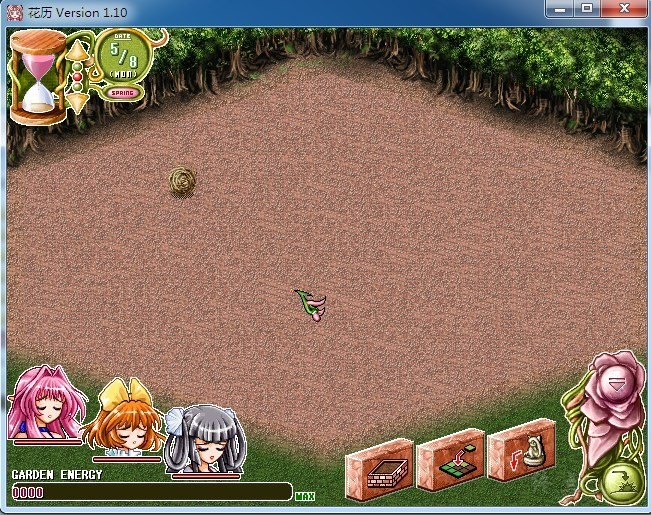

# 游戏简介

记得幼年的我曾经住在祖父家中，那里有个仙境一般的庭园，而当我今天怀着忐忑不安的心情来到这里时，却发现此地一片荒芜。受病卧在床祖父的嘱托，让我照料这个花园，令它恢复往日的美丽，然而，我究竟应该怎样做才能让那个记忆中的仙境重现呢？”

大凡游戏公司总要靠一两个招牌游戏来出名，尤其是对那些尚且立足未稳的小游戏公司来说，更是如此。CYC这个让我们完全从记忆中找不到它存在过的公司也不例外，那么它向我们推出的这款游戏《花历》，又会是怎样的表现呢？

现代或许是一个经营的年代吧，我们小至经营一家西式餐厅或是一家拉面馆，大至一家铁路或是航空公司，乃至一个城市、一个国家，甚至于一整个星球。我们还有什么不可以模拟的？于是CYC把目光投向了家中的后院。

事实上这款游戏远没有你想的那么复杂，无需要有什么专业养花知识，你所要做的，只是精心按你心中的规划来布置这个花园罢了。在这个神奇的花园里，时间的流逝和外界是不同的，花朵在这个花园中生长得特别的快，而一年四季也会在很短的时间内于花园中周而复始。面对一片荒园，我们必须先使用“地面配置”这一指令来为花园规划出每一寸土地的地面效果，比如草地、土地、池塘 等等；然后使用“花坛制成”来配置不同大小、不同外观的花坛。当这两个步骤都完成后，就可以点选花坛进行花卉的种植（每个独立的花坛中只能种植同一种花卉）。为了让玩家更好地享受布置的快乐而免去照料之苦，你只需要定时给每个花坛锄锄草、浇浇水，静等随着时间的流逝花坛中长出茂盛的簇簇鲜花就行了。为了整个花园的美观，你有多余的经费也可以购置一些丰富多彩的盆景或工艺品来予以点缀。当然开始一些比较高级的花卉或点缀品是不能马上就出现在你的花园中的，需要随着游戏的深入和情节的发生才会逐一出现。由于护理花园的游戏过程是即时进行的，你得随时注意留心左上角那个沙漏的残留时间，想要时间过得快一些也可以用右下角的指令飞快地度过当天，以便看到以后的故事情节发展。

养花可是要花一大笔钱的哦，那么你一定想问，这笔费用从哪里来呢？难道是卖花吗？呵呵，当然不是啦。每周一你都能从爷爷那里得到一定的经费，而每月第一个周五还会有著名的园艺师前来评价，如果得到较好的评价，下周起你养花的经费更会大幅增加哦！

俗话说：醉翁之意不在酒。玩这款游戏对我们来说同样是护花之心不在花，因为在这个神秘花园的力量源就在于居住于此的三位可爱绝伦的花之精灵，如果和她们搞好关系，他们就会在你辛勤劳动的过程中予以无私的协助。作为回报，我们在精心照料花圃之余，是否应该约她们外出呢？游戏中到双休日之时你便可以约她们三个中任意一位走出花园，到城市的各个场所去约会，而约会的成功与否就取决于与花园繁荣程度息息相关的她们的精力数值，因此在约她们上街之前，请先把你的后院花园照料得棒棒的吧。

天人互动官方中文

**请使用[IDM](https://www.123pan.com/s/jJprVv-3tMsH)进行下载，使用最新版[winrar](https://www.123pan.com/s/jJprVv-dtMsH)进行解压（非常重要）。**

**解压密码为终点（简体汉字）。**

**添加10%恢复记录，防止网盘抽风损坏。**

