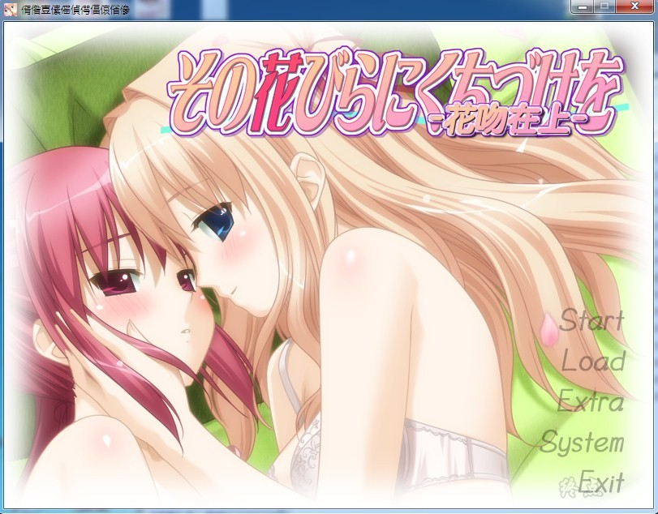
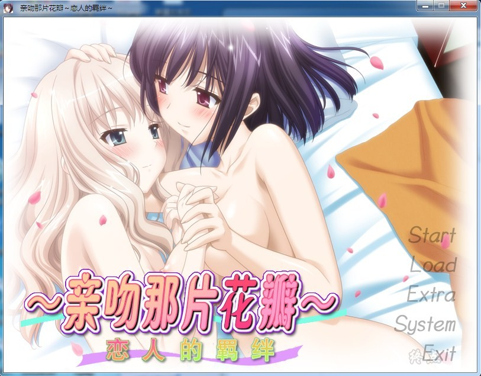
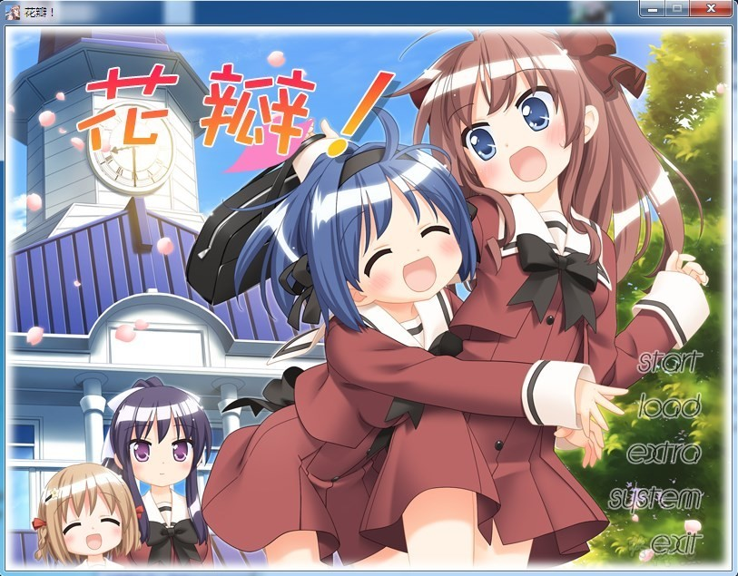
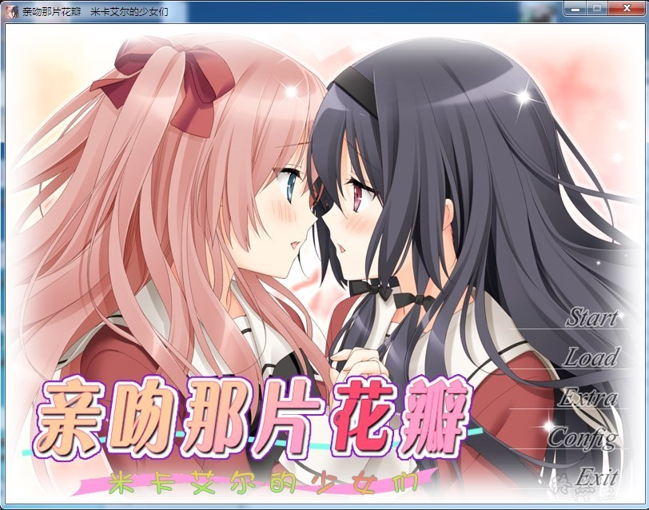
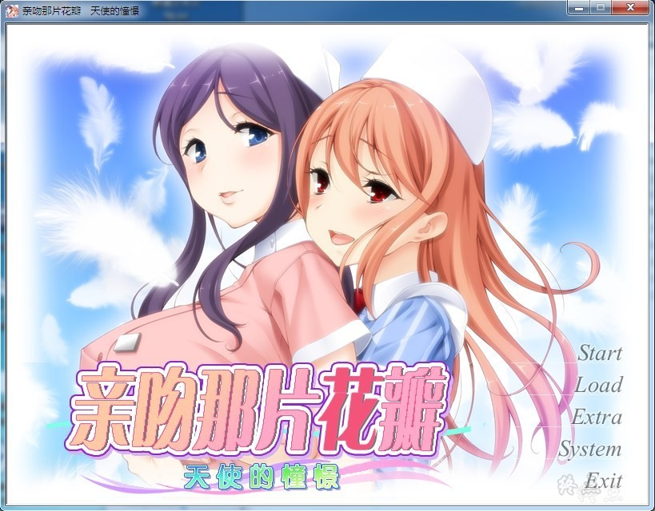
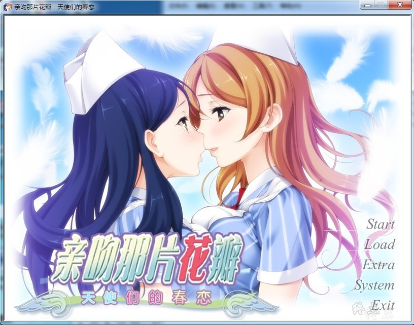

# 游戏简介

亲吻那片花瓣（その花びらにくちづけを），又名花吻、花吻在上，是由同人游戏社团河豚屋（ふぐり屋）所制作并发行的同人视觉小说游戏系列，以及同名轻小说和广播剧。

此系列游戏的故事皆是在虚构的“圣米卡艾鲁女子学院”（聖ミカエル女子學園，简称为米卡女校）展开的，内容则分别为在此学习的几对女孩子的恋情故事。剧情均为百合式，也表现出较高的成人度。每部作品均采用单线剧情，存在选项。

《亲吻那片花瓣 米卡艾尔的少女们》已有兼容中文版的步兵补丁，作者禁止二次上传，因此未加入。

[传送门](https://bbs.kfpromax.com/read.php?tid=959689&sf=395&page=1#16542203)

## 附目录表

**请使用[IDM](https://www.123pan.com/s/jJprVv-3tMsH)进行下载，使用最新版[winrar](https://www.123pan.com/s/jJprVv-dtMsH)进行解压（非常重要）。**

**解压密码为终点（简体汉字）。**

**添加10%恢复记录，防止网盘抽风损坏。**

