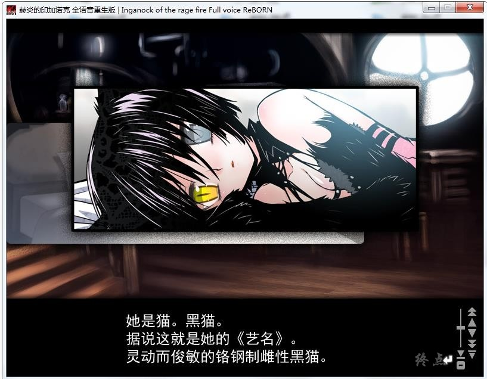

# 原版＆全语音重制版

# Steam官中重制版

# 游戏简介

「──有些人梦见的世界。

──时不时梦见的世界。

──然而，却如此地充满猥杂、残酷与哀伤。

──如此耀眼地闪着光芒。」

异形都市『印加诺克』。在这样一个由积层型巨大构造体形成的完全环境都市（arcology）中，10年前发生的《复活》将一切都扭曲了。人类、树木、还有因机关（engine）排烟而化为灰色的天空。理应独一无二的太阳，如今已变为两个。

令人畏惧的幻想生物不断出没，就连原本给都市带来富裕的蒸汽机械文明，也发生了变异，不时地化为异形袭击人类。唯一得以幸免变异的，只有贵族们居住的都市上层。印加诺克的一小部分。

据称超过100万的人口密集的都市下层，如今正满溢着地上不该存在的异形和奇病，以及发达至异常的暴力般的机械技术。歪曲的天空中生出无限的迷雾，将都市完全地孤立了。

孤立都市，同时也是异形都市的。印加诺克。

巡回医师寂，直至今日依旧奔走在都市中。

他无视了一心要让弱者灭绝的上层贵族所制定的“死之都市法”，来回奔走，诊治救助着下层的人们。从昨天到今天，再到明天。

眼睁睁看着自己手中逝去的无数生命。

为了确认10年前所丢失的究竟为何物，而持续奔走着。

──于是，他遇见了。

──两个人。

一个少女。好似对印加诺克的混沌浑然不知的，黑衣的少女。

她的名字叫琪雅。脸上总是挂着那被人们遗忘了的“笑容”。

还有一个是影。失去了一切幻想的都市中唯一成为传说的，“童话”中登场的角色。

也就是，可变化为万色的钢之人影。

其名为《奇械》。

非人的钢之影。

粉碎异形的刃之手。

给人们带来“美”的，印加诺克唯一的希望──

原版＆全语音重制版，萌你妹汉化组  汉化作品

**[原版汉化发布帖](http://bbs.natsunokiseki.org/read.php?tid=200&fid=33)** 

**[重制版汉化发布帖](http://bbs.natsunokiseki.org/read.php?tid=236&fid=33)**

**Steam官中重制版（双版本）** [Steam地址](https://store.steampowered.com/app/982400/_Fullvoice_ReBORN/) 

**感谢香香，全年龄版，如有能力，请支持正版补票** 

**Steam版本为论坛自购，转载请注明出处**

**2019-3-15 更新Steam官方中文版，全年龄版本**

**重新发帖整理一下，顺便说下这几个版本的区别**

原版，2007发售，R18版本，部分无语音，分辨率800×600。

全语音重制版，2011发售，R18版本，全语音，分辨率800×600。

Steam官中重制版，2019发售，全年龄版本，全语音，内含2个版本。

一个是分辨率1280×720的重制版，一个是分辨率1280×960的HD版。

至于R18版本与全年龄版本的区别，H聊胜于无吧。

3个版本都整合到了这帖，网盘里请自行选择下载

**请使用[IDM](https://www.123pan.com/s/jJprVv-3tMsH)进行下载，使用最新版[winrar](https://www.123pan.com/s/jJprVv-dtMsH)进行解压（非常重要）。**

**解压密码为终点（简体汉字）。**

**添加10%恢复记录，防止网盘抽风损坏。**

