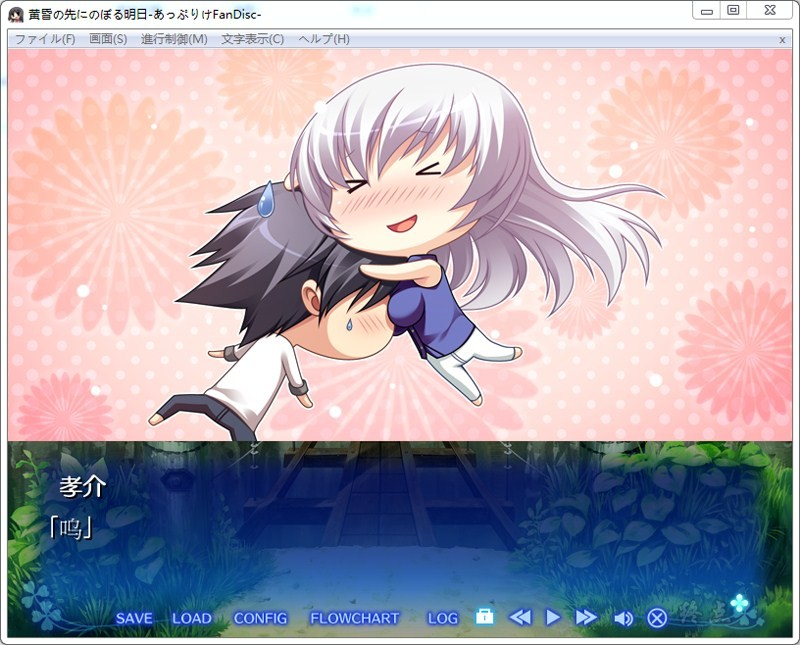
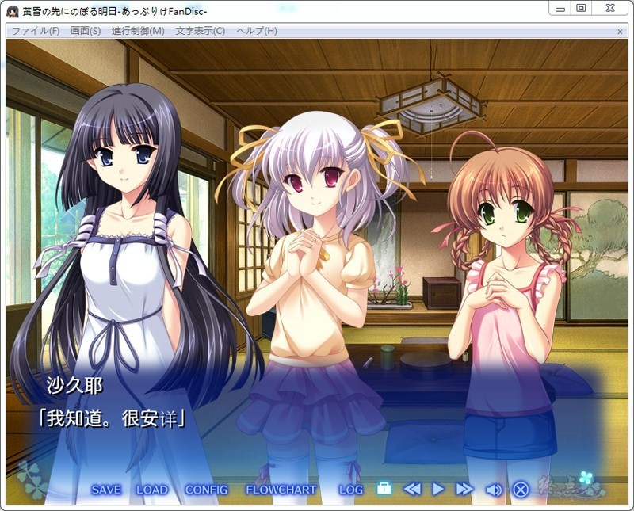
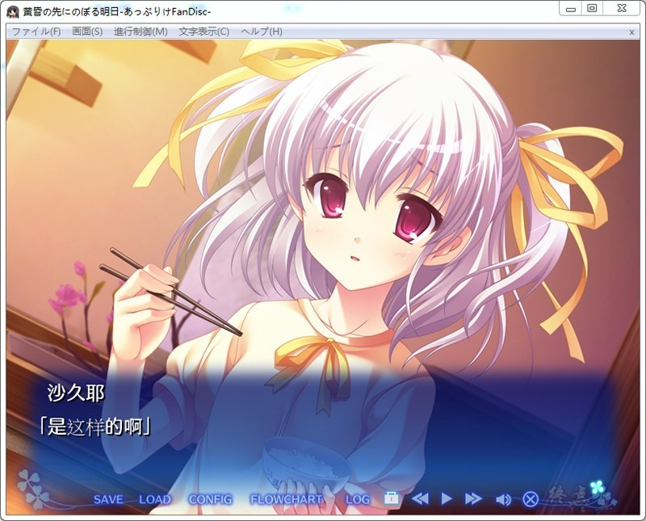
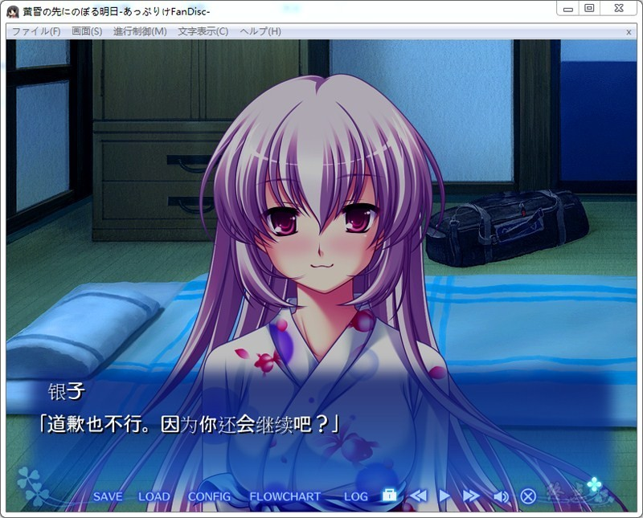
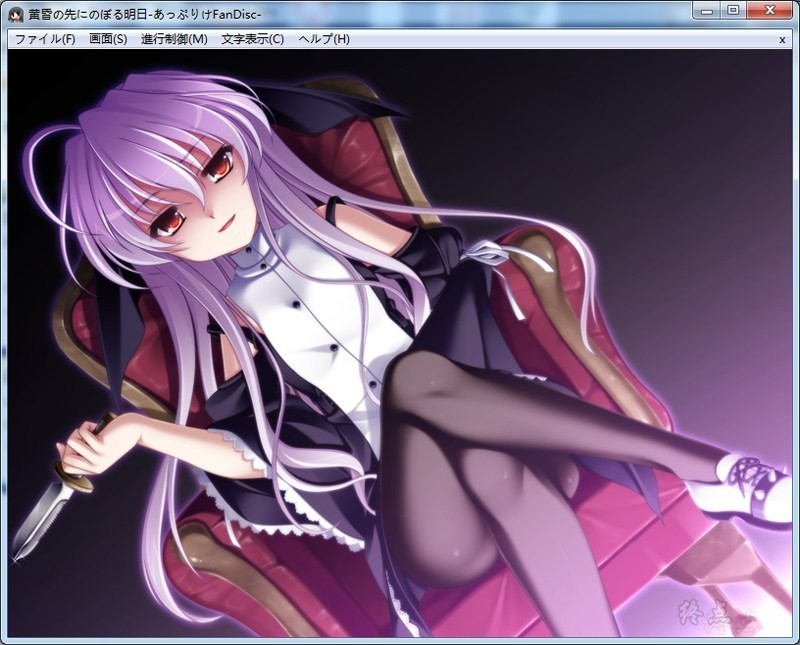
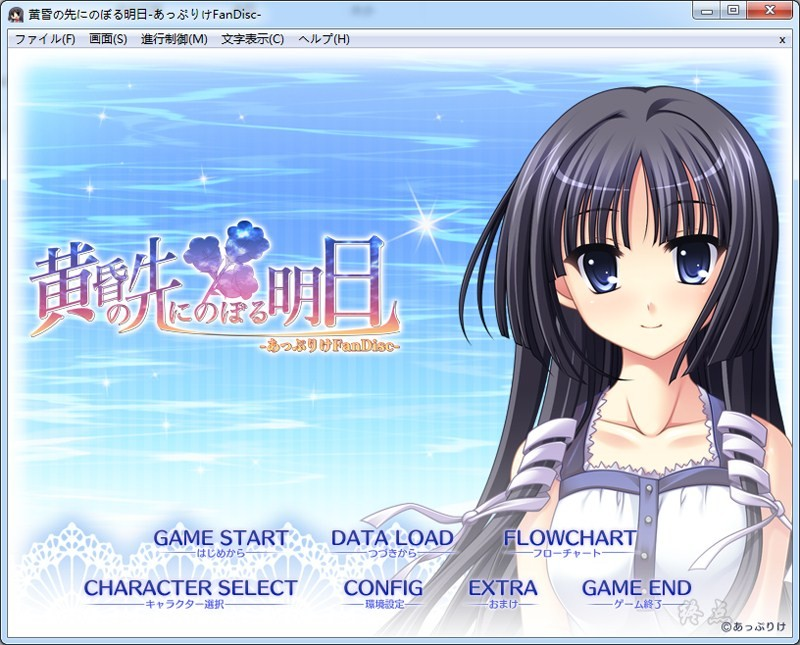
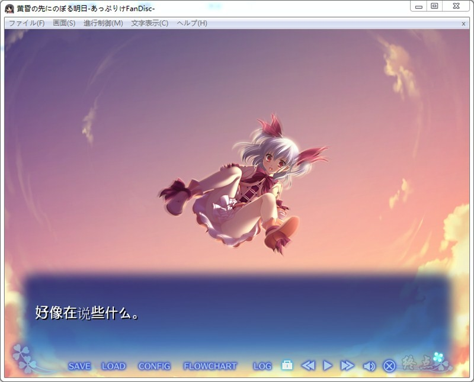

# **游戏简介**

收录了あっぷりけ的人气作品『見上げた空におちていく』、『コンチェルトノート』、『黄昏のシンセミア』的后传、外传以及短篇故事，还有网上连线麻将的FanDisk！

短篇故事“フラグメント”，是在玩家参与型企划“あっぷりけ放送局”中，以回答由实际玩家所提出来的疑问、质问的形式而开放的。说不定您的投稿也会涉及其中哦！？

而麻将则会附带即使是初学者也能放心的介绍说明。还附有让只想专注故事的人关掉麻将部分的功能（※注意不会产生故事分支）。

您还能通过网上连线麻将与同为粉丝的人一起公正地一决胜负。还会有仅限这里才能看到的cut-in以及台词，想要完通游戏的人必定要玩啊！？

当然作为主菜的故事剧本，亲密接触、喜剧、严肃等值得期待的章节也是很丰富的♪

・「魔法少女春奈」（『黄昏のシンセミア』故事）
事件还没浮现出终结的征兆，正在暑假当中的御奈神村。
就在这个时候，在孝介的面前，有个少女从天而降。
一身古怪的cos装的少女，看着有点像是銀子……

与她的相遇成为了分水岭，孝介体验了“另一个夏天”。

**another篇「魔法少女春奈」已汉化**

[汉化原帖](https://tieba.baidu.com/p/4338940386)

**请使用[IDM](https://www.123pan.com/s/jJprVv-3tMsH)进行下载，使用最新版[winrar](https://www.123pan.com/s/jJprVv-dtMsH)进行解压（非常重要）。**
**解压密码为终点（简体汉字）。**
**添加10%恢复记录，防止网盘抽风损坏。**