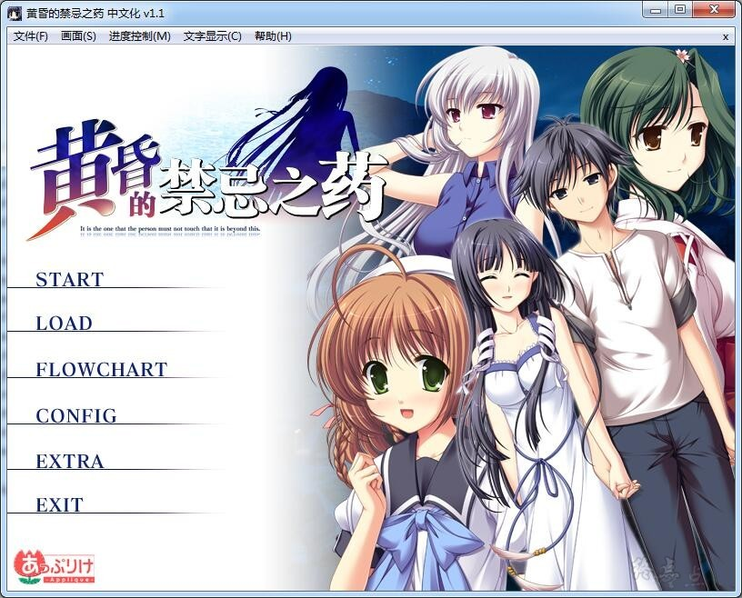
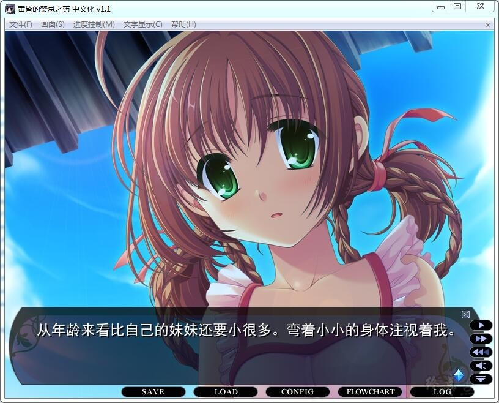
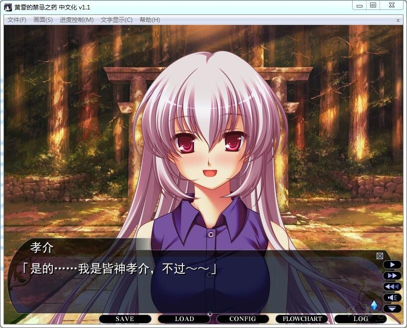
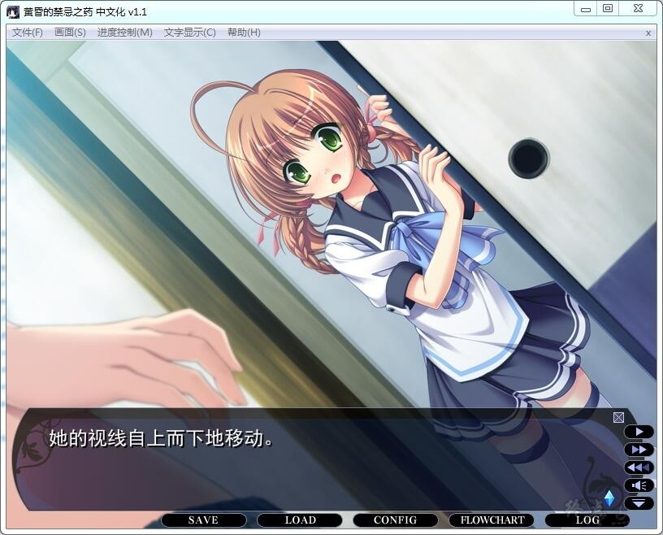
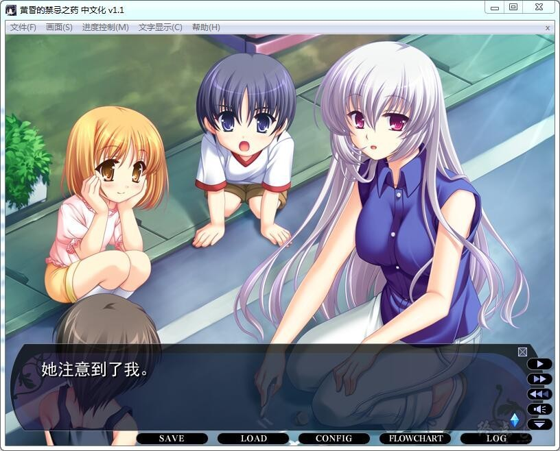
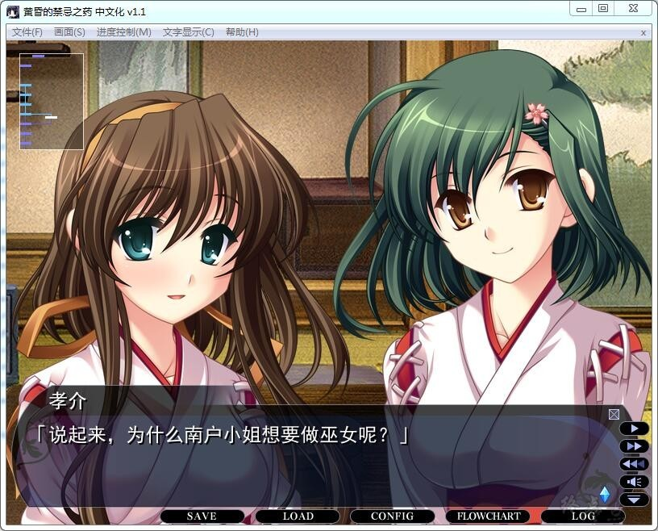
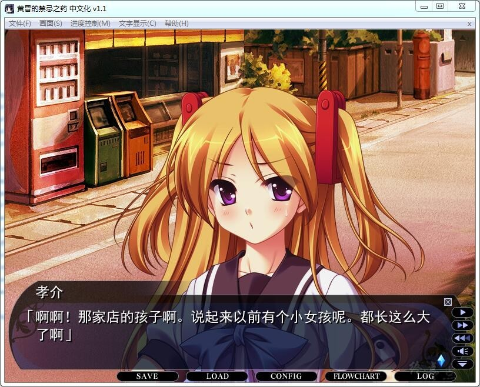
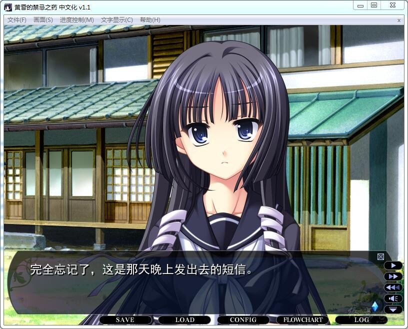

# **游戏简介**

**「有谁就此离你而逝，那会是怎样的一种心情呢……」**

**这里是被山所包围的，风光明媚的御奈神村（みなかみむら）。**

**村的中心是一座历史悠久的巨大神社，而天女羽衣的传说也在这里流传着。**

**主人公皆神孝介是大学生，如今利用暑假回到了这个村庄，他母亲的故乡。**

**契机只在于从叔母那里听来的关于打工的话题。**

**在这令人怀念的村庄里，将上演的是和少女们的邂逅，以及再会。**

**看似友人，实则亲妹妹的皆神さくや （みながみ さくや）。**

**已经变得疏远的表妹——岩永翔子（いわなが しょうこ）。**

**神社的巫女，青梅竹马的春日伊吕波（かすが いろは）。**

**还有，在村里邂逅的谜团重重的少女——银子 （ぎんこ）。**

**怀念的人们，还有新认识的少女，在这种种的相逢之中，孝介也慢慢地有了新的容身之处。**

**——然而，向孝介他们袭来的异变，却将如此的日常摧毁了。**

**所谓山童 （やまわろ），是村里传说中的妖怪。**

**那是能让生物产生异变的神话中的药的真正形态。**

**而根据传说，依旧残存下来的天女，究竟又是怎么一回事呢？**

**无数真实的迫近，他们也将面临不得不作出的决断——**

妹乃萌汉化组的作品

**请使用[IDM](https://www.123pan.com/s/jJprVv-3tMsH)进行下载，使用最新版[winrar](https://www.123pan.com/s/jJprVv-dtMsH)进行解压（非常重要）。**
**解压密码为终点（简体汉字）。**
**添加10%恢复记录，防止网盘抽风损坏。**