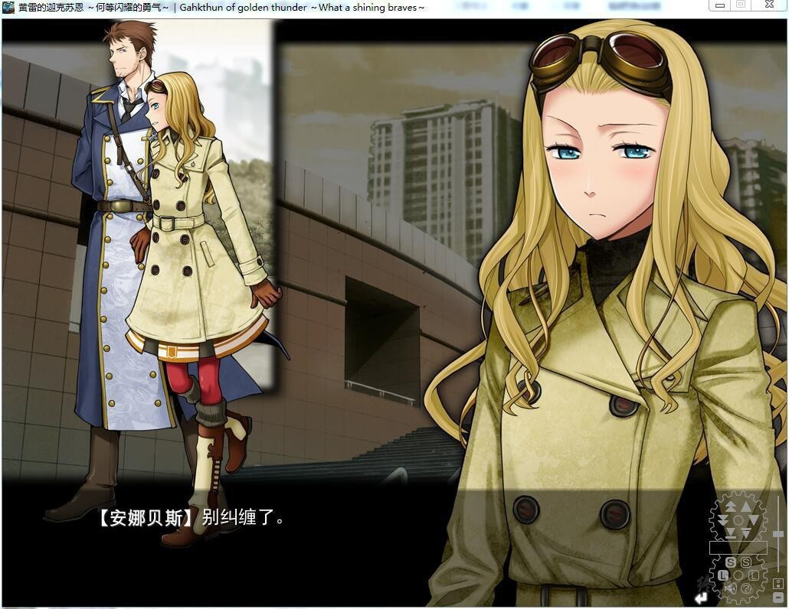

# 游戏简介

20世界初、1908年。

被隐瞒的世纪、被隐瞒的世界。

走在与我们拥有的世界有所差别的19世纪的，是无数的蒸气机关的身躯。

异常发达的蒸气文明导致世界所有的天空都染上灰色，就连海也染上了黑色。

海——黑色的海。过去曾是蓝色的海，现在，漆黑晦暗。

欧洲法兰西王国往昔的港湾都市马赛也是如此漆黑、暗色的海，却又有着与世界上其他海有所不同的地方。

那就是仿如巨大的要塞的坚固的大型人工岛。那里，既是都市，同时又是华美的“校园”。

其正式名称，是『マルセイユ洋上学園都市』。

这是一所基于先进的机关科学而建立的都市，是一所为了诞生世界最棒的硕学的学校，尽管位处被华美的蒸气文明所污染的海上、所污染的天空下，然而这里，却充满着讴歌青春的年轻人们的光辉。

洋溢着令人联想到业已失去的太阳的活力与热情，闪耀着令人联想到业已失去的群星的美丽。

然而，在这个学园都市里，却有着一个连法兰西政府也为之恐惧的“秘密”。

坦白来说，那就是学校被统治了整个欧洲幕后势力的秘密结社『西インド会社』所支配的事实。

欧州无论哪个国家组织都不能弄清学园都市的全貌，也不容许介入，各国的首脑只能秘密地静静地观察其动向。

完全封锁的绚丽的学园。

唯一、只有以“毕业”的形式才能允许学生离去的都市。
由『西インド会社』的下属组织、被称为『フラタニティ／ソロリティ』的统治会所支配，拒绝外部一切干涉的年轻人的花园。

无论谁也无法开启的、秘密的花园。不断诞生众多闪耀的才能以及让人畏惧的异能的、华美世界的扭曲。

然而，1908年。此际，一个青年露面了。

明言反抗统治会的他，如此报上名号：

「ニコラ・テスラ。72岁。是个转校生」

「マルセイユ洋上学園都市 10万的学生诸君。被命运诅咒的你们、所有人」

「──由我，这只手，来拯救」

然后，ディフ塔的钟声响起。

在学园都市通告欢喜之时才会响起的『ガクトゥーンの鐘』竟然——

萌你妹汉化组  汉化作品，详情请看汉化发布帖

**[汉化发布帖&ＢＵＧ反馈](http://bbs.natsunokiseki.org/read.php?tid=18678)**

**蒸汽朋克系列，这系列多有名，应该不用提了。**

**告别2014年的0.9版本，终于等到完整汉化了。**

**已打鉴赏修正+演出强化补丁，内置全CG存档。**

**2019-10-9  更新V1.01汉化版本，修正部分名词的译法，增加名词表。**

**请使用[IDM](https://www.123pan.com/s/jJprVv-3tMsH)进行下载，使用最新版[winrar](https://www.123pan.com/s/jJprVv-dtMsH)进行解压（非常重要）。**

**解压密码为终点（简体汉字）。**

**添加10%恢复记录，防止网盘抽风损坏。**

