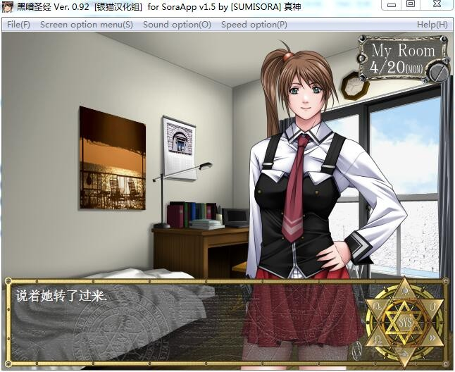

# 游戏介绍

《黑魔术学园》（或译作《黑暗圣经》，日文原名バイブルブラック，即英文Bible Black）是2000年由日本Active公司制作的一款十八禁游戏，原画和脚本制作者是著名的“圣少女”。此作是“圣少女”受雇Active时期六部原画作品的第五部、出任原作者后“三部曲”中的第二部。

因为游戏的情节和画风受业内好评，2002年由Milky Studio公司制作成动画系列，标题为“La Noche de Walpurgis”（意指“五朔节前夕”)，总共有6集，此外还有2集外传和3集特别版；Milky Studio在2004年发布了续集系列，标题为“La Lanza de Longinus”（意指“朗基努斯之枪”），总共有6集。

**请使用[IDM](https://www.123pan.com/s/jJprVv-3tMsH)进行下载，使用最新版[winrar](https://www.123pan.com/s/jJprVv-dtMsH)进行解压（非常重要）。**

**解压密码为终点（简体汉字）。**

**添加10%恢复记录，防止网盘抽风损坏。**

