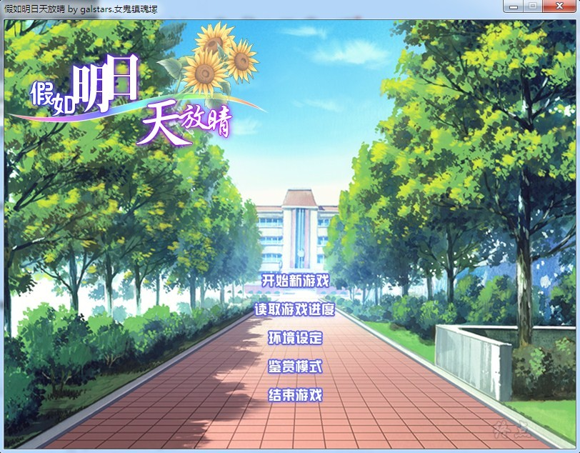
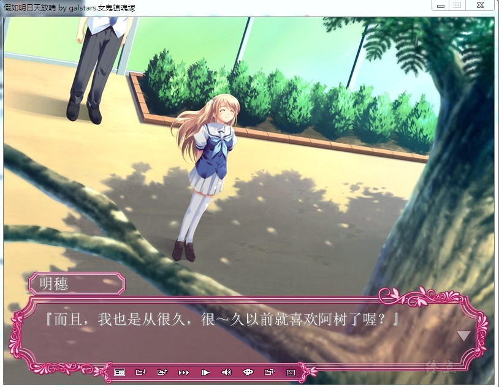
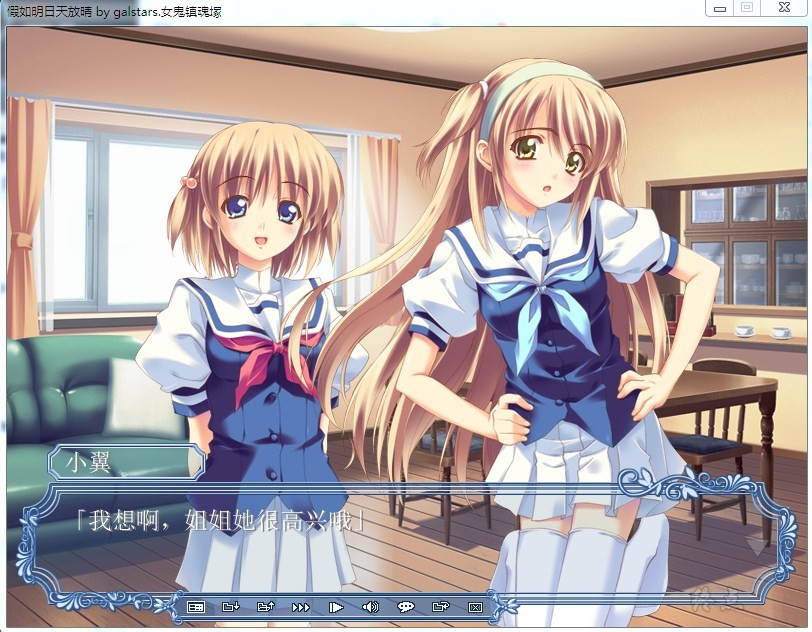
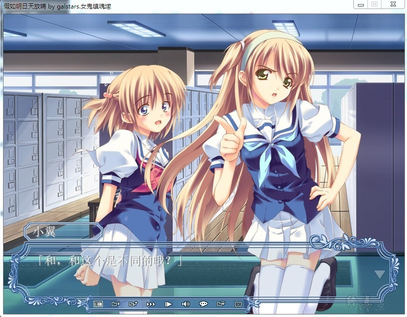

# 游戏简介

对于主人公鸠羽一树来说，野乃崎明穂是不可替代的人。

一直一来，像家人一样在一树家里寄宿着的女孩子。
在那个夏天的的首次告白后，成为一树恋人的女孩子。

从这以后，本应一起创造出幸福的回忆。

但是，这样的她却突然病倒，就这样离开了人世。

由于事情来得太过突然，而且逝去的少女在大家心中占据了如此重要的位置……

活着的人们甚至忘记了哭泣，仅仅是不知所措。

数月之后，在那个大家都已渐渐恢复过来的季节里……

明穂却在没有任何预兆的情况下，回到了这个世界。

「因为还有未完成的心愿啊」

她一边微笑一边这样说着，以一个幽灵的身份。

galstars的汉化作品

**请使用[IDM](https://www.123pan.com/s/jJprVv-3tMsH)进行下载，使用最新版[winrar](https://www.123pan.com/s/jJprVv-dtMsH)进行解压（非常重要）。**

**解压密码为终点（简体汉字）。**

**添加10%恢复记录，防止网盘抽风损坏。**

