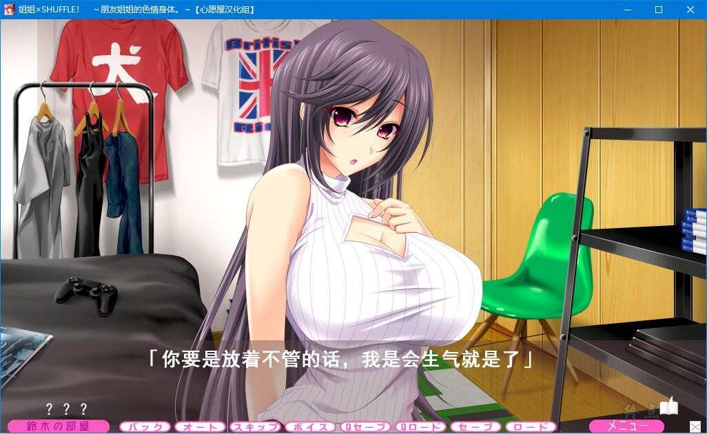
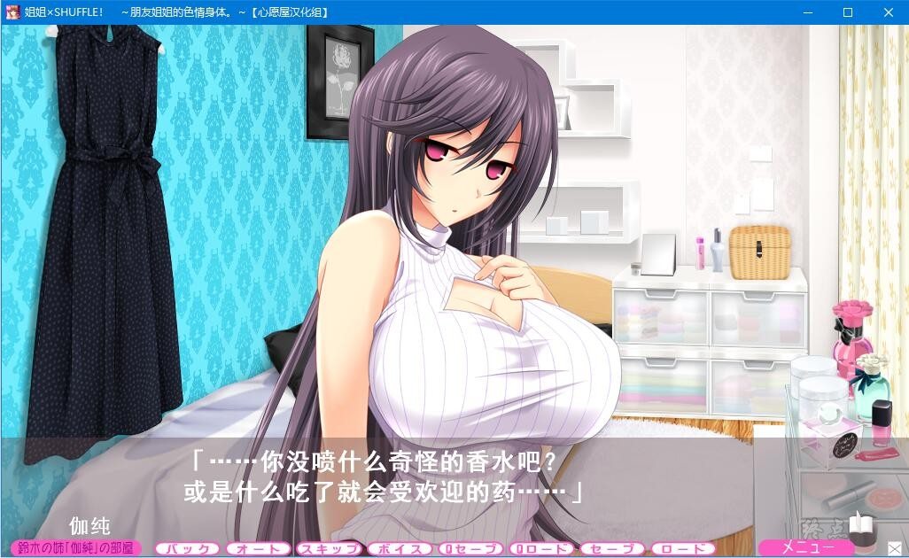
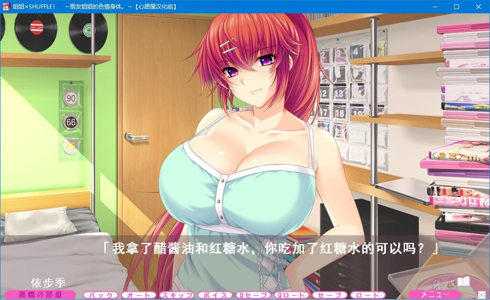
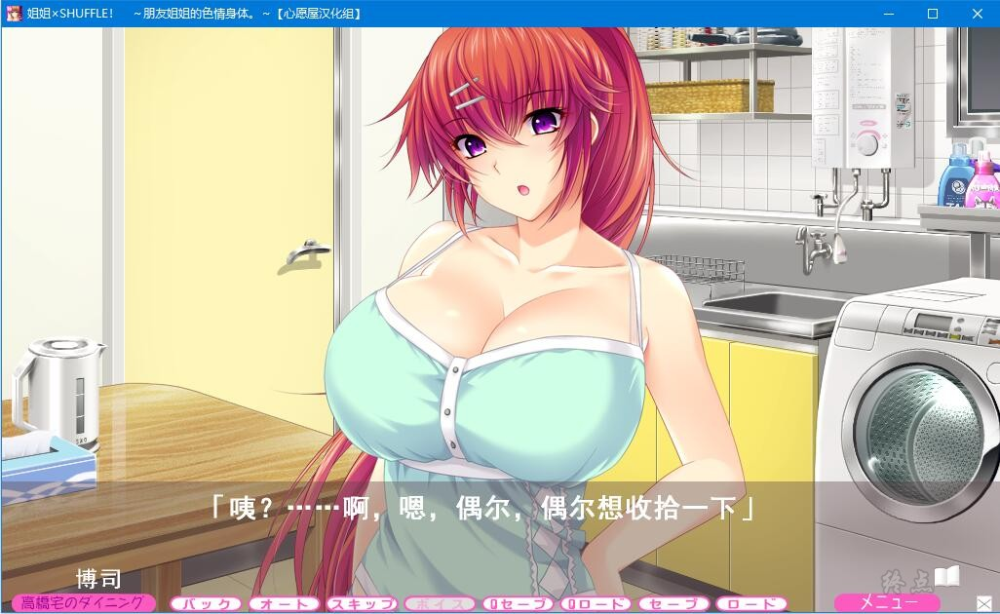

# 故事背景

传说世上有3个跟自己长相一样的人...

也不知什么玩笑，居然会在同一所大学和研讨会里遇到!!!

如此偶然必须要有效利用，恶友们为了制造不在场证明，让主人公被迫潜入他们家中当一天的替身...

但，事情也不会想象之中那般顺利...一上来就发生了意外事件!!!

是的，跟他们同居的是「可爱的姐姐们」!!!

「根本没听说过啊!!!」

回过神，发现跟别人姐姐住在同一屋檐下的状态...而且，还是以弟弟的身份...

这对童贞的我而言是个很严重的状态...

为了圆谎，再次说谎，也无法再一夜中完结...

到底这shuffle生活能迎来结束的一天么....

心愿屋汉化组的汉化作品

**请使用[IDM](https://www.123pan.com/s/jJprVv-3tMsH)进行下载，使用最新版[winrar](https://www.123pan.com/s/jJprVv-dtMsH)进行解压（非常重要）。**

**解压密码为终点（简体汉字）。**

**添加10%恢复记录，防止网盘抽风损坏。**

