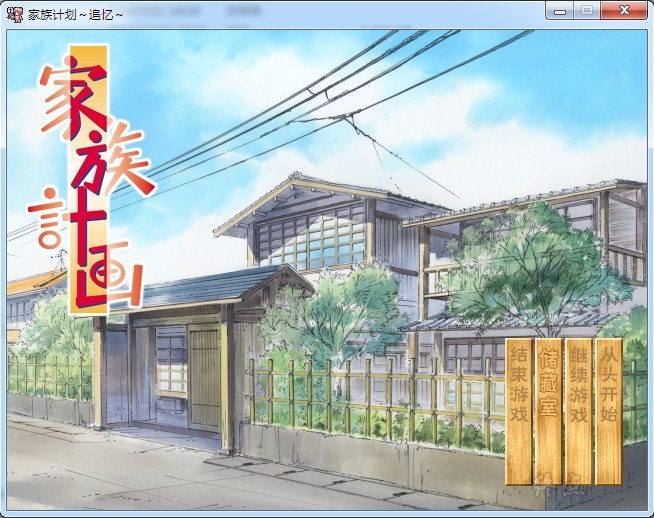

# 游戏简介

很早就失去双亲的主人公——沢村司，一直都是一人独居，从来没有体会过家庭的温暖。一天，他在打工的料理店后面小巷里，“捡到”了一个倒在路边的中国女孩。在无计可施的情况下，司把她带回自己的家中一起生活。当然，一切才刚刚开始。从那一天起，一个又一个有着灰暗过去和内心创伤的人们，聚集到了司的身边。虽然身世、性格、经历各不相同，但他们都有一个共同点，“家庭的欠缺”。

司一行人找到一处无人居住的旧宅，决定在这里组成一个家庭，并一起生活下去。于是，互相扶助的家族计划开始了……

爱好、性格各异，如同无法咬合的齿轮，最终他们会找到幸福吗？

家计推广委员会的作品

[汉化原帖](https://tieba.baidu.com/p/2051885039)

2020-7-18  更新步兵版本，原版文件已备份。

**请使用[IDM](https://www.123pan.com/s/jJprVv-3tMsH)进行下载，使用最新版[winrar](https://www.123pan.com/s/jJprVv-dtMsH)进行解压（非常重要）。**

**解压密码为终点（简体汉字）。**

**添加10%恢复记录，防止网盘抽风损坏。**

