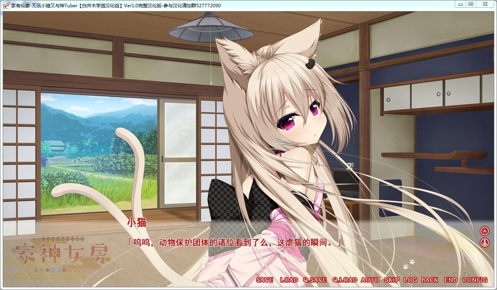
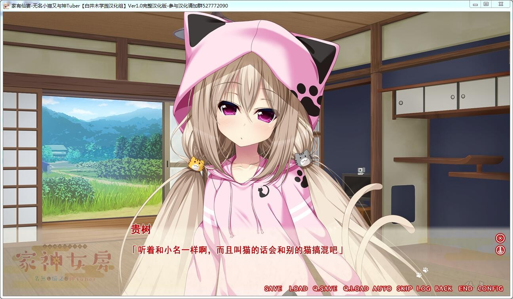
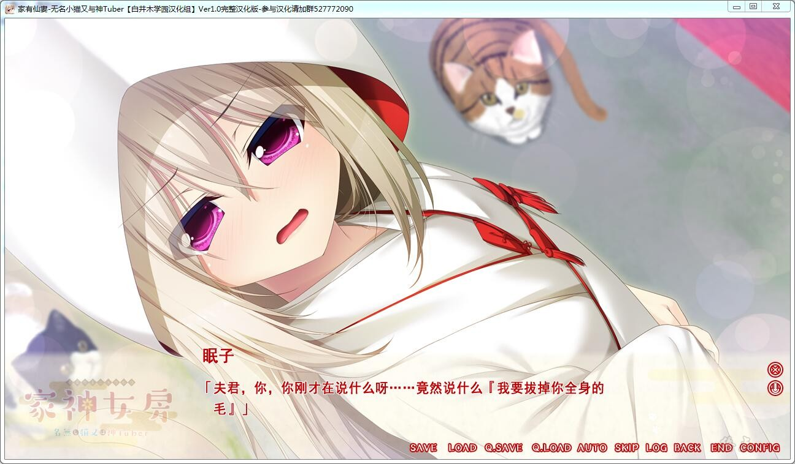
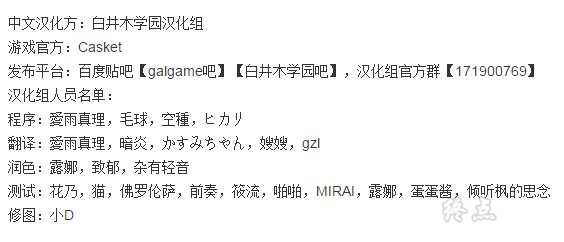

# 游戏简介

*（来自2DFan）*

为了整理去年刚过世的祖母的遗物，主人公重新回到了老家所在的村子。

那里是个人口仅为百余人的超偏僻乡下，虽幻想着能和田园的丰满美少女的来个浪漫邂逅，

不过现实当然会很骨感吧——

「唔……哥哥、莫非是都市里的人？」

一只自称名为“猫”的猫又家神，向呆然伫立在公交车站内的主人公搭起了话。

会在共享视频网站“神Tube”投稿自制动画，被称为“神Tuber”的这位家神，

似乎就负责守护主人公的祖母家……

「猫、现在正在募集主人呢。能养养猫吗？」

随性且懒散，说好听的就是只爱撒娇的可爱家伙，

主人公和猫又间波澜万丈的同居生活、就此拉开序幕——

家神是什么？

本作品的舞台“祀在村”，据传是将以前神明所居住的灵山劈开而开拓而成的村落，

各家各户都有着以家庭为单位和八百万神立下共存契约的风俗习惯。

剧本前半讲述了邂逅同居到结婚的过程，而后半部则针对浓厚的婚后生活来描写。

结下契约的神明大人被称作“家神”。

而家神的种类则千奇百怪，有雪女、河童、座敷童子等——

任何被称作妖怪的存在也会被村民们以家神的地位来祭祀。

家神们都有着超越人智力量的神通力，

平时完全无法实现的特殊PLAY或许也能……？

**白井木学园  汉化作品**

**详情请看 [汉化发布帖](https://tieba.baidu.com/p/6211149535)**

**2019-08-21 更新Ver1.1汉化版本，修复部分Win10无法进游戏的BUG，内置全CG存档和攻略**

**请使用[IDM](https://www.123pan.com/s/jJprVv-3tMsH)进行下载，使用最新版[winrar](https://www.123pan.com/s/jJprVv-dtMsH)进行解压（非常重要）。**

**解压密码为终点（简体汉字）。**

**添加10%恢复记录，防止网盘抽风损坏。**

