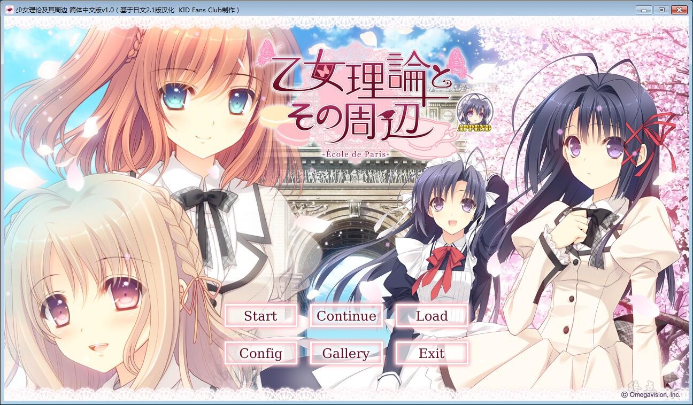
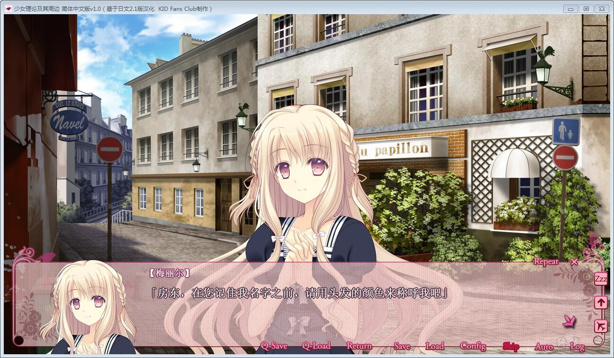
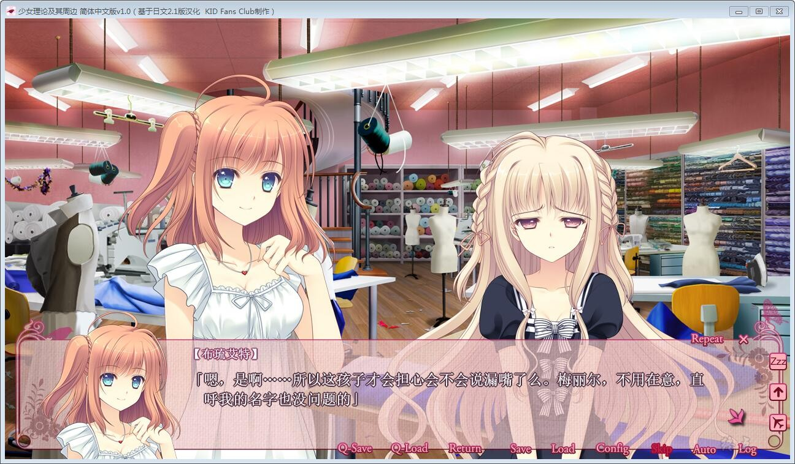
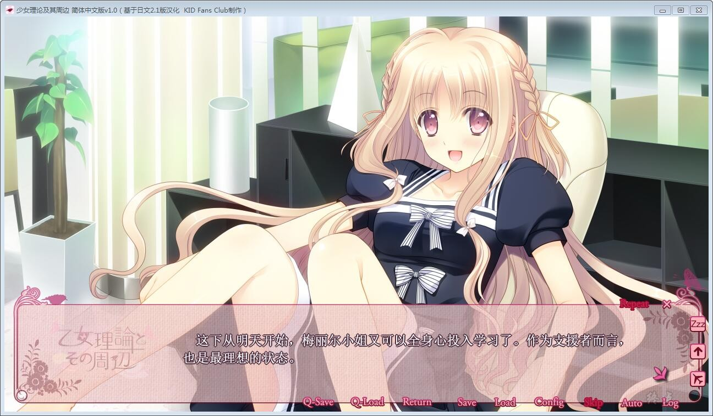
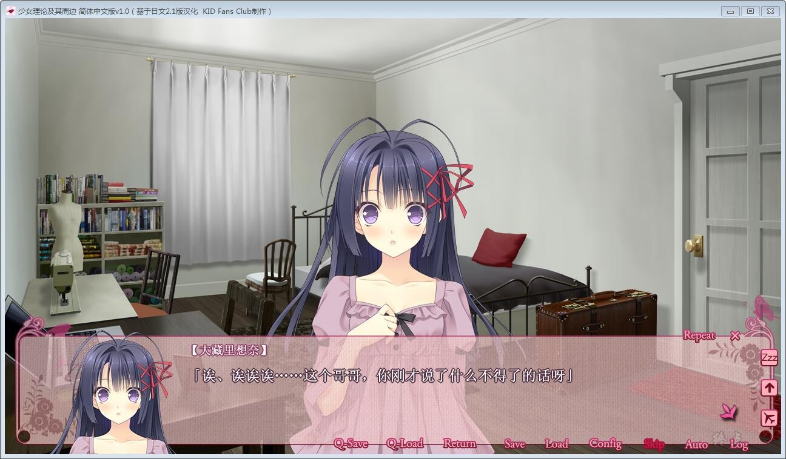

# 游戏简介

——蝴蝶于花之都起舞——

主人公大蔵遊星是代表日本财界的华丽的一族大藏家在不被期望的情况下诞生的孩子。

随着年龄增长获得了平凡的梦想与希望的游星伪造了性别，通过仕从桜小路ルナ，从大藏家这个囚禁自己的笼子中逃出、触摸到了梦想的边缘。

游星的妹妹大蔵りそな是在大藏家的嫡子与正妻之间生下、享受着重重爱意被精心抚养长大。

虽然りそな得意自由地长大，但双亲过度的爱意终于变成了束缚りそな的坚固而扭曲的茧。当りそな发觉时，这个茧已经无法凭她自己的力量打破了。

りそな在安心舒适的茧中失去了抵抗的气力，舍弃了去往外面这个选择。

——某天，他们的兄长尝试性地将“茧”放入了“笼子”之中。

りそな憧憬着外面的世界，向哥哥问道。「我能够去到茧的外面吗」

游星察觉到，茧的壳已经开始渐渐剥落。

「可以哦」
游星与りそな舍弃了安全的笼子与茧，相视而笑，不约而同地说出了同一句话。

「如果两人一起的话就可以踏上旅途了」

为了不能再在フィリア女学院日本分校上课的游星，りそな提出要前往巴黎的本部留学。

游星再次成为平民的女儿小仓朝日，作为仕从りそな的女仆，进入了服装专修机关。

在巴黎有着与新的少女们的邂逅。

拥有纯粹的内心与卓越的才能的メリル，以及她的主人、开朗而亲切地迎接二人的ブリュエット。

还有同年级的リリアーヌ、充满个性的留学生ディートリンデ。还有她们各自的从者们。

游星兄妹的主从生活，就在新国都的各式各样的邂逅中开始了。

游星=朝日追逐着自己的梦想，りそな寻求着自立的勇气。

游星兄妹究竟能否互相支持着双方的心愿，安然度过学院生活呢？

转载于KID Fans Club，[汉化原帖](http://bbs.kid-game.cn/forum.php?mod=viewthread&tid=57330&extra=page%3D1)

**请使用[IDM](https://www.123pan.com/s/jJprVv-3tMsH)进行下载，使用最新版[winrar](https://www.123pan.com/s/jJprVv-dtMsH)进行解压（非常重要）。**

**解压密码为终点（简体汉字）。**

**添加10%恢复记录，防止网盘抽风损坏。**

