# 汉化版

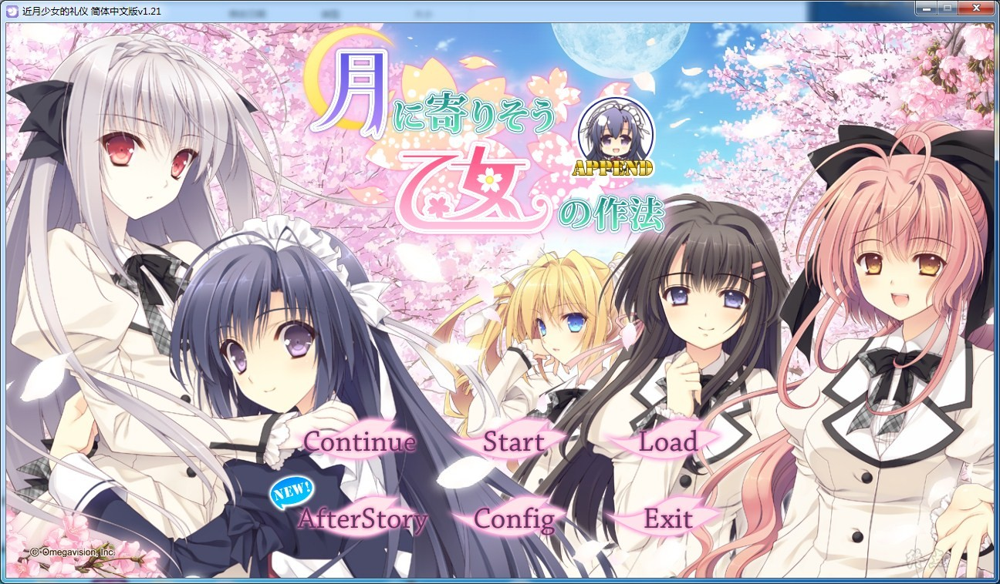

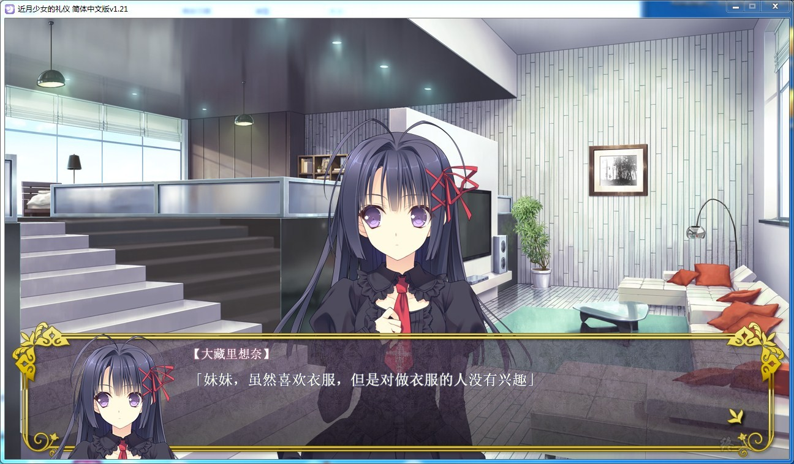

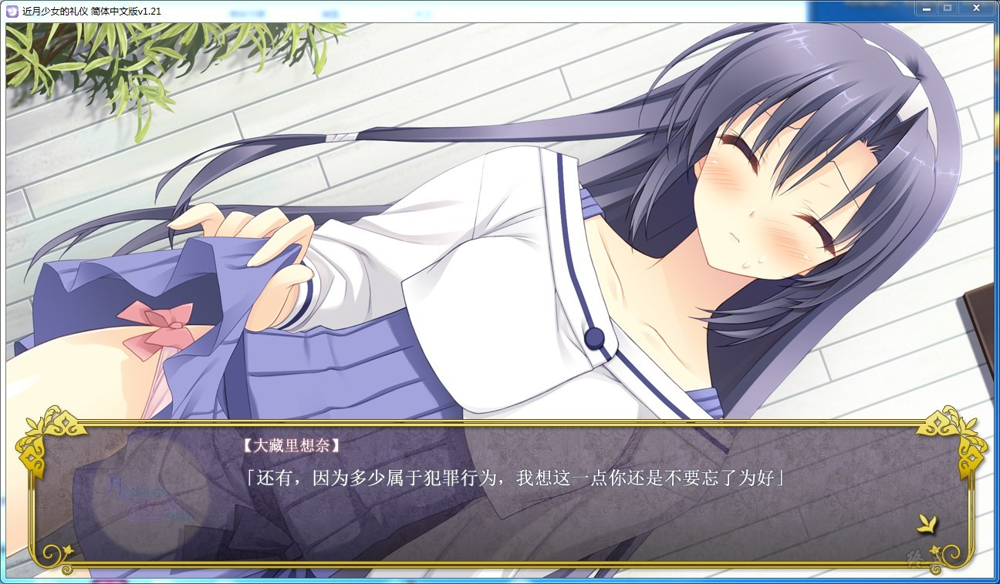

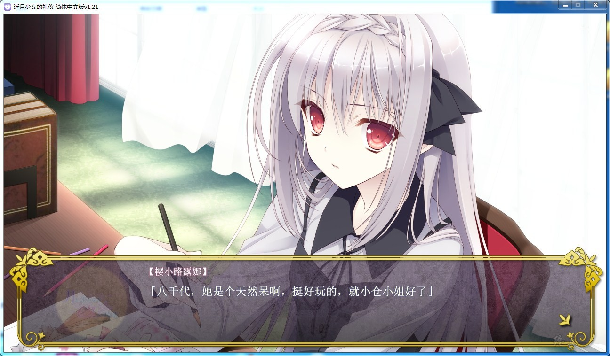

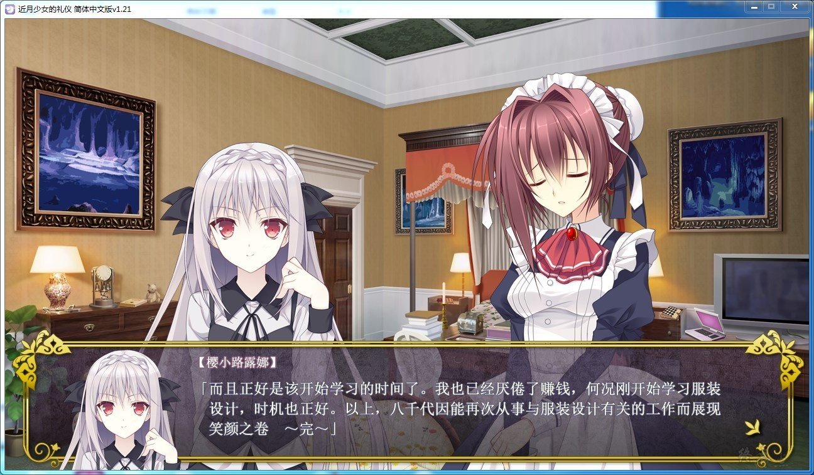

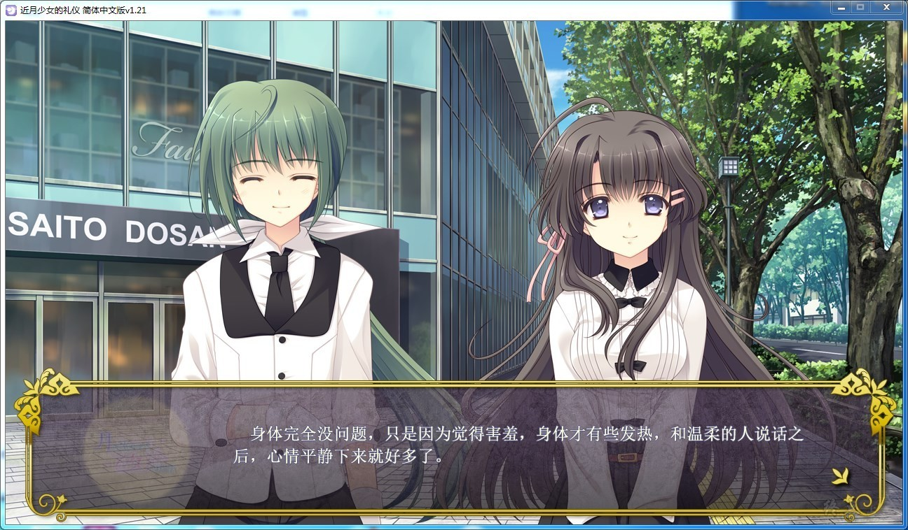

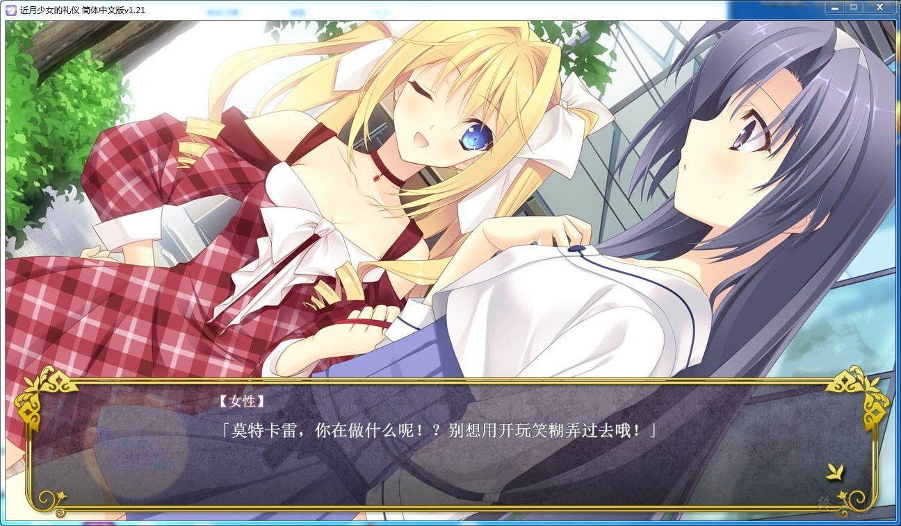

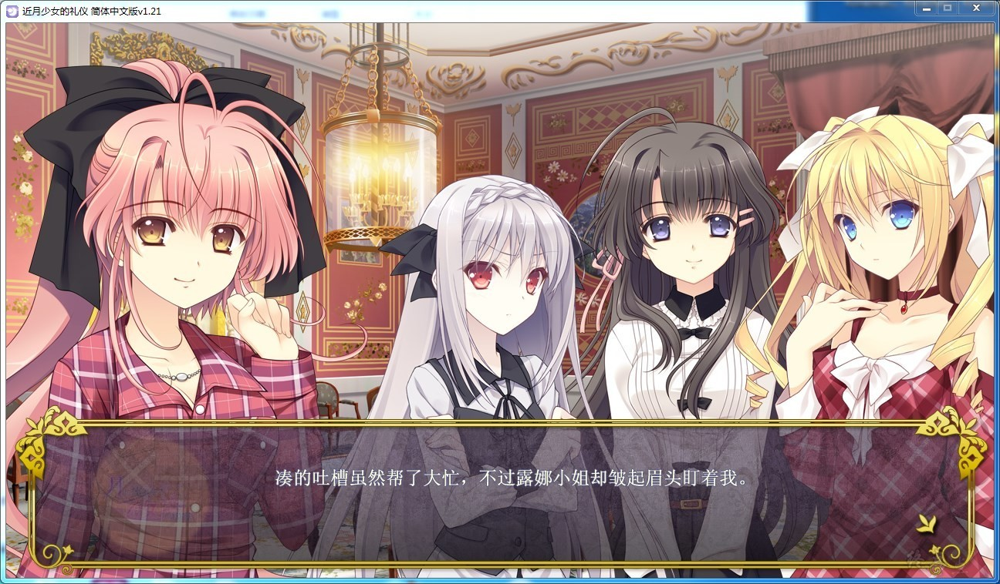

# 官方中文

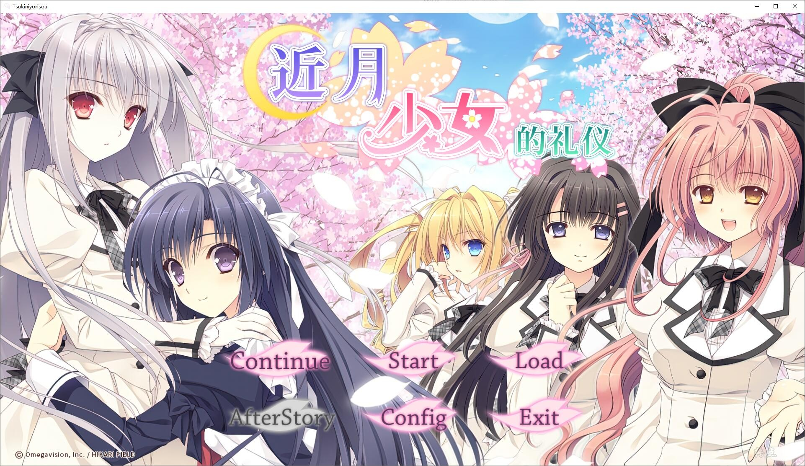

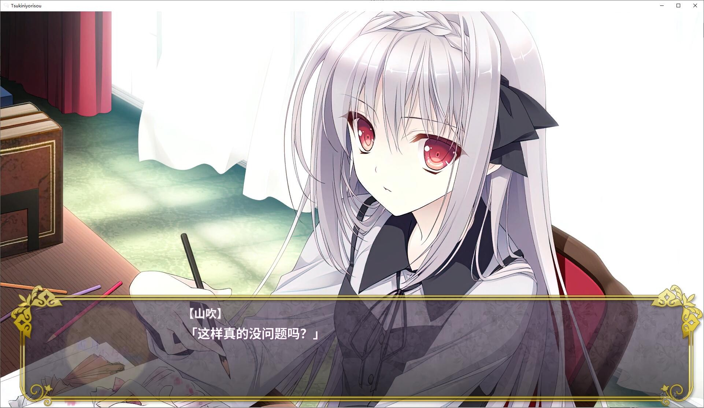

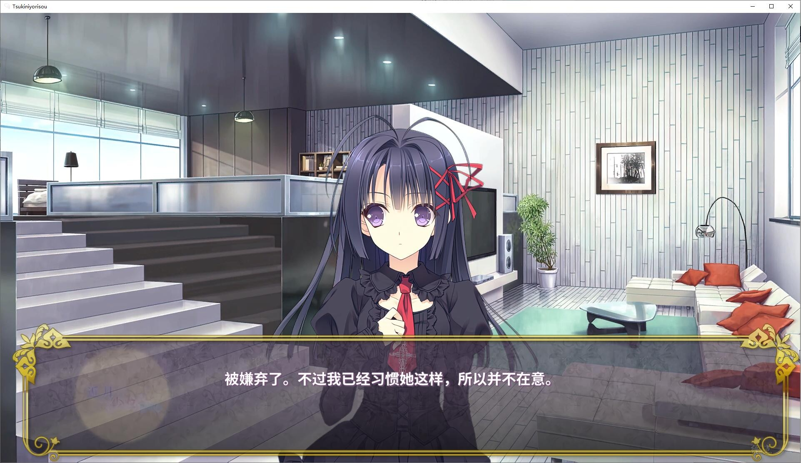

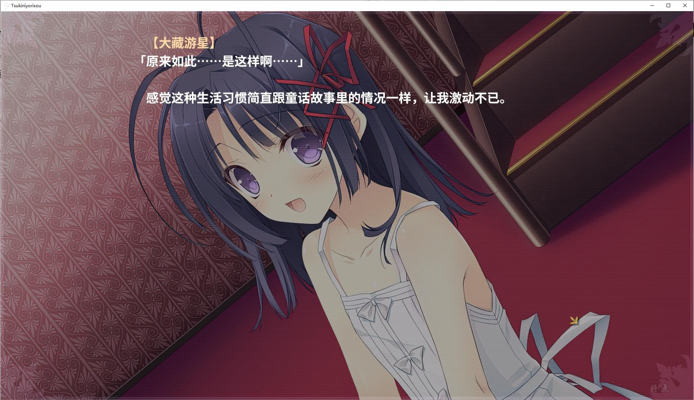

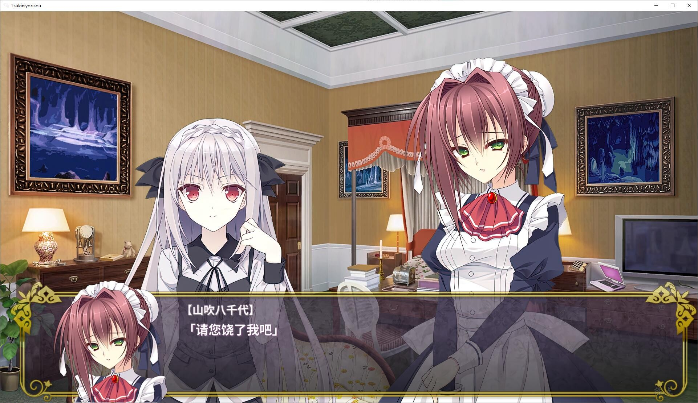

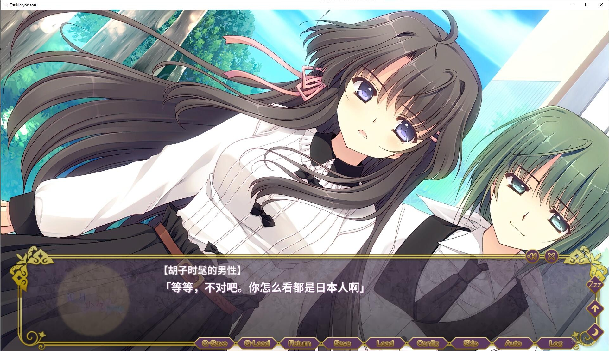

# 游戏简介

主人公大蔵游星，作为代表了日本财界的“华丽一族”的大藏家的末端，其出生就被寄予厚望。

在优秀的亲人与家庭教师身边被严格培育的游星，虽然各方面都很优秀，但换句话说也不过是一只笼中鸟，过着与普通人的梦想与希望毫无关系的生活。

就在这时，游星首次得到了一个脱离一族的监视、独自来到外面的世界的机会。

他化身为毫无名气的庶民女子小仓朝日，隐藏自己的身份潜入了上流阶层的子女云集的服饰专修机构『菲利亚女子学院』。

作为相关一环，游星（朝日）将以侍候学院第一的超级同级生、樱小路露娜的女仆身份，在她所住的『樱公馆』劳作。

也因此，他还会在那里与跟露娜有关系的一众学院生同住。

一位是来自瑞士的高傲留学生，尤希尔。

一位是继承传统花道系谱的大和抚子，花之宫瑞穂。

另外一位，则是在主人公少年时代喜欢上他的庶民派社长千金，柳ヶ瀬凑。

再加上一众独具个性的大小姐，以及跟随她们的超个性的侍者，更让游星（朝日）的生活波澜万丈。

最终，游星能否一直伪装着身份（主要是性别），平安度过公馆与学校的双重生活中呢？

---

2022-6-17更新官方中文，已打补丁

游戏为终点论坛自购，转载请注明终点论坛，谢谢配合。

如有能力，还请支持正版。

[Steam地址](https://store.steampowered.com/app/1776970/_/)

2022-6-18更新官方修正

2022-6-19更新官方修正

2022-6-23更新官方修正

2022-6-26更新官方修正

**请使用[IDM](https://www.123pan.com/s/jJprVv-3tMsH)进行下载，使用最新版[winrar](https://www.123pan.com/s/jJprVv-dtMsH)进行解压（非常重要）。**

**解压密码为终点（简体汉字）。**

**添加10%恢复记录，防止网盘抽风损坏。**

