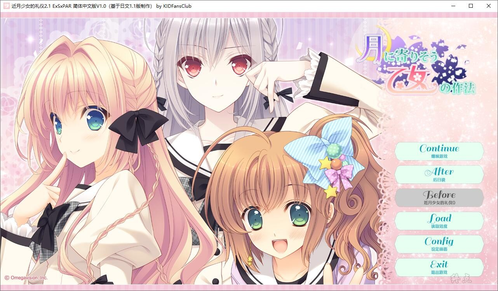
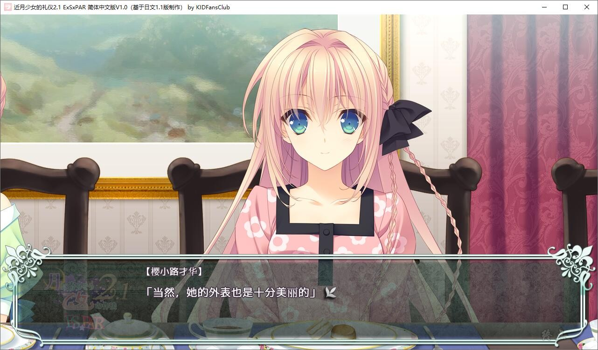
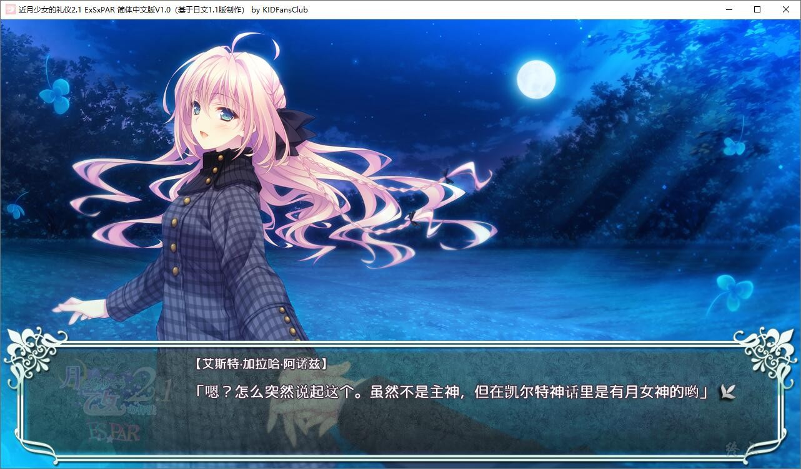
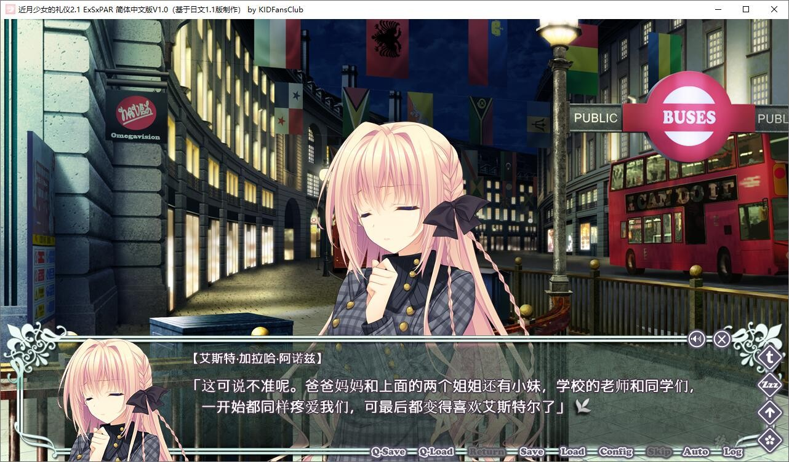
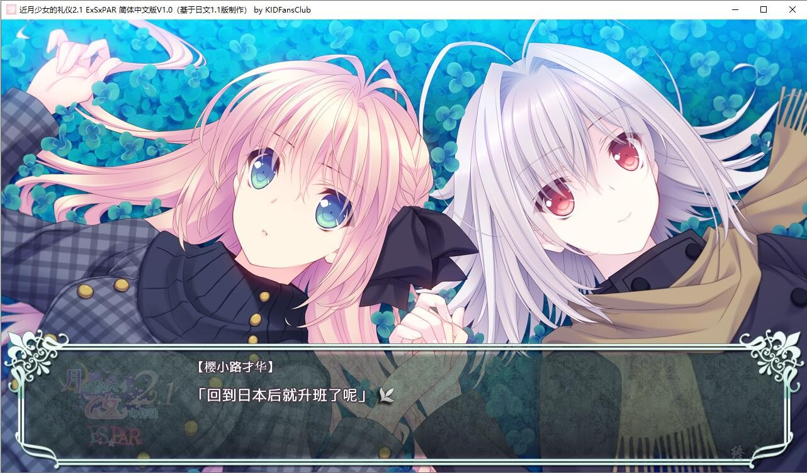
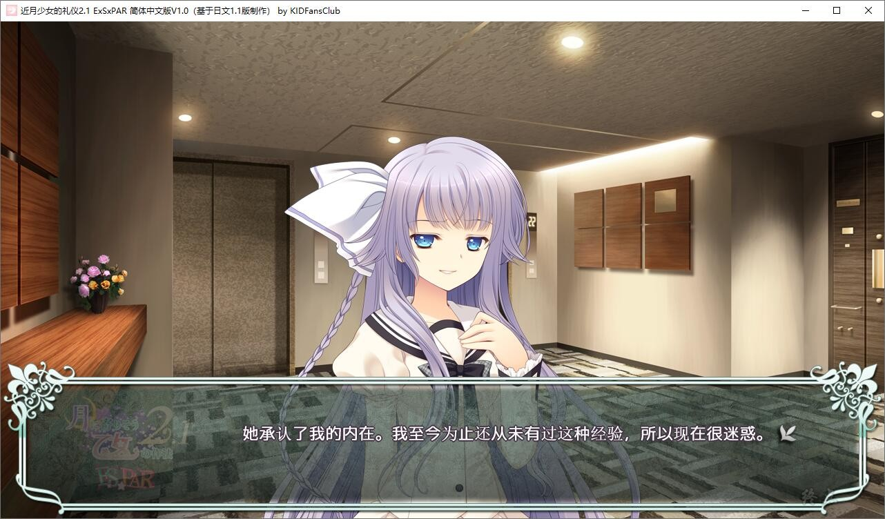

# 游戏简介

**・エストafter「Double Irish」**

「桜小路才華」，克服了自己的弱点。

与主人「エスト・ギャラッハ・アーノッツ」共度了一年时光，在发现了从她身上所追寻的强韧之后，他成功地打破了长期囚禁着自己的外壳。才華达成了第一年的目标，两个人得到了很强的连接，结合为超越主仆的关系。

「总算站在了起跑线上」，才華比以前更要埋头于设计之中。这位身边最亲近的人，既是主人兼恋人，又是他在设计上的竞争对手；通过灵活地运用这么便利的关系，エスト与才華互相提升了自己。

作为展示实力的舞台，两人向着下一个目标、「フィリア・クリスマス・コレクション」二连霸倾注力量。但是，

尽管综合科目认可共同参加，但能被时装设计科的「秀」所选上的最优秀奖只有单件作品。在万全的状态下エスト与才華进行了一次竞争，究竟这场胜负将会如何了结？

**・パル子after「银色混子，出现在原宿」**

「桜小路才華」，通过舍弃自身的光辉，得到了自由。

在某个事件之中，做出了自己所定义的「不美丽的行为」的才華，遵从自己的心，堕落为「混子」。

但是，在没有梦与理想的束缚下，他的立场变得放松，一切皆自由的混子的世界，对他来说是崭新的、快乐的。面对教会了他这种快乐方式的「パル子」，在才能与意识的部分上产生共鸣的才華选择了在「满满的快乐」世界上与她同路。

两个人亲密得被朋友「一丸弓」揶揄「每天死一遍」。但是，正如另一位朋友「ジャスティーヌ」的忠告所说，面对被评价为天才的パル子，才華在才能这个方面吃了苦头。在他们经营的网店里，才華所设计的服装完全卖不出去，创下了连续两个月销售额0元（pause）的记录。受到了鬼社长「连你的脑袋也pause了吗」的宣告后，才華品尝到了前所未有的挫败感。在无可辩解的「销售额」的数字面前，究竟才華的头发能否平安无事呢？

**・「月に寄りそう乙女の作法0」**

『月に寄りそう乙女の作法』的主人公的亲人「大蔵衣遠」，在某个晚上，因为寂寞一股脑地闯进了胸口而喝了个酩酊大醉，到了现在没有主人的「桜屋敷」避难。然而，作为一夜之宿而所选择的这个地方，意料之外地刚好迎来了外甥与侄女，他们死缠着要自己说出年轻时代的回忆。为了醒酒，同时，为了抒发胸口的寂寞，在月光被云层遮蔽的一点短暂时间，衣遠回顾了他在Antwerp所度过的学生时代。他在霸道的征程之中，确切地存在过的、那份青春的哀欢——

*（介绍来自2dfan）*

KID Fans Club汉化组的汉化作品，详情请看汉化原帖

[汉化原帖](https://tieba.baidu.com/p/7589864726)

基于1.1本体，游戏要保持英文路径

2021-10-30 更新 1.1汉化补丁

**请使用[IDM](https://www.123pan.com/s/jJprVv-3tMsH)进行下载，使用最新版[winrar](https://www.123pan.com/s/jJprVv-dtMsH)进行解压（非常重要）。**

**解压密码为终点（简体汉字）。**

**添加10%恢复记录，防止网盘抽风损坏。**

