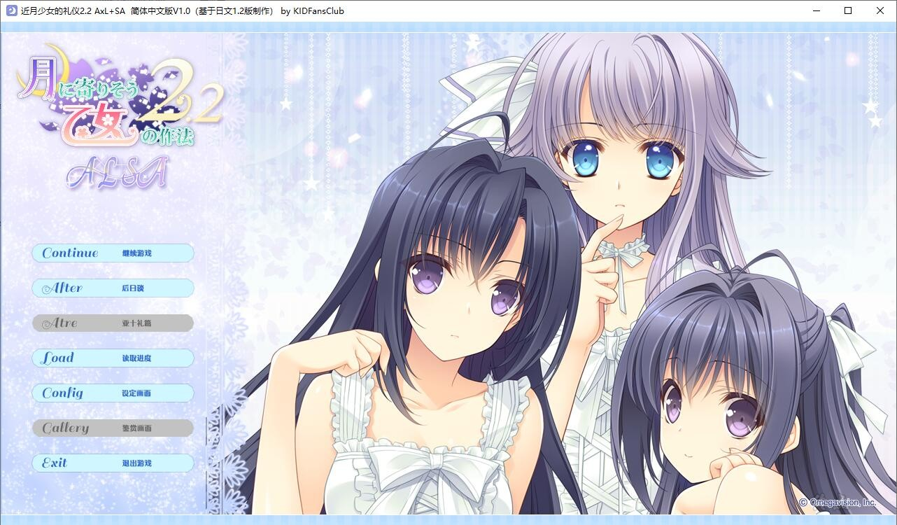
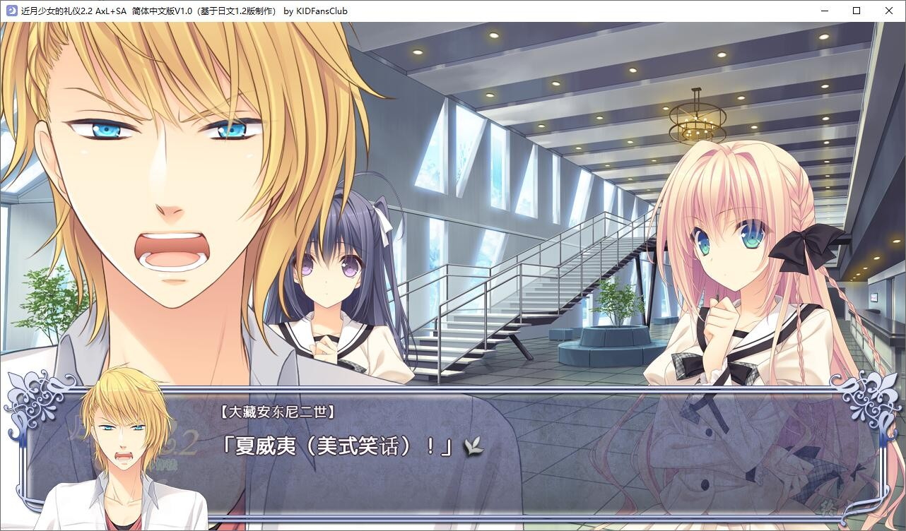
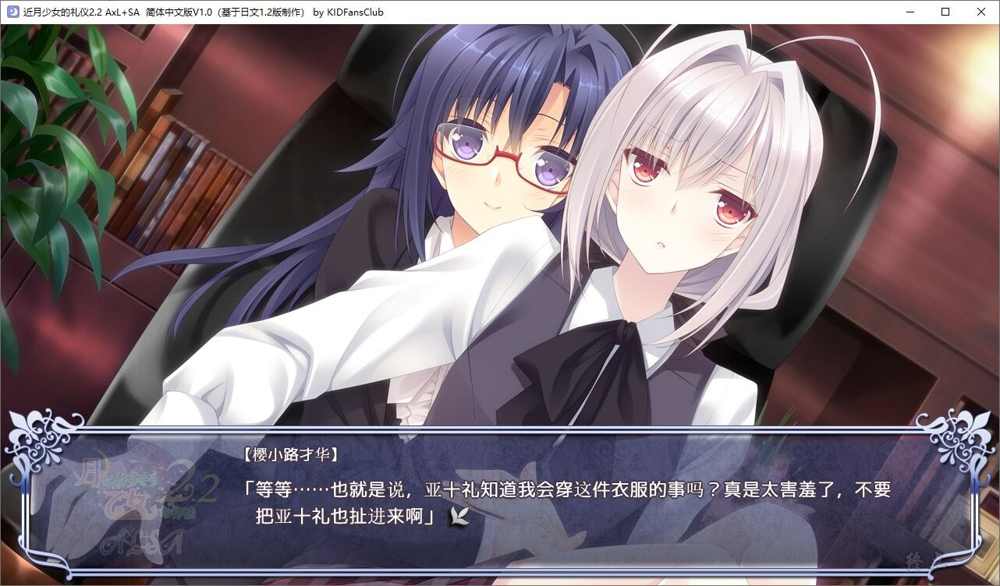
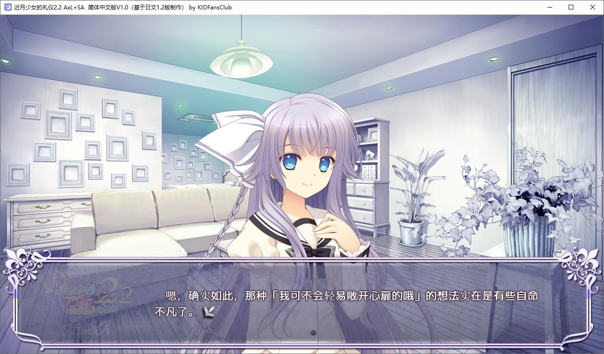

# 故事介绍

**·朔莉after story 『八日堂女士选择舔舔舔』**

『樱小路才华』获得了极棒的恋人，身心一跃轻松了起来。

他发觉了在自己不知道的地方，有着如此默默保护着自己的存在。这使得他能够更加安心地继续自己的生活了。

对于他来说，至今为止的所有关系网都是家族关联的人物，或是不得不隐藏自己性别的对象。而朔莉是唯一一个只与他本人相关的、可以坦诚相待的人物，他非常开心。

才华怀抱着胸中的感动，成为了『八日堂朔莉』的恋人、但是，八日堂朔莉来这个学院学习只是偶然事件，她本来应该活跃在远比这里宽广许多的世界舞台上的。

结束了短暂的休息时间，朔莉再次回到了忙碌的生活之中。与此同时，才华所要达成的梦想和目标还在这所学院之中。他对自己的恋人要离开自己感到很不安。

一边烦恼着两人立场的不同，一边意识到了自己的软弱的才华，他所追求的与恋人的相处方式会是？

**·ルミネafter story 『身为弟弟之人』**
『樱小路才华』通过无视自己的软弱，获得了一时的安心感。

虽然他并没有解决自己内心的问题，但他还是通过向自己最喜欢的姐姐撒娇和接受姐姐的撒娇的方式，成功地逃离了内心的重压。
“想帮上弱小的姐姐的忙”这一心愿，虽说只是当时（本篇最后）的限定，但确实是才华自身的意志。他通过自身的力量成功地得出了结果。

同时，被才华所拯救的『ルミネ』也正在慢慢取回自己失去的自信，恢复到了足以定下下个目标的程度。

ルミネ所定下的目标是『以自己所能接受的演奏得出结果』。是否『足够』这一点交给了才华来判断，以『才华是否能够开心』作为判定基准。

这里的『结果』，指的是面对曾经让才华一时沉溺的演奏的演奏者『山县大瑛』，『在正式比赛中胜过他』。她向大瑛本人提出了挑战。但是大瑛却说『自己没有过被选为学院代表的经历』，所以很难和她进行正式比赛的对决，驳回了ルミネ的请求。

才华究竟是否能唤起ルミネ的干劲，并让她完全取回丧失的自信呢？

*（介绍来自2dfan）*

KID Fans Club汉化组的汉化作品，详情请看汉化原帖

[汉化原帖](https://tieba.baidu.com/p/7589864726)

基于1.2本体，游戏要保持英文路径

2021-10-30 更新 1.1汉化补丁

**请使用[IDM](https://www.123pan.com/s/jJprVv-3tMsH)进行下载，使用最新版[winrar](https://www.123pan.com/s/jJprVv-dtMsH)进行解压（非常重要）。**

**解压密码为终点（简体汉字）。**

**添加10%恢复记录，防止网盘抽风损坏。**

