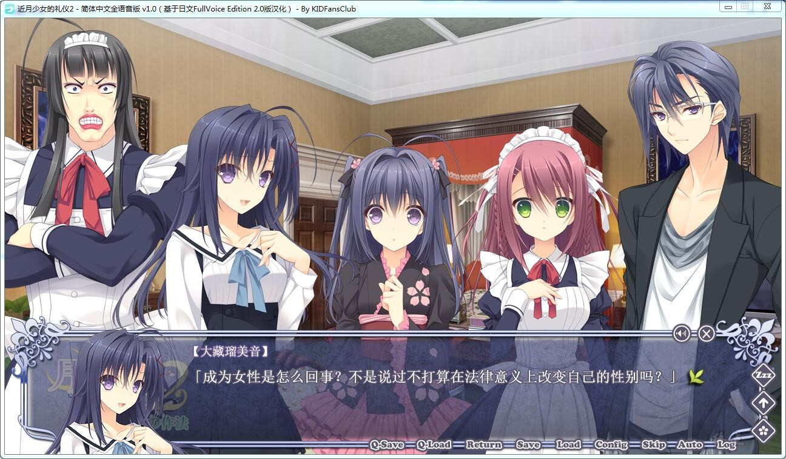

# 游戏简介

一位青年返回了祖国。

时隔数十年踏上日本土地的主人公：樱小路才华的心中，藏着一份如燃烧的火焰一般炽热的思念。

那就是，在扬名世界的艺术综合学院：フィリア学院获得最好的成绩。

换句话说，就是在每年年末举行的学院秀中获得最优秀奖，和尊敬的双亲走上同样的道路，然后超越他们。

这就是才华的梦想的开始。不，本来应该是从此开始的。

才华在令人怀念的故居『樱屋敷』，从久违再会的伯父口中得知了学院的变化。

「フィリア学院的设计师科，将在下一年度废止男子部」

得知男子部的废止无法挽回，才华甚至度过了一年自暴自弃的流浪生活。

然而，发觉了自己的容姿与女性无异的才华，决意在三年间舍弃自己的性别，进入学院学习。

在此之后，才华假借曾经在这里学习的传说中的女仆：小仓朝日的名字，以其二代目：小仓朝阳（朝日和朝阳同音あさひASaHi）之名，成为了侍奉上流阶级的大小姐エスト的女仆。

然而，虽然是成功地入了学，但真正的困难才刚刚开始而已。

只是穿上最好的衣服、走在一夜成名的快车道上，是无法实现在世界上屈指可数的艺术综合学院中成为最闪耀的人的。

必须严格地选择服饰、剧本、音乐等等要素，再把它们组合起来，演出一个最好的剧目才行。

为此，才华（=朝阳）将要在和聚集在自己准备的66层的高层公寓『樱之园』的拥有才能的少女们进行交流、加深感情。

才华究竟能否一边隐藏着性格和本性，一边发现最好的搭档、成功获得最优秀奖的荣誉吗？

KIDFansClub汉化组的作品，详情请看汉化原帖

汉化硬盘，已经按汉化组要求，修正什么的都打了

[汉化原帖](https://tieba.baidu.com/p/5023745816)

**请使用[IDM](https://www.123pan.com/s/jJprVv-3tMsH)进行下载，使用最新版[winrar](https://www.123pan.com/s/jJprVv-dtMsH)进行解压（非常重要）。**

**解压密码为终点（简体汉字）。**

**添加10%恢复记录，防止网盘抽风损坏。**

