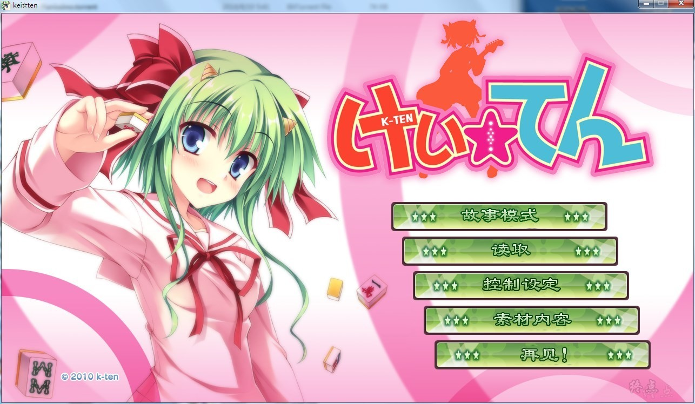
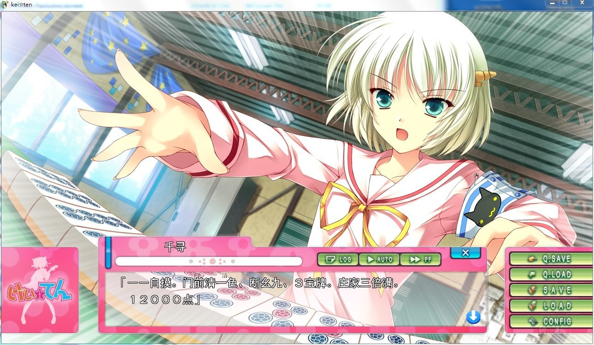
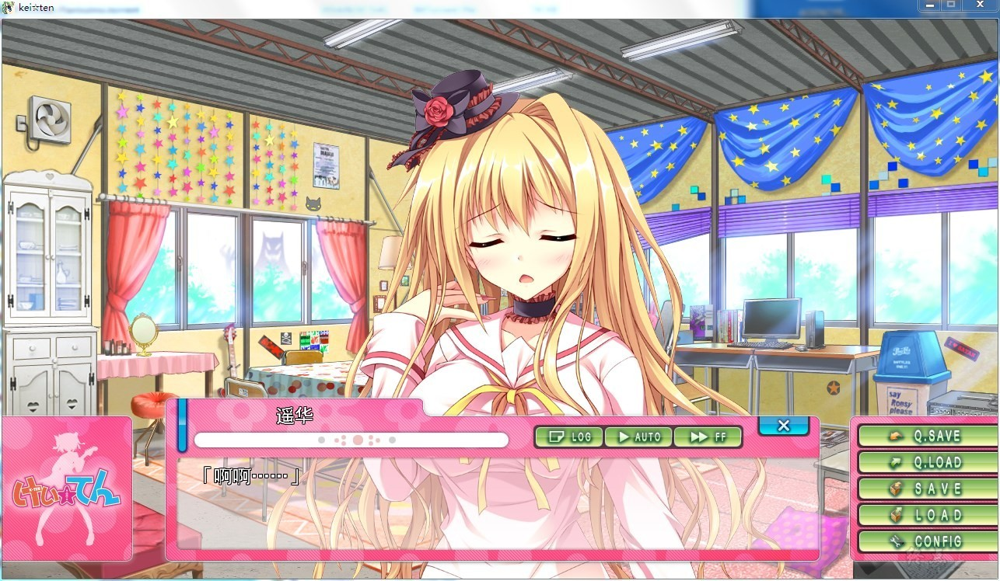
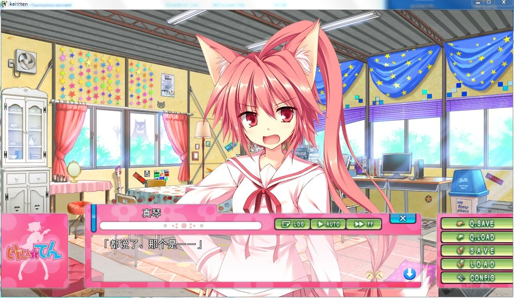

# 游戏简介

原文标题：けい☆てん 〜ハトでもわかる激萌え麻雀〜

「呀～呵！　好像找到奇怪的东西了哟!?」

和人间界似是而非的世界・怪物界。

以游手好闲知名的练魔学园轻音乐部，在想要将其逼至废部绝境的学生会长的压力下，被迫接受赌上社团生死存亡的挑战。

然而，这场挑战竟然是和轻音乐部完全没关系的麻将!?

话又说回来，事件的发端正是轻音乐部的吉他手桐沢美咲在活动室的角落里发现麻将牌一事……不知道麻将玩法的美咲她们的命运究竟会!!

点点点，与此相对却完全没有什么紧张感、能够轻松学会麻将玩法的故事『けい☆てん』开始了！

由CIRCUS和S-Prism共同开发，k-ten销售的作品。

[汉化原帖](https://tieba.baidu.com/p/2756312944)

**请使用[IDM](https://www.123pan.com/s/jJprVv-3tMsH)进行下载，使用最新版[winrar](https://www.123pan.com/s/jJprVv-dtMsH)进行解压（非常重要）。**

**解压密码为终点（简体汉字）。**

**添加10%恢复记录，防止网盘抽风损坏。**

