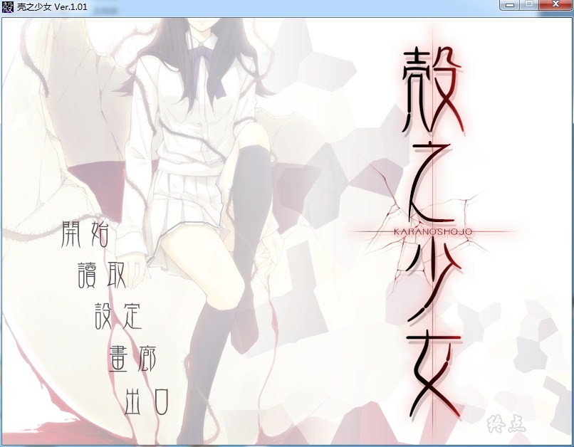

# 汉化版

# 官方中文

# 游戏简介

你有知道故事真相的觉悟吗——

拥有此觉悟之人将舍弃一切希望。

昭和三十一年三月，战败十年之后，逐渐恢复昔日面貌的某街、东京。

私家侦探时坂玲人在井之头公园接受了一位少女奇怪的委托。

“希望你能找到——我。真正的、我”

在此期间，街头经常发生奇妙的猎奇犯罪事件。

尽是些少女被诱拐、身体的一部分和子宫被切除后杀害。

警视厅搜查科的鱼住夹三委托旧识并曾是同事的时坂调查此事件。

保谷町边上有座私立樱羽女学院。时坂的妹妹紫就读于此，两名女学生下落不明。

学院的教导主任佐伯时生委托紫的哥哥时坂调查失踪学生的下落。

时坂同时接受了三个委托。

接受了佐伯的委托后，为了搜集失踪女学生的情报，时坂作为教师潜入樱羽女学院。

在那里——与她再会了。

朽木冬子。委托我寻找失物的少女。她用那如铃般婉转的声音、少年般的语气说道。

“呀——又相遇了呢，侦探先生”

牺牲者在增加。

被认为是简单的女学生的搜查事件却并没有看上去那么简单。

下落不明者与身份不明的遗体数量并不吻合。

于是被选中的下一个牺牲者究竟是——

没有终点的悲剧的轮回。伴随新事件而来的六年前事件之谜到底是——

打破满是悲剧的世界之壳的、也许是少女的微笑。

2019-1-1  更新Steam步兵汉化版，Steam英文版是R18步兵，已打上Steam版汉化补丁。

**[Steam地址](https://store.steampowered.com/app/965810/Kara_no_Shojo/)（已锁国区）**

[Steam版汉化发布帖](https://weibo.com/6083427668/GFjtyt7WB)

---

2023-7-28 更新steam官方中文，已打补丁

感谢逆天飞翔的自购，转载请注明终点论坛，谢谢配合

如有能力还请支持正版

[steam地址](https://store.steampowered.com/app/2258770/_/)

**2023-7-29更新步兵补丁，感谢等雨来提供，删除TheShell.pfs.041，即可还原骑兵**

**请使用[IDM](https://www.123pan.com/s/jJprVv-3tMsH)进行下载，使用最新版[winrar](https://www.123pan.com/s/jJprVv-dtMsH)进行解压（非常重要）。**

**解压密码为终点（简体汉字）。**

**添加10%恢复记录，防止网盘抽风损坏。**

