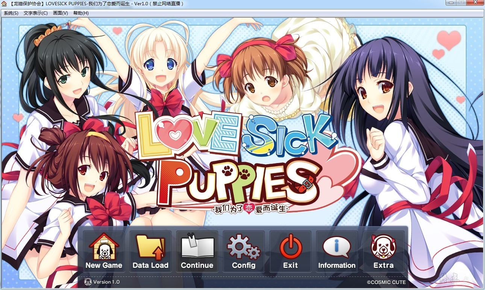
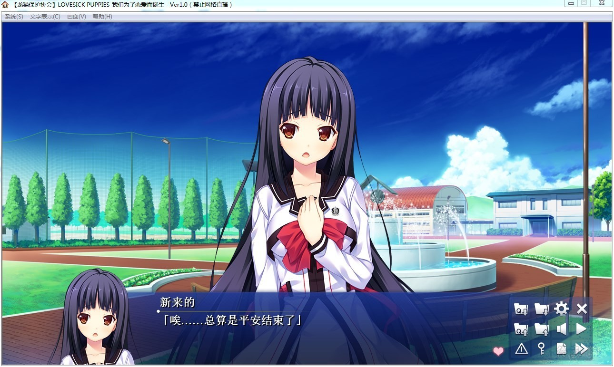
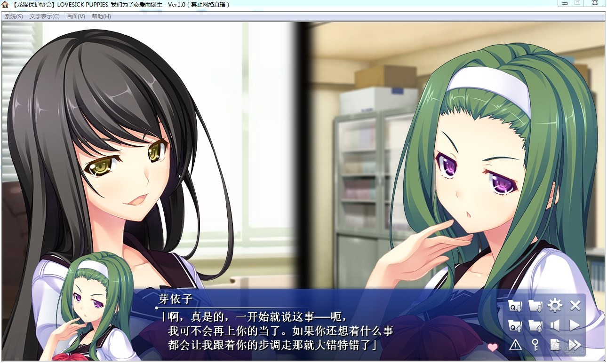
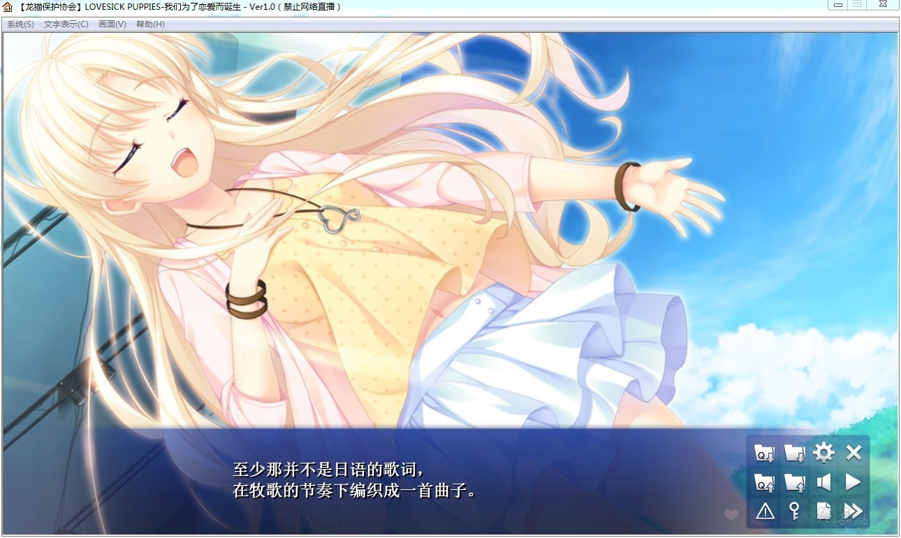
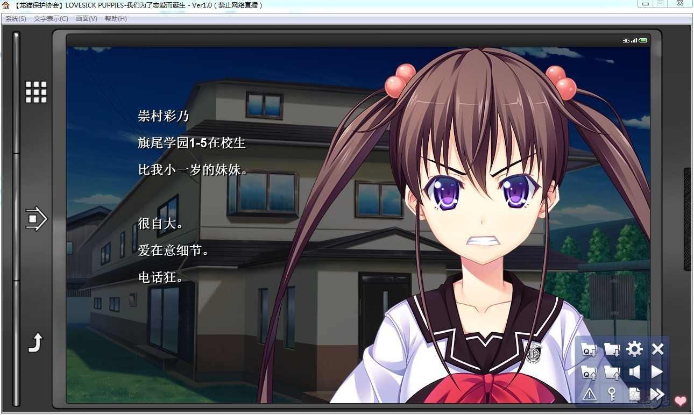

# 游戏简介

崇村虎太郎本是一个普通的学生……除了他是『相谈室』的成员以外，一切都很普通。

相谈室——也就是可以称之为“投诉部” “什么都干”的、解决学校内外各种麻烦的令人退避三舍的地方。

甚至大家都会用「那家伙抽了支凶签。」的想法来同情他。

但是，对于本来就喜欢关心别人的他来说，倾听各式的人的抱怨的日子，并不是怎么苦痛。

——而就在这么一天，虎太郎遇上了一名少女。

“违反校规到了差点就要受到退学处分的地步的怪僻的人”——空小路织衣 （からこうじ おりえ）。

被任命为她的指导员的虎太郎，对此感到困惑。

然而，尽管性格有点难受，但她卖力工作的样子感动了虎太郎。

而在某一天，她在知道了虎太郎的家是公寓后，向他提出了想让自己住进去的强烈希望。

本想拒绝的虎太郎，在她的强迫，以及知道了事情的缘由后，表示OK。

就这样，两人奇妙的同居开始了。而尽管互相都不适应，但也算是慢慢地克服了共同生活。

——就在这时，问题发生了。

叔父提出了要将所经营的这间公寓拆掉的消息。

理所当然地，两人感到动摇。虎太郎将失去留恋的家。织衣将失去纠正自己人生的家。

但是，并没有可以叹息悲伤的时间。

不知为何事情峰回路转，反过来住的人数还增加了。

稍稍内敛的、但是性格顽固的问题少女柴咲まるな。

现在身价高涨的人气声优、有点宅的ソーニャ。

另外再加上同班同学的武道一根筋的姫里勇，以及知其脾性的青梅竹马保科有希，公寓变得更加热闹。

就这样，在虎太郎他们这个家庭之中，成员互相的羁绊不断加深。

在这么一个终结时间已经定了下来的、有着时间限制的家庭……

龙猫汉化组的作品

[汉化原帖](http://www.wakasako.com/forum.php?mod=viewthread&tid=40)

**请使用[IDM](https://www.123pan.com/s/jJprVv-3tMsH)进行下载，使用最新版[winrar](https://www.123pan.com/s/jJprVv-dtMsH)进行解压（非常重要）。**

**解压密码为终点（简体汉字）。**

**添加10%恢复记录，防止网盘抽风损坏。**

