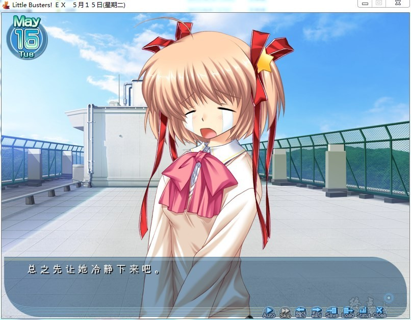

# 游戏简介

故事于2007年5月13日开始。主角直枝理树与其青梅竹马的朋友枣恭介、枣铃、井之原真人、宫泽谦吾一起过着全寄宿制的高中生活。他们曾于小时候结成一个与恶势力作斗争，号称正义的使者的队伍，名为“Little Busters”。

某日，三年级的恭介从就职活动中回来，并提议要组成一个棒球队伍，队名沿用“Little Busters”，想和从前一样再热闹地玩一次。于是理树他们就开始寻找队员，挥洒著青春的光彩，理树也渴望与伙伴们的日子能够永远持续下去。

不久以后，理树和铃在一只被恭介取名为“蓝侬”的猫身上找到一张纸条，上面有这样的讯息：“请找出这个世界的秘密”…

**请使用[IDM](https://www.123pan.com/s/jJprVv-3tMsH)进行下载，使用最新版[winrar](https://www.123pan.com/s/jJprVv-dtMsH)进行解压（非常重要）。**

**解压密码为终点（简体汉字）。**

**添加10%恢复记录，防止网盘抽风损坏。**

